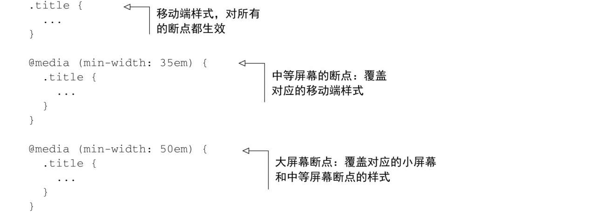
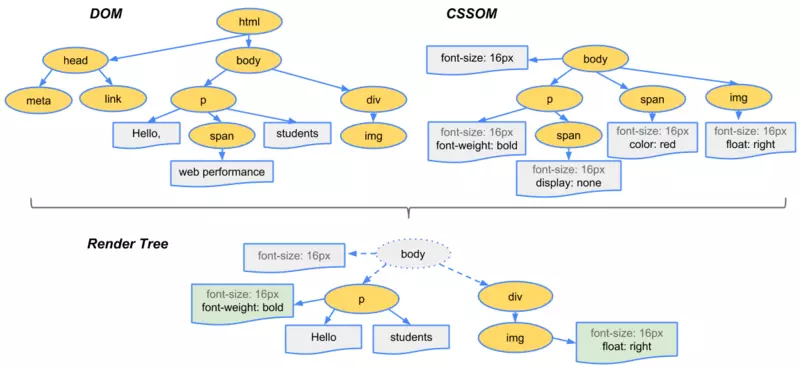
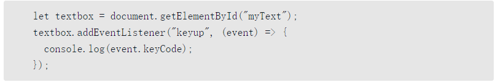
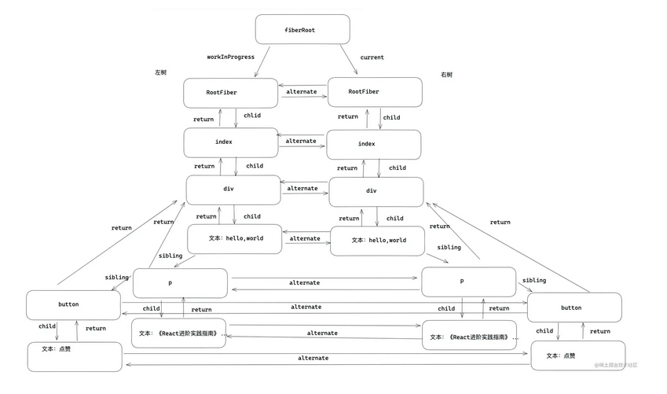
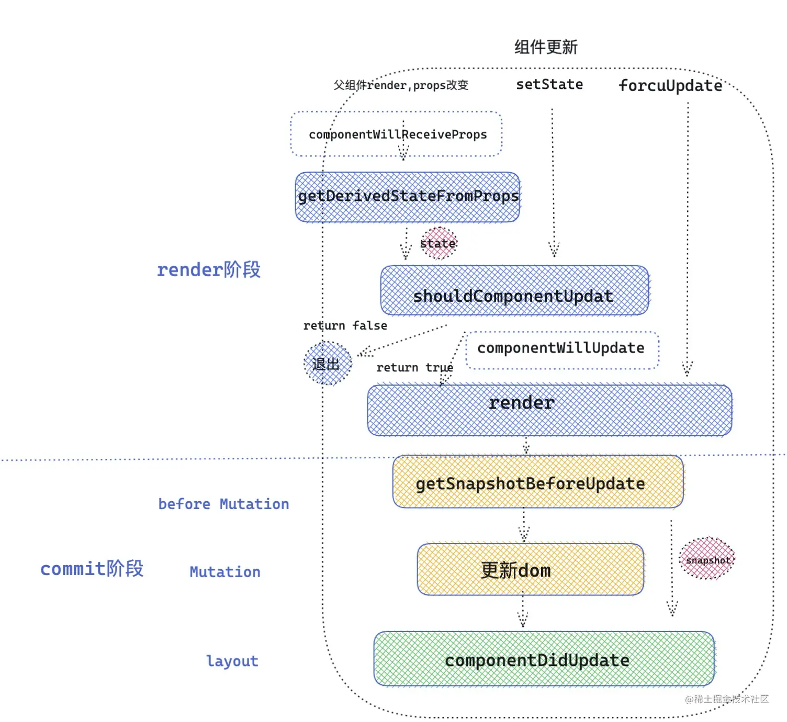
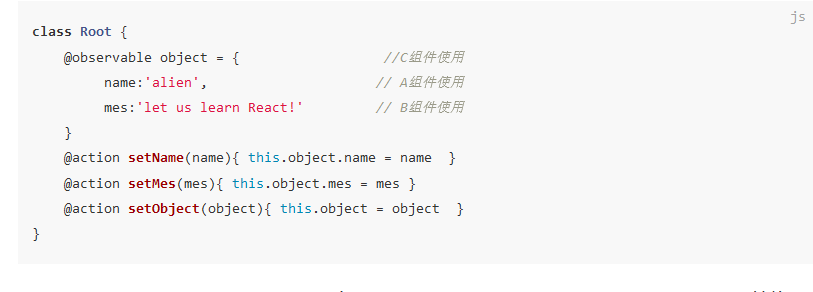

# 面试汇总

## CSS

### 1.正方形盒子九宫格排列

1. flex: 设置增长因子、缩减因子为1、弹性基准为33.33%。高度也是33.33%。
2. float:左浮动，设置子元素的宽高为33.33%。并且通过::after伪元素清楚后续浮动。
3. grid：设置行列模板都为1fr。
4. inline-block：子元素宽高33.33%。注意通过letter-spacing、word-spacing、font-size等消除边距，并且vertical-align对其top，否则上下有间隙。

### 2.水平垂直居中

1. 知道内部元素与外部元素的宽高，通过设置计算设置宽高即可。
2. 父元素display:grid、align-items:center、justify-items:center。
3. 父元素display:grid、align-items:center、justify-content:center。
4. **父元素display:grid，子元素margin：auto。**
5. 父元素display:flex、align-items:center、justify-content:center。
6. **父元素display:flex，子元素margin:auto。**
7. 父元素display:table-cell、text-align:center、vertical-align:middle，子元素display:inline-block;
8. 父元素position：relative，子元素 position: absolute、left: 50%、 top: 50%、transfrom: translate(-50%, -50%)。
9. 父元素position：relative，子元素position: absolute、top: 0、left: 0、right: 0、margin: auto。

### 3. Flex布局

**概念：**给某个元素设置了display：flex，那么该元素成了弹性容器，容器内的元素成了弹性子元素。容器内的元素在主轴上依次排列，如果不够排列就往副轴方向换行。弹性布局使得我们可以通过设置弹性容器来轻松操控容器内所有元素的布局，相比于浮动布局弹性布局更加精确，方便。

**容器属性：**

```css
flex-flow:flex-direction flex-wrap
flex-direction:row/row-reverse/column/column-reverse
flex-wrap:nowrap/wrap/wrap-reverse
justify-content:flext-start/flex-end/center/space-between/space-around/space/evenly
align-items:flex-start/flext-end/center/baseline/strench
align-content:flex-start/flex-end/center/space-evenly/space-between/space-around/strench
```

**元素属性：**

```css
flex:flex-grow flex-shrink flex-basis
flex-grow:1
flex-shrink:1
flex-basis:100px/content
align-self
jusfity-self
order:5
```

### 4. Grid布局

**概念：**给某个元素设置了display：flex，那么该容器就称为栅格容器，容器内的元素成了栅格子元素。网格分为网格线、网格轨道、网格单元、网格区域。相对于flex布局网格布局的提供了二维布局方式，可以灵活的控制两个维度上元素的布局。


**容器属性：**

```css
grid-template-rows:100px/50%/1fr repeat(3,100px/1fr 2em)
grid-template-areas:"header hedar hedar"
                    "content content content"
                    "footer footer fotter"
grind-row/column-gap:10px
content类型表示将划分完行列后剩下的空间分配到行列周围，也就是整个行和整个列的分布（格子的对齐）
items类型表示每个元素在网格单元中的分布（格子内的对齐）
justify-items:flex-start/flext-end/center/baseline/strench
justify-content:flext-start/flex-end/center/space-between/space-around/space/evenly
align-items:flex-start/flext-end/center/baseline/strench
align-content:flex-start/flex-end/center/space-evenly/space-between/space-around/strench
```

**元素属性：**

```css
align-self
jusfity-self
order:5
```

### 5. 响应式布局

**响应设计的三大原则：**

1. 移动优先：移动端有诸多限制，先布局好移动端就可以用渐进增强的方式来布局桌面端。
2. @media规则：利用媒体查询来修改图片等每次适应不同的屏幕大小。
3. 流式布局：使用自适应的属性和布局，使得布局中的元素可以随着屏幕的伸缩自适应的调整布局。

移动端设计的重点在于突出内容，因为移动端屏幕有限首先要抓住用户的眼球。

```css
移动端自适应代码
font-size:calc(1vw + 0.6em);

<meta name='viewport' content='width=device-width' initial-scale=1'>
meta标签的content属性里包含两个选项。首先，它告诉浏览器当解析CSS时将设备的宽度作为假定宽度，而不是一个全屏的桌面浏览器的宽度。其次当页面加载时，它使用initial-scale将缩放比设置为100%。
                                            
@media (min-width:500px){
    .titel > h1{
        font-size:2.25em;
    }                                                  
}
在媒体查询断点中推荐使用em单位。在各大主流浏览器中，当用户缩放页面或者改变默认的字号时，只有em单位表现一致。

@media(min-width:20em) and (max-width:35em){...}//与 >=20em && <=25em
@media(max-width:20em),(min-width:35em){...}//或 <=20em || >=35em
❑(min-height: 20em)——匹配高度大于等于20em的视口。
❑ (max-height: 20em)——匹配高度小于等于20em的视口。
❑ (orientation: landscape)——匹配宽度大于高度的视口。
❑ (orientation: portrait)——匹配高度大于宽度的视口。
❑ (min-resolution: 2dppx)——匹配屏幕分辨率大于等于2dppx（dppx指每个CSS像素里包含的物理像素点数）的设备，比如视网膜屏幕。
❑ (max-resolution: 2dppx)——匹配屏幕分辨率小于等于2dppx的设备。


```

通常来说，移动优先的开发方式意味着最常用的媒体查询类型应该是min-width。在任何媒体查询之前，最先写的是移动端样式，然后设置越来越大的断点。



**总结：**

❑ 优先实现移动端设计。

❑ 使用媒体查询，按照视口从小到大的顺序渐进增强网页。

❑ 使用流式布局适应任意浏览器尺寸。

❑ 使用响应式图片适应移动设备的带宽限制。

❑ 不要忘记给视口添加meta标签。

### 6. 选择器和优先级

#### 1.选择器类型

- id选择器（#id）
- class选择器（.class）
- 属性选择器（[attr=value]/[attr]）
- 伪类选择器（:active）
- 伪元素选择器（::after）
- 元素选择器（p)
- 关系选择器（> + space ~)
- 全局选择器（*）

#### 2.权重

- 第一级：内联样式（1000）
- 第二级：id选择器（0100）
- 第三级：类、伪类、属性选择器（0010）
- 第四级：元素、伪元素选择器（0001）
- 第五级别：关系选择器、全局选择器（0000）
- 误解别：继承的样式

#### 3.优先级

1. important标记：有import标记的要大于没有的，有import的外部样式要大于内联样式。
2. 来源：读者的！import>创作者的！import>创作者>读者>用户代理
3. 权重：按权重值排序
4. 位置：同等权重下后面的要覆盖前面的

### 7. position定位

position用来设置元素的定位，有static、relative、absolute、fixed、sticky等值。

#### 绝对定位

1. 子绝父相
2. 子绝，父为最近的非static。如果没有，则将页面第一屏body作为初始定位块。

#### 固定定位

将要定位的元素设置为fixed即可，不需要设定父。容纳块为视区，固定元素完全脱离标准文档流。

#### 相对定位

相对定位的容纳块必须为static。

#### 粘滞定位

设置为sticky的元素，偏移属性用来定义相对容纳块的粘滞定位移动区域。

### 8. 重排与重绘（*）


**结合上图，一个完整的渲染流程大致可总结为如下**

- 渲染进程将HTML内容转换为能够读懂的DOM树结构。
- 渲染引擎将CSS样式表转化为浏览器可以理解CSSOM。
- 创建布局树，并计算元素的布局信息。（为了生成渲染树）
- 对布局树进行分层，并生成分层树。（为了生成渲染树）
- 为每个图层生成绘制列表，并将其提交到合成线程。（下面开始非主线程了）
- 合成线程将图层分成图块，并在光栅化线程池中将图块转换成位图。
- 合成线程发送绘制图块命令DrawQuad给浏览器进程。
- 浏览器进程根据DrawQuad消息生成页面，并显示到显示器上

#### 重排

通过JavaScript或者css修改元素几何位置属性，例如改变宽高等，那么浏览器会触发重新布局，解析之后的一系列子过程，这个过程就叫做重排，重排需要更新整个流水线从计算布局到最后的渲染的整个过程，所以重排开销很大。


#### 重绘

通过JavaScript或者css修改元素的外观，比如背景色和边框字体颜色。那么布局阶段不会执行，而直接从绘制阶段开始，执行之后的一系列子过程，这个过程就叫重绘。相比于重排，重绘省去了布局和分层阶段，开销更小。


#### 直接合成阶段

如果更改一个既不要布局也不要绘制的属性比如transform、animation，渲染引擎将跳过布局和绘制阶段，直接执行后续的合成操作，这个过程叫做直接合成。在上图中，我们使用了CSS的transform来实现动画效果，这可以避开重排和重绘阶段，直接在非主线程上执行合成动画操作。这样的效率是最高的，因为是在非主线程上合成，并没有占用主线程的资源，另外也避开了布局和绘制两个子阶段，所以相对于重绘和重排，合成能大大提升绘制效率。

#### 引起重排和重绘的属性

**引发重排**：

1. 添加、删除可见的dom，display：none。
2. 元素的位置改变（left、right、top、bottom），元素的尺寸改变(margin、padding、width、height)。
3. 元素几何信息的获取（width/height、offsetTop/Left/Right/Bottom、offsetWidth/Height、scrollTop/Left/Width/Height、clientTop/Left/Width/Height）
4. 页面渲染初始化，浏览器窗口尺寸改变
5. 获取一些属性包括：offsetTop、offsetLeft、  offsetWidth、offsetHeight、scrollTop、scrollLeft、scrollWidth、scrollHeight、clientTop、clientLeft、clientWidth、clientHeight、getComputedStyle() 

**引发重绘：**

1. 修改元素与颜色相关的属性，例如元素的颜色、背景（background-color、font-color、border-color、outline等）、让元素消失但是留下位置的visibility：hidden。

**减少重绘和重排**：

1. 需要多次修改的样式不要一条一条修改，可以通过事先定义好样式，通过修改class类应用样式。
2. 不要把DOM节点引发重排的属性值放到循环里面当循环的变量，可以用变量来保存这个属性值。
3. 除非不得已，不要使用table布局，table布局一个小改动会影响这个布局，开销极大。
4. 如果需要插入多个DOM元素，可以通过创建documentFragment一次插入，或者innerHtml插入。
5. 对于需要多次重排的元素，设置position定位使其脱离文档流，从而不会影响别的元素，例如实现动画。
6. 多次操作一个元素是可以先display：none隐藏，是元素不在渲染树，待操作完成后再展示。
7. 使用css实现动画或者过渡，css实现的动画只在合成线程执行，不占用主线程且有cpu加速。同理，可以设置CSS属性开启GPU加速：transform、opacity、filter、will-change

### 9. 盒模型

**概念：**盒模型用来描述元素的大小和位置信息，盒模型有标准盒模型和IE盒模型。

盒模型包含最外层margin表示盒子与周围元素的距离，然后是边界border，然后是表示内容与盒子边框的距离padding，然后是内容content；

####  标准盒模型

width、height表示content的。


####  IE盒模型

width、height表示可见宽度和高度，即content+padding+border。


#### 设置方法

（标准）box-sizing：content-box；

（IE）box-sizing：border-box；

获得盒子的宽高：window.getComputedStyle(dom).width/height

### 10. 解决CSS样式冲突

样式发生冲突的原因还是优先级没有区分，解决样式冲突的主要思路是改变优先级来增加区分度。

**方法：**

1. 细化选择符：选择符越精确，优先级越高。如果两个样式发送冲突，净其中的一个样式添加上关系选择器或者属性选择器来细化选择符。
2. 再写一次选择符：本质是细化选择符的特例，可以多次写。
3. 改变css样式的位置：根据层叠的原理，后面出现的优先级更高。
4. 用！important提升优先级：一般不建议，会把影响后续修改。
5. 改用行内样式：行内样式优先级高于外部样式。

### 11. 解决flex布局space-between最后一行两边分布问题

1.三列：给包裹容器设置一个伪元素，令其宽度为一个子元素的宽度。
.boxContainer:after{
	content:'';
	width:100px;
}

2.四列：尾部添加一个元素和设置一个伪元素，把空位占了。


### 12 伪类和伪元素

**伪类：**如名字表示的一样，伪类的效果就像增加了一个虚拟的类，幽灵类。比如我想选择文档中的一些特定位置的元素，可以用伪类来选择，选择的效果和我为特定元素设置了类一样。伪类有结构伪类first-of-type、动态伪类active、UI状态伪类hover等。

**伪元素：**如名字一样，效果如同增加了虚拟的元素。用于创建一些不在DOM树中的元素，例如、首字母first-word、首行first-line、before、after。

html5规定伪类用：，伪元素用：：。在这之前都是：。.

### 13 画一条0.5px的线


1. 直接设置元素的高为0.5px，不同浏览器表现不一致。并且安卓和苹果表现也不一样。

   - chrome：把0.5四舍五入，0.5入成1，0.4舍为0。
   - Firefox：将不小于0.55px当成1px。
   - Safari：将不小于0.75px当成1px。

2. **缩放：scaleY(0.5)**，通用的方案。直接用缩放有些浏览器只是模糊了，没有完全达到0.5px的效果，所以再加上transform-origin:50% 100%；

3. 利用黑白色的线性渐变：linear-gradient(0deg，#FFF, #000）,实现效果和直接缩放一样，只是模糊了，不够完美。

4. box-shadow：给一个元素设置高度为height:1px，背景不展示background:none，从而隐藏元素，然后设置阴影为正下方0.5px处，模糊半径为0, 颜色为黑色box-shadow: 0 0.5px 0 #000。缺点就是Safari不支持小于1px的box-shadow。

5. SVG：利用svg的line元素划线，stroke表示描边的颜色。由于SVG的stroke等属性的1px就是物理像素的1px，而CSS中的1px实际是物理屏的两个px，所以这里描绘的1px就是CSS的0.5px。另外还可以使用svg的rect等元素进行绘制。缺点就是Firefox的background-image如果是svg的话只支持命名颜色，不支持色值。

6. 在head中的meta标签设置viewport：

7. ```html
   <meta name="viewport" content="width=device-width,initial-sacle=1">
   ```

   其中width=device-width表示将viewport视窗的宽度调整为设备的宽度，这个宽度通常是指物理上宽度。默认的缩放比例为1，如iphone 6竖屏的宽度为750px，它的dpr=2，用2px表示1px，这样设置之后viewport的宽度就变成375px。这时候0.5px的边就使用我们上面讨论的方法。

   但是你可以把scale改成0.5：

   ```html
   <meta name="viewport" content="width=device-width,initial-sacle=0.5">
   ```

   这样的话，viewport的宽度就是原本的750px，所以1个px还是1px，正常画就行，但这样也意味着UI需要按2倍图的出，整体面面的单位都会放大一倍。

总结：使用transfrom scale/svg的方法兼容性和效果都是最好的，svg可以支持复杂的图形，所以**在viewport是1的情况下，可以使用transform/SVG画0.5px，而如果viewport的缩放比例不是1的话，那么直接画1px即可**。

### 14 transform

#### 变形函数

1. 位移：
   - translate()
   - translateX()
   - translateY()
   - translateZ()
   - translate3d()
2. 缩放
   - scale()
   - scaleX()
   - scaleY()
   - scaleZ()
   - scale3d()
3. 旋转
   - rorate()
   - rotateX()
   - rotateY()
   - rotateX()
   - rotate3d()
4. 倾斜
   - skew()
   - skewX()
   - skewY()
5. 其它变形
   - matrix()
   - matrix3d()
   - perspective()

#### 变形原点

transform-origin: 长度值 长度值

### 15 transition

##### 如何触发过渡：

- 使用伪类hover、invalid、click。
- 添加和删除类。

transition：过渡属性 过渡持续时间 过渡时序函数 过渡延迟。

注意：过渡有关的属性一般设置在稳定的状态上，这样使得过渡前后都有效果。

##### 过渡事件

```js
document.querySelector('div').addEventListener('transitioned', function(e){console.log(e.propertyName)});
```

##### **过渡延迟**

1. 设置一个值表示所有过渡属性延迟的时间
2. 设置两个值，但是有两个以上的过渡属性，则以奇偶延迟
3. 设置匹配的多个值，则是每个过渡属性开始过渡的延迟时间。设置一个过度延迟事件的序列可以让过度一个接着一个开始。
4. 延迟时间如果为负值，且绝对值小于过渡时间，则从两者求和的位置开始过渡。如果绝对值大于过渡时间，则过度无效。

### 16 animation

##### 如何触发动画：

- 使用伪类hover、invalid、click。
- 添加和删除类。
- 直接在元素上应用

animation：动画名 持续时间 时序函数 延迟时间 迭代次数 动画方向 

##### 动画事件

1. 动画开始触发：animation start
2. 动画结束时触发：animationend
3. 动画几次迭代结束到下一次迭代开始之前触发：animationiteration

##### 关键帧

- 百分数
- from、to

```
@keyframes spin{
from{ transform:rotate(0deg)}
to{transform:rotate(360deg)}
}
```

### 17 三栏布局

#### 1.浮动布局

首先，三个元素顺序依次是left、right、main。中间的元素要放最后，因为前面两个元素浮动后会脱离文档流，空出位置给main。

```html
    <div class="left"></div>
    <div class="right"></div>
    <div class="main"></div>
```

然后左侧元素左浮动，右侧元素右浮动，中间的元素设置margin为左右两个元素的宽度，宽度自适应。

```css
      .main {
        margin: 0 200px;
      }
      .left {
        float: left;
      }
      .right {
        float: right;
      }
```

#### 2.定位布局

main元素可以提前，因为绝对定位会脱离文档流。

```html
    <!-- 可以把Main提前，使主要内容可以优先加载 -->
    <div class="main">Main</div>
    <div class="left">Left</div>
    <div class="right">Right</div>
```

然后将左右两个元素贴边，中间的元素设置margin为左右两个元素的宽度，宽度自适应。

```3.
        .left {
            position: absolute;
            top: 0;
            left: 0;
        }

        .right {
            position: absolute;
            top: 0;
            right: 0;
        }

        .main {
            margin: 0 200px;
        }
```

#### 3.flex布局

给三个元素外添加一个弹性容器。

弹性容器设置display：flex，然后给中间的子元素设置增长因子、缩减因子为1，弹性基准为auto。

此外还可以通过设置order属性来使得main最先加载。

```html
    <style>
        .container {
            display: flex;
        }

        .main {
            flex: 1;
            /* flex: 1 1 auto; */
        }
    </style>

    <div class="container">
        <div class="left">Left</div>
        <div class="main">Main</div>
        <div class="right">Right</div>
    </div>
```

#### 4.表格布局

给三个元素外添加一个表格容器。

表格容器设置display：table，然后给表格元素设置display：table-cell。无需给中间的main元素设置，表格容器内剩余的空间会分配给中间的容器，达到自适应。

```html
    <style>
        .container {
            display: table;
            width: 100%;
        }

        .container>div {
            display: table-cell;
        }
    </style>

    <div class="container">
        <div class="left">Left</div>
        <div class="main">Main</div>
        <div class="right">Right</div>
    </div>
```

#### 5.网格布局

给三个元素外添加一个网格容器。

网格容器设置display：girder，grid-template-columns：200px auto(1fr) 200px；

此外还可以通过设置order属性来使得main最先加载。

```html
    <style>
        .container {
            display: grid;
            width: 100%;
            grid-template-columns: 200px auto 200px;
        }
    </style>

    <div class="container">
        <div class="left">Left</div>
        <div class="main">Main</div>
        <div class="right">Right</div>
    </div>
```

#### 6.calc函数布局

三个元素全部左浮动，然后利用calc函数给中间的元素计算宽度。

```html
<style>
    .container {
        width: 100%;
    }
    .container>div {
        float: left;
    }
    .main {
        width: calc(100% - 400px);注意运算符前后要有空格！！！
    }
</style>
<div class="container">
    <div class="left">Left</div>
    <div class="main">Main</div>
    <div class="right">Right</div>
</div>
```

#### 7.圣杯布局

利用浮动、相对定位、负边距来实现三栏自适应，且第一个加载main元素。

```html
<div class="container">
      <div class="main"></div>
      <div class="left"></div>
      <div class="right"></div>
    </div> 
```

给三个元素加一个容器，容器设置内边距来压缩空间留给左右两个元素（这里不能给main元素设置外边距来压缩空间，因为其宽度已经是100%）。

三个元素通通左浮动，通过负边距将后面两个元素拉到中间的main元素内部两侧。

最后通过相对定位将左右两个元素拉到空余位置，我就说main元素外部两侧。

```css
 .container {
        padding: 0 200px;
      }
      .main {
        float: left;
        width: 100%;
      }
      .left {
        float: left;
        margin-left: -100%;

        position: relative;
        left: -200px;
      }
      .right {
        float: left;
        margin-left: -200px;
        position: relative;
        right: -200px;
      } 
```

8.双飞翼布局

利用浮动、正边距、负边距来实现三栏自适应，且第一个加载main元素，和圣杯布局的区别在于给main元素加了一个包裹元素，通过包裹元素的正边距压缩空间给左右两侧的元素。

```html
    <div class="container">
      <div class="wrapper">
        <div class="main"></div>
      </div>
      <div class="left"></div>
      <div class="right"></div>
    </div>
```

三个元素通通左浮动，通过负边距将后面两个元素拉到中间的包裹元素内部两侧。

最后通过正边距将main元素的宽度压缩为中间的宽度，否则是100%。

```css
      .container {
        width: 100%;
      }
      .wrapper {
        float: left;
        width: 100%;
      }
      .main {
        margin: 0 200px;
      }
      .left {
        float: left;
        margin-left: -100%;
      }
      .right {
        float: left;
        margin-left: -200px;
      }
```

### 18. 什么是BFC

BFC全称 Block Formatting Context 即`块级格式上下文`，简单的说，BFC是页面上的一个隔离的独立容器，不受外界干扰或干扰外界

**创建方式：**

- 浮动属性float
- 定位属性position：absolute、fixed，relative，static等
- 行内快inline-block
- 表格单元diaplay: table这类属性table-cell、table-caption
- 弹性盒子：display：flex，inline-flex
- overflow：非visible（wrap）

#### BFC的渲染规则是什么

- BFC是页面上的一个隔离的独立容器，不受外界干扰或干扰外界
- 计算BFC的高度时，浮动子元素也参与计算（即内部有浮动元素时也不会发生高度塌陷）
- BFC的区域不会与float的元素区域重叠
- BFC内部的元素会在垂直方向上放置
- BFC内部两个相邻元素的margin会发生重叠

####  BFC的应用场景

- **清除浮动**：BFC内部的浮动元素会参与高度计算，因此可用于清除浮动，防止高度塌陷
- **避免某元素被浮动元素覆盖**：BFC的区域不会与浮动元素的区域重叠
- **阻止外边距重叠**：属于同一个BFC的两个相邻Box的margin会发生折叠，不同BFC不会发生折叠
- 创建各种自适应布局：比如圣杯布局，双飞翼布局，自适应两三栏布局。

### 19. 行内格式上下文

**概念：**内部的环境表现为行内格式。

**布局规则**：

- 内部的box会在水平方向一个一个堆叠。
- box之间只有水平方向的边距、边框、填充有效果。
- 对齐方式：以底部、顶部、基线对其。

### 20. 层叠上下文

元素提升为一个比较特殊的图层，在三维空间中 (z轴) 高出普通元素一等。

**触发条件**

- 根层叠上下文(`html`)
- `position`
- css3属性
  - `flex`
  - `transform`
  - `opacity`
  - `filter`
  - `will-change`
  - `webkit-overflow-scrolling`

**层叠等级：层叠上下文在z轴上的排序**

- 在同一层叠上下文中，层叠等级才有意义

- `z-index`的优先级最高

  

## HTML

## JavaScript

### 1.实现轮播图

1. 定义一个容器组件，组件的子元素就是img图片标签。
2. 容器组件内部再定义三个子组件，分别是轮播图、bullet、左右切换按钮
3. 容器组件内部定义state：当前下标、当前子节点。
4. useEffect给组件添加定时器，根据传入的轮播时间切换下标。
5. 然后就是给bullet和左右切换按钮添加点击事件，点击切换下标出发state改变，然后重新渲染展示的图片，bullet也根据下标修改class，css配合修改激活颜色；

### 2.闭包

闭包的概念：闭包指的是能够读取其他函数作用域的函数。

如果要显示的表现闭包，那就是在一个函数内部定义另一个函数。那么根据词法作用域，内部的函数是可以访问外部函数的作用域的。然后以某种方式在函数外部获得这个内部函数的引用（通过返回值或者设置为外部对象的属性，或者将函数作为外部的函数的参数）。那么当整个包裹函数执行完之后，调用栈的指针就会下移一位，释放该函数的执行上下文。那么此时内部的函数引用了作用域中的变量，并且内部的函数也被别的执行上下文引用。此时虽然调用栈释放了包裹函数的执行上下文，但是会在堆内存中开辟一块空间，用来存储被内部函数引用的变量，这就是闭包。

闭包的特性：

- 函数内再嵌套函数
- 内部函数可以引用外层的参数和变量
- 参数和变量不会被垃圾回收机制回收

闭包的好处;

1. 设计私有变量和方法，避免被全局变量污染。
2. 使变量始终存在内存中，有缓存的效果。

闭包的坏处：

1. 闭包会长驻在内存中，使用不当会造成内存溢出。

解决方法：合理使用闭包，避免不必要的产生闭包的情况。对于必要的闭包，在不需要的时候即使解除引用，让垃圾回收机制回收。

闭包的应用场景：

1. 创建私有变量
2. JavaScript的模块机制就是利用闭包的原理
3. 回调函数
4. 函数防抖和函数节流等


### 3.原型链

原型链的由来：JavaScript中是没有类的概念的。在面向类的语言中，实例化一个对象，就是将类的属性和方法复制到实例化对象上，而JavaScript中是没有类似的复制机制的。不能创建一个类的多个实例，只能创建多个对象，而多个对象的内部链接[[prototype]]指向同一个对象，也就是说这多个对象通过这个内部链接复用了指向对象的某些方法和属性，而不是复制这些方法和属性。那么这个指向关系就是原型链。


JavaScript的继承是基于原型链的，也就是将一个对象A的内部链接[[prototype]]指向另外一个对象B的prototypetype属性，那么A就继承了B的prototype上的属性和方法，这种继承是借用，而不是复制。

在JavaScript，有两个元老级别的对象，函数Object和函数Function。新的对象的内部链接[[prototype]]都指向Object的prototype对象，而Object的内部链接[[prototype]]只能指空。新的函数的内部链接[[prototype]]都指向Function的prototype对象，而Function的内部链接[[prototype]]指向Object的prototype对象。

也就是说，从原型链上寻找，所有的函数的内部链接[[prototype]]最终会指向Function的prototype对象，所有对象的内部链接最终会指向Object的prototype对象。

### 4.判断数据类型的方法

1. 基本数据类型用typeof，typeof不能判断引用数据类型和null。typeof的值（number、string、function、object、undefined、boolean）
2. 引用数据类型用instanceof（instanceof的原理主要是看两个对象的内部链接prototype的指向）。
3. constructor（原理还是靠原型链，通过原型链找到了原型对象，然后调用原型对象的constructor指向来判断)。
4. Object.prototype.toString().call(obj)，通过该方法得到的字符串格式为[object Number]。

### 5.Object的toString和构造函数的toString的区别

Object的toString得到的字符串是[object Number]，常用于判断类型。

而Function、Number、String等构造函数的toString重写了Object的原型上的toString，得到的是函数的字符串形式"function Number() { [native code] }"；

### 6.this的指向问题

JS中的this可以理解为执行环境或者调用对象。从物理的角度来看，在js的调用栈中的每个函数的执行上下文都有四个对象，变量环境、词法环境、外部环境、还有this对象，this就相当于这个函数的调用对象或者执行环境。


在js的执行过程中，函数的this的指向是动态变化的，有四种绑定this的方式。

1. 默认绑定：默认就是没有应用其它绑定时的绑定，当直接调用函数时，函数的this默认绑定到全局对象（严格模式下为undefined）。默认绑定也是导致函数丢失this的原因，在JS中如果多个函数嵌套，内层的函数直接调用是this就丢失了。

2. 隐式绑定：当用一个对象调用函数是，this隐式绑定为调用对象。

3. 显式绑定：用call，apply,bind绑定函数的this。

4. new绑定：用new关键字调用函数，会执行如下几个步骤：

   1.创建一个全新的对象。

   2.将这个对象的内部链接[[prototype]]指向函数的prototype属性。

   3.将新对象的this绑定到函数的this，然后调用函数初始化对象。

   4.如果函数没返回其它对象，则将新对象返回。

### 7. 箭头函数和普通函数的区别

箭头函数和普通函数主要区别在于this对象的指向。

1. 箭头函数的this是静态的，由词法作用域决定，所以箭头函数的this是根据词法作用域找最近的调用对象，也就是箭头函数外第一层函数的this对象。
2. 因为箭头函数的this是基于词法作用域的，所以不可以修改。从而函数的四种绑定对于this都不管用，this不可以用new调用。
3. 箭头函数没有arguments对象。
4. 箭头函数不可以用bind、apply、call调用。
5. 箭头函数不能作为生成器函数使用yield关键字。

### 8. 堆内存和栈内存

JavaScript的内存分为代码空间、栈空间、堆空间。


栈空间：栈空间就是调用栈，用来存储执行上下文和原始数据类型。JavaScript需要栈来维护程序执行期间的上下文状态，所以栈空间不能太大，太大会影响执行上下文的切换效率，进而影响程序的执行效率。

堆空间：堆空间用来存储引用数据类型，堆空间比栈空间大得多，对空间的内存分配和回收需要垃圾回收机制的参与，所以在操作效率上不如栈空间；

栈和堆的区别：

1. 栈内存空间比堆内存小
2. 栈内存操作效率比堆内存搞，靠栈指针来分配和回收空间。
3. 栈内存分配是连续的，堆内存分配不一定连续，栈内存像数组，堆内存像链表。
4. 栈内存存储内存大小固定的原始数据类型，堆内存存储内存大小不固定的引用数据类型，引用数据类型是基本数据类型的集合，所以大小是不固定的；
5. 栈内存中的变量，存储的是堆内存中对象的地址。需要引用对象的时候先从栈内存的变量中取得地址，然后从根据地址从堆内存获得对象。所以操作对象需要多一步取址的操作，所以操作引用数据类型没有原始数据类型效率高。

### 9. BOM中计算距离的API

1.[`Element.clientHeight`](https://developer.mozilla.org/zh-CN/docs/Web/API/Element/clientHeight) 只读 

返回[`Number`](https://developer.mozilla.org/zh-CN/docs/Web/JavaScript/Reference/Global_Objects/Number) 表示内部相对于外层元素的高度。


2.[`Element.clientLeft`](https://developer.mozilla.org/zh-CN/docs/Web/API/Element/clientLeft) 只读 

返回[`Number`](https://developer.mozilla.org/zh-CN/docs/Web/JavaScript/Reference/Global_Objects/Number)表示该元素距离它左边界的宽度。


3.[`Element.scrollHeight`](https://developer.mozilla.org/zh-CN/docs/Web/API/Element/scrollHeight) 只读 

返回类型为： [`Number`](https://developer.mozilla.org/zh-CN/docs/Web/JavaScript/Reference/Global_Objects/Number)，表示元素的滚动视图高度。

4.[`Element.scrollLeft`](https://developer.mozilla.org/zh-CN/docs/Web/API/Element/scrollLeft)

返回类型为：[`Number`](https://developer.mozilla.org/zh-CN/docs/Web/JavaScript/Reference/Global_Objects/Number)，表示该元素横向滚动条距离最左的位移。

5.[`Element.scrollLeftMax`](https://developer.mozilla.org/zh-CN/docs/Web/API/Element/scrollLeftMax)     Non-Standard 只读 

返回类型为： [`Number`](https://developer.mozilla.org/zh-CN/docs/Web/JavaScript/Reference/Global_Objects/Number)，表示该元素横向滚动条可移动的最大值

6.[`Element.getBoundingClientRect()`](https://developer.mozilla.org/zh-CN/docs/Web/API/Element/getBoundingClientRect)

返回元素的大小及其相对于视口的位置的对象。


7.[`Element.getClientRects()`](https://developer.mozilla.org/zh-CN/docs/Web/API/Element/getClientRects)

返回元素相对于视口的位置的对象。

8.[`MouseEvent.clientX`](https://developer.mozilla.org/zh-CN/docs/Web/API/MouseEvent/clientX) 只读 

鼠标指针在点击元素（DOM）中的 X 坐标。

9.[`MouseEvent.x`](https://developer.mozilla.org/zh-CN/docs/Web/API/MouseEvent/x)     Experimental 只读 

[`MouseEvent.clientX`](https://developer.mozilla.org/zh-CN/docs/Web/API/MouseEvent/clientX)的别名。

10.[`MouseEvent.offsetX`](https://developer.mozilla.org/zh-CN/docs/Web/API/MouseEvent/offsetX) 只读     Experimental

鼠标指针相对于目标节点内边位置的 X 坐标

11.[`MouseEvent.pageX`](https://developer.mozilla.org/zh-CN/docs/Web/API/MouseEvent/pageX) 只读     Experimental

鼠标指针相对于整个文档的 X 坐标。

12.[`MouseEvent.screenX`](https://developer.mozilla.org/zh-CN/docs/Web/API/MouseEvent/screenX) 只读 

鼠标指针相对于全局（屏幕）的 X 坐标。

### 10. 实现继承的方式

#### 1.原型链继承

实现方式：将子类的原型链接到父类的实例上。

```javascript
Child.prototype = new Parent();//Child.prototype.__proto__ === Parent.prototype //true
var child = new Child();//child.__proto__ === Child.prototype
```

优点：可以继承父类构造函数的属性和方法，以及原型的属性和方法

缺点：

1. 无法向父类构造函数传参
2. 所有子类实例共享父类实例的属性，如果属性为引用则牵一发而动全身。

#### 2.构造函数继承

实现方式：在子类的构造函数中使用call或者apply劫持父类的构造函数，并传参。

```javascript
function Child(name, id){
  Parent.call(this, name, id);
  // Parent.apply(this, arguments);
}
```

优点：可以解决原型链继承的缺点，即无法传参和共享引用类型的问题。

缺点：不可继承父类原型的方法，方法都在构造函数中定义，构造函数无法复用

#### 3.组合继承

实现方式：构造函数继承和原型链继承结合。

```javascript
function Child(name, id){
  Parent.call(this, name, id);
  // Parent.apply(this, arguments);
}
Child.prototype = new Parent();//第一次调用父构造函数
var child = new Child("jin", "1");//第二次调用父构造函数
```

优点：结合了构造函数和原型继承两者的优点，避开了两者缺陷。

缺点：引入了新的问题，就是调用两次父类的构造函数，消耗内存。

#### 4.原型式继承

原理：类似Object.create，实际是把要子对象的`__proto__`指向父对象的prototype

```javascript
var parent = {
  names: ['a']
}
function copy(object) {
  function F() {}
  F.prototype = object;    
  return new F();//new 出了F的实例对象，实例对象的__proto__指向构造函数的prototype，所以child的__proto__指向parent.prototype
}
var child = copy(parent);
//child.__proto__ === parent true
```

缺点：构造处理的子对象共享父类的引用类型；

#### 5.寄生式继承

原理：二次封装原型式继承，在原型式继承的基础上对方法进行扩展。

```javascript
function createObject(obj) {
  var o = copy(obj);
  o.getNames = function() {
    console.log(this.names);
    return this.names;
  }
  return o;
}
```

优点：可添加新的属性和方法 

#### 6.class继承（寄生组合式继承）

原理：改进组合继承，把组合继承里面原型链继承的那一步改为寄生式继承，避免了调用父类构造函数。

我们的实际目的无非就是想要把子类的`__proto__`指向父类的prototype，那么利用原型式继承就可以达到，但是为了同时能够修改constructor的指向所以要用寄生式继承

```JavaScript
function inheritPrototype(subClass, superClass) {
  // 复制一份父类的原型
  var p = copy(superClass.prototype);
  // 修正构造函数
  p.constructor = subClass;
  // 设置子类原型
  subClass.prototype = p;
}

function Parent(name, id){
  this.id = id;
  this.name = name;
  this.list = ['a'];
  this.printName = function(){
    console.log(this.name);
  }
}
Parent.prototype.sayName = function(){
  console.log(this.name);
};
function Child(name, id){
  Parent.call(this, name, id);
  // Parent.apply(this, arguments);
}
inheritPrototype(Child, Parent);
```

优点：实现了组合继承的功能，同时借助寄生继承的思想避免了第二次调用构造函数。

### 11. let、var、const

#### 1.var

作用范围：以函数为划分的函数作用域。

变量提升：具有，效果如同在作用域顶部声明了变量一样。

#### 2.let

作用范围：以大括号为划分的块级作用域。

变量提升：不具有，在声明位置之前的临时死区调用会报错。

#### 3.const

作用范围和变量提升域let一致，区别在于const只能指向同一个地址，所以用const给变量赋值原始类型则不可以改变，如果赋值引用类型则可以改变引用类型的属性但是不能改变指向。

##### 变量提升的原理：

在调用栈中的每个执行上下文中，存在变量环境、词法环境、外部环境、this对象。其中变量环境就是用来存储var声明的变量，词法环境用来存放let和const存放的变量。当JavaScript代码执行之前，会个非常短暂的编译阶段，这个时候全局作用域中var声明的变量会被存到全局执行上下文的变量环境中，并赋值为undefined，let和const声明的变量会被放到词法环境中。而执行到每个函数的时候会把函数中var声明的变量赋值undefined放入变量环境，把let和const声明的变量放入词法环境中。从原理上来看let和const其实也实现了变量提升，只是let和const已经声明的变量在零时死区被屏蔽了。表现出来就是当代码执行的时候，如果在没有声明位置前使用var声明的变量会从变量环境中查找得到undefined的值，如果是let和const声明的变量，则存在词法环境中在遍历环境中找不到所以会报错。


https://interview2.poetries.top/fe-base-docs/browser/part2/lesson09.html#javascript%E6%98%AF%E5%A6%82%E4%BD%95%E6%94%AF%E6%8C%81%E5%9D%97%E7%BA%A7%E4%BD%9C%E7%94%A8%E5%9F%9F%E7%9A%84

### 12. 数组去重

1.Set：将数组放作为Set构造函数的参数得到Set实例，然后Array.from转换为数组。

2.双循环：外层i遍历前一个元素，内层j遍历i后面的元素。如果相同则用arr.splice(j,1)去除后面的元素，此时后面的元素往前了，j--。

3.indexOf：用一个res=[]，遍历数组arr同时res.indexOf(arr[i])，如果!==-1则放入res。

4.sort：对数组arr排序，然后从下标1开始遍历，如果i-1===i则用splice(i-1,1)去除前面的元素。

5.利用对象当map：对象obj={}用来当map，利用每个元素的类型和toString组成的字符串作为key，值则是true表示该元素存在。

然后filter遍历arr,判断每个对象是否存在obj中如果存在返回false过滤该元素，如果不存在则设置map的值为true表示放入map。

6.利用filter：filter遍历数组arr然后判断arr.indexOf(item)===index如果下标等于自己则是唯一元素应该保留，否则过滤；

7.递归：和sort方法一样，只不过利用递归的形式来遍历数组。

8.利用map：用map来记录res数组中存在的元素，遍历arr如果map中没有遍历的元素则放入res，同时设置map对于key为true。如果有则啥也不干，跳到下一个元素。

9.利用reduce：pre存结果，return pre.includes(cur)?pre:[...pre,cur]来决定每次返回的结果。

### 13. JS数据类型

基本数据类型：string、number、bool、null、undefine、Symbol(ES6)。

引用数据类型：Object、Function、Array、Date、RegExp、基本类型的包装类型（Bool、String、Number）、Proxy、Reflect、Map、WeakMap、Set、WeakSet、Error。

区别：

1. 基本数据类型直接存储在栈中，占用空间小，大小固定，属于频繁使用的数据。（栈是存储基本类型值和执行代码的空间）
2. 引用数据类型存储在堆内存中，占据空间大，大小不固定，引用数据类型在栈中存储了指针，指针指向堆内存中的其实地址。

### 14. 作用域

**概念：**作用域值在程序中定义变量的区域，该区域决定了变量的生命周期。通俗的说，作用域就是变量和函数可以访问的范围。

ES5的作用域：

1. 全局作用域：作用范围最大，在代码任何地方都可以访问，生命周期伴随页面的周期。
2. 函数作用域：作用范围只在函数内：什么周期也随着函数的执行结束而销毁。

ES6的作用域：

1. 块级作用域：作用域在代码块内，也就是大括号内。生命周期随代码块的执行完成而结束。

作用域的底层实现原理：

调用栈中存在全局执行上下文和每个函数的函数执行上下文，每个执行上下文中都有变量环境、词法环境、外部环境、this对象。那么变量环境中存放的就是var声明的变量，全局上下文的变量环境就是全局作用域，函数上下文的变量环境就是函数作用域，而块级作用域就是每个执行上下文的词法环境实现的。


### 15. JS找出数组重复最多的元素

**方法1：**利用map，遍历数组统计每个元素的次数，然后对map排序

**方法2：**利用数组当map。

**方法3：**利用对象当map。

### 16. JS判断对象是否为空

**方法1：**通过JSON.stringfy()判断是否为“{}”。

**方法2**：for in 循环，空对象是不会进入循环的。

**方法3：**利用ES6的Object.keys()、Object.entryies()、Object.values()，空对象获取的是空数组，长度为0。

**方法4：**利用ES5的Object.getOwnPropertyNames()，返回的是字符串数组，空对象为空数组。

### 17. 浏览器兼容性

**能力检测：**重点在于检测浏览器是否拥有某种能力，能否使用某个函数。

**用户代理检测：**通过检测用户代理字符串来判断用户代理的版本和型号。

**怪癖检测**：有些浏览器版本有自己的bug，一般只有某种怪癖干扰到JS脚本的执行才使用。

### 18. Array的方法

1. slice
2. splice
3. split
4. sort
5. join
6. push
7. pop
8. shift
9. unshift
10. some
11. forEach
12. reduce
13. map
14. filter
15. concat
16. indexOf
17. includes
18. find
19. findIndex
20. has
21. every
22. fill
23. flat
24. reverse

### 19. ES6新特性

1. 块级作用域let和const：
2. 模板字面量：模板字面量最大的威力就是标签模板，标签模板可以对模板中的字符串和变量进行处理返回新的字符串。例如styled-components就是利用标签模板实现在CSS代码中插入props变量的。
3. 函数：形参默认值、不定参数（...)、展开运算符、name属性、块级函数、箭头函数。
4. 对象：属性值简写、方法简写、Object.is()、Object.assign()、super关键字（相当于Object.getPrototypeOf(this)。
5. 解构：数组解构、对象解构。
6. Symbol原始类型。
7. Set、Map、WeakSet、WeakMap集合。
8. 迭代器、生成器
9. 类、继承：ES5中的继承是先创建子类然后调用父类构造器，ES6则是先创建父类this值，然后子类的构造函数再继承this对其进行修改。
10. 数组：Array.of、Array.from、find、findIndex、fill。
11. Promise、async。
12. Proxy、Reflection：Reflection的主要作用是将分散在Object、Function、或全局函数中的方法（apply、delete、get、set）整合一起，方便统一管理原生API，其次是配合Proxy对代理对象做一些操作，Reflect的返回值可以代替try catch。
13. ES6模块。

### 20. JS和ES

JS包括：

- JS语言的核心部分的国际标准ECMAscript
- 文档对象模型DOM
- 浏览器对象模型BOM

### 21 常见的DOM方法

```js
//create node
let div = document.createElement("div");
let testNode = document.createTextNode("tom");

//relationship between nodes
let parent = div.parentNode; //single parent node
let childrens = div.childNodes; // live collection
let nextSibling = div.nextSibling; //single parent node
let previousSibling = div.previousSibling; //single parent node
let firstChild = div.firstChild;
let lastChild = div.lastChild;

//manipulate node
let returnNode1 = div.appendChild(div.firstChild);
let returenElement = div.append(span)
let returnNode2 = div.insertBefore(div.firstChild);
let returnNode3 = div.replaceChild(div.lastChild, div.firstChild);
let newNode = div.cloneNode(true); //true deep clone

//selection of elements
let singleNode = document.querySelector("#main div span");
let nodeLists = document.querySelectorAll("div span");

let singleNode1 = document.getElementById("circle");
let liveHTMLCollections = document.getElementsByTagName("div");
let liveHTMLCollections1 = document.getElementsByClassName("class1 class2");
let liveNodeListCollectoins = document.getElementsByName("dot");

//manipulate attributes
div.setAttribute("class", "className");
div.removeAttribute("class");
let attributes = div.getAttribute("class");
let tag = div.hasAttribute("name");

//event
div.addEventListener("click", callback, false);
div.removeEventListener("click", callback, false);

var div1 = document.getElementById("div1");
div1.addEventListener(
  "message",
  function () {
    console.log("test");
  },
  false
);

var div2 = document.getElementById("div2");
div2.addEventListener(
  "message",
  function (e) {
    console.log(this);
    console.log(e);
  },
  false
);
var ev = document.createEvent("Event");
ev.initEvent("message", false, true); // 起泡参数变为true，div1的事件就会触发
div2.dispatchEvent(ev);

```

### 22 深拷贝

#### 浅拷贝（拷贝第一层）

1. 数组和类数组利用Array.slice()、Array.concat()。
2. 利用Object.assign({},{a:1,b:2})。
3. 展开运算符号

#### 深拷贝（完全拷贝）

1. JSON.parse(JSON.stringify(obj));
   - 无法实现对函数、RegExp等特殊对象的拷贝
   - 会抛弃对象的constructor，所有构造函数指向Object
   - 如果有循环应用会出错
2. 递归，后续遍历实现一个深拷贝。
   - 用map解决循环引用的问题
   - 用instancesof或Object.prototype.toString.call(obj)来分辨引用类型
   - 用克隆对象的构造器来得到一个新的初始对象保证不丢失原型
   - 对于Map、Set、Array、Object等可以递归遍历的引用类下则递归处理
     - Map：`cloneTarget.set(deepClone(key, map), deepClone(item, map));`
     - Set：` cloneTarget.add(deepClone(item, map));`
     - Array、Object：`cloneTarget[prop] = deepClone(target[prop], map);`
   - 对于Boolean、Number、String、Symbol、Error、Date、RegExp、Function这类不能遍历的引用类型用特殊方法处理
     - Boolean、Number、String、Symbol：`new Object(Boolean.prototype.valueOf.call(target)); `
     - Error、Date：`new Ctor(target);`
     - RegExp：`const { source, flags } = target;   new target.constructor(source, flags);`
     - Function：toString获取函数字符串，然后正则解析出函数体和参数传入构造函数Funtion得到函数对象。或者eval直接执行。

### 23 JS模块（CommonJS、CMD、AMD、ES6 Modules）

#### CommonJS

定义非浏览器平台使用的API，一般是node环境下。

commonJS导入的模块分为三种：

1. 核心模块(`Node.js`自带的模块)
2. 路径模块(相对或绝对定位开始的模块)
3. 自定义模块(`node_modules`里的模块)

```js
// 直接导入
const path = require('path');
// 相对路径
const m1 = require('./m1.js');
// 直接导入
const lodash = require('lodash');

```

三种模块的查找方式：

1. 核心模块，直接跳过路径分析和文件定位
2. 路径模块，直接得出相对路径就好了
3. 自定义模块，先在当前目录的`node_modules`里找这个模块，如果没有，它会往上一级目录查找，查找上一级的`node_modules`，依次往上，直到根目录下都没有, 就抛出错误。

通过上面模块的文件查找方式之后，总结下文件查找的优先级：

- 缓存的模块优先级最高
- 如果是内置模块，则直接返回，优先级仅次缓存的模块
- 如果是绝对路径 / 开头，则从根目录找
- 如果是相对路径 ./开头，则从当前require文件相对位置找
- 如果文件没有携带后缀，先从js、json、node按顺序查找
- 如果是目录，则根据 package.json的main属性值决定目录下入口文件，默认情况为 index.js
- 如果文件为第三方模块，则会引入 node_modules 文件，如果不在当前仓库文件中，则自动从上级递归查找，直到根目录

CommonJS规范特点：

1. 所有代码都运行在模块作用域，不会污染全局作用域；
2. 模块是同步加载的，即只有加载完成，才能执行后面的操作；
3. 模块在首次执行后就会缓存，再次加载只返回缓存结果，如果想要再次执行，可清除缓存；
4. CommonJS输出是值的拷贝(即，`require`返回的值是被输出的值的拷贝，模块内部的变化也不会影响这个值)。

#### AMD

AMD规范就是Asynchronous Module Definition，是用在浏览器端的模块机制，主要特点是异步。

#### CMD

CMD (Common Module Definition), 是seajs推崇的规范，CMD则是依赖就近，用的时候再require。

#### 两者区别

##### 申明依赖模块不同

对于依赖的模块，AMD 和 CMD 的处理方式是不一样的。

- AMD 推崇依赖前置，在定义模块的时候就要声明其依赖的模块。
- CMD 推崇依赖就近，只有在用到某个模块的时候再去 require 。

##### 执行依赖模块时机

- AMD 提前执行依赖（异步加载：依赖先执行）+延迟执行
- CMD 延迟执行依赖（运行到需加载，根据顺序执行）

#### ES6 Modules规范

`ES6`标准出来后，`ES6 Modules`规范算是成为了前端的主流吧，以`import`引入模块，`export`导出接口被越来越多的人使用。

`ES6 Modules`规范：

- 输出使用`export`
- 输入使用`import`
- 可以使用`export...from...`这种写法来达到一个`"中转"`的效果
- 输入的模块变量是不可重新赋值的，它只是个可读引用，不过却可以改写属性
- `export`命令和`import`命令可以出现在模块的任何位置，只要处于模块顶层就可以。 如果处于块级作用域内，就会报错，这是因为处于条件代码块之中，就没法做静态优化了，违背了ES6模块的设计初衷。
- `import`命令具有提升效果，会提升到整个模块的头部，首先执行。

#### CommonJS与ES6 Modules规范的区别

- CommonJS模块是运行时加载，ES6 Modules是编译时输出接口
- CommonJS输出是值的拷贝；ES6 Modules输出的是值的引用，被输出模块的内部的改变会影响引用的改变
- CommonJs导入的模块路径可以是一个表达式，因为它使用的是`require()`方法；而ES6 Modules只能是字符串
- CommonJS `this`指向当前模块，ES6 Modules `this`指向`undefined`
- 且ES6 Modules中没有这些顶层变量：`arguments`、`require`、`module`、`exports`、`__filename`、`__dirname`

关于第一个差异，是因为CommonJS 加载的是一个对象（即`module.exports`属性），该对象只有在脚本运行完才会生成。而 ES6 模块不是对象，它的对外接口只是一种静态定义，在代码静态解析阶段就会生成。

### 24 高性能JS

#### 数据存储

在js中数据存储会对代码的性能有重要的影响。数据存储有4中方法：字面量，变量，数组项，对象成员，他们有着各自的性能特点。

1、字面量和局部变量的访问速度是最快的，相反访问数组元素、全局变量、对象成员则相对较慢

2、局部变量存在于作用域链的最开始位置，局部变量性能远好于全局变量，尤其是跨作用域的访问（可以简单的理解为跨文件的引用这种）

3、避免使用with语句和try，catch中的catch，它们会改变执行环境作用域链

4、嵌套的对象成员会明显印象性能，尽量少用。

5、所有的对象成员，数组，跨域变量在使用的时候，最佳方式是使用局部变量赋值之后使用。

例如经常使用object.b这个成员，需要定义局部变量var tmp = object.b

#### 算法和流程控制

1、基于函数的迭代foreach，each，性能要差于简单的for，while，do-while等循环，只有他们的1/8，尽量少用基于函数的迭代，还包括every。

2、不要使用for in，除非在一个属性数量未知的对象，它的效率只有普通循环的1/7；

3、在for语句中的判断条件，将每次都要取的length改为使用局部变量，大部分浏览器中可以提升25%的性能

    低效写法：for（var i=0， i<items.length, i++)
    高效写法：var len = items.length
              for(var i=0, i<len, i++)

4、使用倒序的写法，并将true和false的比较改为直接与0比较，0在bool时直接就是false。上面第3点中的传统写法，会先计算出i<len的值是true还是false，再将结果与true比较。而直接用0来比较会减少一次计算取值（0就是false），在迭代次数很多的时候会提高50%左右的性能

    for（var i = items.length, i--,){
        process()
    }
     
    var j = items.length
    while(j--) {
        process()
    }


5、使用“达夫设备”，代替传统的循环。正常的写法一个长度1000的数组process函数调用1000次，且i--，i<len的比较同样进行1000次。而达夫设备的写法是循环1次，一次连着运行8次process，当迭代次数很多时候，例如50000次的时候，性能可以提高70%。  这么看达夫设备就是为了减少比较次数，节省性能

    // 处理余数
    var i = items.length % 8
    while(i) {
        process(item[i--]
    }
     
    // 处理整除数的主循环
    j = Math.floor(length/8)
     
    while(j){
        process(item[i--])
        process(item[i--])
        process(item[i--])
        process(item[i--])
        process(item[i--])
        process(item[i--])
        process(item[i--])
        process(item[i--])
    }

6、if else和switch。在条件众多的时候倾向于用switch，条件很少的时候使用if else。当if else的离散值有多个的时候，尽量的写法是要比较每个值都进行比较，高性能的写法是：

    if (value < 6) {
        if(val < 3) {
            if(val === 0){}
            else if(val === 1){}
            else{// 这里就是等于2的时候}
        } else {
            if(val === 3){}
            else if(val === 4){}
            else{// 这里就是等于5的时候}
        }
    }
     
    上述写法就是为了减少比较的次数，但遇到这种情况就直接用switch吧

7、如果离散的值还要更多，那么直接用数据的查找表来实现item[i]，这样几乎不会产生额外的性能开销。

8、尽量比较减少迭代，反复的在一个函数中调用函数，比老老实实写一个循环开销要大的多，而且迭代函数的可读性也不如循环来的直观和简单。

#### 字符串相关的优化

字符串是每个语言都离不开的变量类型，在js中更是使用非常的频繁，掌握它的相关高效写法，多多少少会提升代码性能。最不济当A和B两种写法都可以的时候，给了你一种较为正确选择的理由，拒绝纠结，快速决断。

1、字符串连接

如果这么写一个语句str += “one” + “two”，代码运行时会有多个步骤，创建两个临时变量，连接两个临时变量，然后和str连接，最后赋值给str变量。

更简便的写法是，分开使用自加运算符：

str += “one”

str += “two”

这样避免了使用临时变量和开辟内存空间，大多数浏览器中可以提升10% - 40%的性能。

2、数组项合并，使用array.join()

在目前大多数的浏览器中，这个方法都比+=更慢，但是由于这个函数真的很好用，所以如果有业务需求，数据量大的话，那么就直接用即可。毕竟少写几行代码和性能的权衡，我还是愿意少写代码吧（笑哭）

3、string.contact()字符串连接函数

这个函数性能也会比+，+=更慢，所以如果是数量少的字符串连接尽量使用+，+=符号。

字符串相关的性能写法，书上讲的不多，简单总结来看+，+=是性能最佳的写法，如果字符串数量少的话，就直接+，+=即可。

## 浏览器

### 1.跨域原理

跨域指的是：只要协议、域名、端口有任何一个不同，都被当作是不同的域

跨域的方法：

1. iframe设置domain：网页a(URL http://a.com/foo)里面设置一个iframe元素，元素的src为http://b.a.com/bar。然后在网页b(http://b.a.com/bar)中设置domain为上级域名a.com就可以实现跨域了

2. 有src属性或者href的标签可以跨域获取资源：比如img、script、audio、video、link等；

3. 常用的就是jsonp：先设置一个script标签，里面定义一个函数fn。再设置一个script标签，src中携带query参数callback=fn。然后后端收到了请求，解析出参数中的fn，通过拼接字符串传入参数返回。然后第二个script收到返回的数据执行了带参数的函数。

   - 优点：script标签基本上所有浏览器都支持，所以jsonp兼容性好，不需要XMLHttpRequest就可以发送请求。

   - 缺点：

     1. 带src的标签都只支持get请求不支持其它类型。

     2. 调用失败不会返回HTTP状态码。
     3. 安全性差，必须保证提供jsonp服务器是可靠的，如果服务器存在漏洞，那么所有调用该jsonp的网站都遭遇。比如提供jsonp的服务可以注入恶意代码。

4. 设置http头里面的字段Access-Control-Allow-Origin为同源url或者通配符；

5. 反向代理：跨域主要是浏览器接受数据有限制，服务器和服务器之间不跨域。给前端设置一个代理服务器，前端的请求转发到后端，然后再将后端的响应转发前端，代理服务器会将响应头的域名设置与前端同源；

### 2.浏览器存储

| 方式           | 时效                     | 大小                    | 作用域         | 存在地点             |
| -------------- | ------------------------ | ----------------------- | -------------- | -------------------- |
| cookie         | 服务器设置的过期时间之前 | 不超过4k                | 所有同源窗口下 | 始终携带在请求响应中 |
| sessionStorage | 浏览器窗口关闭之前       | 5M及以上                | 一个窗口下     | 浏览器               |
| loacalStorage  | 始终有效，可以做持久数据 | 5M及以上                | 所有同源窗口下 | 浏览器               |
| IndexDB        | 始终有效，可以做持久数据 | 在用户许可下可以大于50m | 所有同源窗口下 | 浏览器               |

cookie、sessionStorage、localStorage使用方法，见代码；

cookie的属性：name, value, expires, path, domain, secure，httpOnly，sameSite。

#### 应用场景

cookie：与浏览器进行交互，作为http规范的一部分存在，所以cookie常用来记录用户登录信息，这样下次用户访问就不需要在输入账户名密码。cookie还可以用来保存保存用户访问信息，方便更好的个性化服务。

localStorage和sessionStorage都是webStorage的实例，webStorage是为了本地存储数据诞生的。所以localStorage可用于本地持久化存储，用于存储应用数据，比如应用的国际化、主题、菜单数据等应用数据。而sessionStorage用于本地存储会话信息，例如前一个页面获取的数据需要在后一个页面提交就可以存到sessionStorage。

#### document.cookie的使用

```js
//'BT=1641367989237; c_dl_rid=1653616816342_952926; c_dsid=11_1654757951074.011089'
var CookieUtil = {
  // 1.找到cookie中name的开始下标和结束的分号的下标
  // 2.然后从中分割出value
  get: function (name) {
    let cookieName = encodeURI(name) + "=",
      cookieStart = document.cookie.indexOf(cookieName),
      cookieValue = null;
    if (cookieStart > -1) {
      let cookieEnd = document.cookie.indexOf(";", cookieStart);
      //对于最后一个cookie结尾没有";"
      if (cookieEnd === -1) {
        cookieEnd = document.cookie.length;
      }
      cookieValue = decodeURI(
        document.cookie.slice(cookieStart + cookieName.length, cookieEnd)
      );
      return cookieValue;
    }
  },
  // 1.将name和value编码
  // 2.拼接传入来的参数
  // 3.直接给document.cookie赋值就可以完成设置
  set: function (name, value, expires, path, domain, secure) {
    let cookieText = encodeURI(name) + "=" + encodeURI(value);
    if (expires) {
      cookieText += ";expires=" + expires.toGMTString();
    }
    if (path) {
      cookieText += ";path=" + path;
    }
    if (domain) {
      cookieText += ";domain=" + domain;
    }
    if (secure) {
      cookieText += ";secure=" + secure;
    }
    document.cookie = cookieText;
  },
  // 1.将expire设置为Date（0）也就是当前时间，就可以删除cookie
  unset: function (name, path, domain, secure) {
    this.set(name, "", new Date(0), path, domain, secure);
  },
};

```

问题描述：在实际的应用场景中, 我们往往需要让localStorage 设置的某个 「key」 能在指定时间内自动失效, 所以基于这种场景, 我们如何去解决呢?
1. 初级解法

    localStorage.setItem('dooring', '1.0.0')
    // 设置一小时的有效期
    const expire = 1000 * 60 * 60;
    setTimeout(() => {
      localStorage.removeItem('dooring', '')
    }, expire)

当然这种方案能解决一时的问题, 但是如果要设置任意键的有效期, 使用这种方案就需要编写多个定时器, 「维护成本极高, 且不利于工程化复用」。
2. 中级解法

    用「localStorage」存一份{key(键): expire(过期时间)}的映射表
    重写「localStorage API」, 对方法进行二次封装

代码如下（示例）：

    const store = {
      // 存储过期时间映射
      setExpireMap: (key, expire) => {
        const expireMap = localStorage.getItem('EXPIRE_MAP') || "{}"
        localStorage.setItem(
          'EXPIRE_MAP', 
          JSON.stringify({
          ...JSON.parse(expireMap),
          key: expire
        }))
      },
      setItem: (key, value, expire) => {
        store.setExpireMap(key, expire)
        localStorage.setItem(key, value)
      },
      getItem: (key) => {
        // 在取值之前先判断是否过期
        const expireMap = JSON.parse(
          localStorage.getItem('EXPIRE_MAP') || "{}"
        )
        if(expireMap[key] && expireMap[key] < Date.now()) {
          return localStorage.getItem(key)
        }else {
          localStorage.removeItem(key)
          return null
        }
      }
    }

眨眼一看这个方案确实解决了复用性的问题, 并且不同团队都可以使用这个方案, 但仍然有一些缺点:
● 对 store 操作时需要维护2份数据, 并且占用缓存空间
● 如果 EXPIRE_MAP 误删除将会导致所有过期时间失效
● 对操作过程缺少更灵活的控制(比如操作状态, 操作回调等)

### 3.输入URL到渲染页面发送什么（*）

https://interview2.poetries.top/days/%E6%AF%8F%E6%97%A5%E4%B8%80%E9%A2%98.html#%E7%AC%AC19%E9%A2%98-jq-ajax%E3%80%81axios%E3%80%81fetch%E7%9A%84%E6%A0%B8%E5%BF%83%E5%8C%BA%E5%88%AB

目前的浏览器已经发展到多进程的架构，以Chrome为例。Chrome有五个主要的进程，包括浏览器主进程、网络进程、gpu进程、渲染进程和插件进程。


1.用户输入URL并回车。

2.浏览器进程检查URL，组装协议，构成完整的URL。然后通过进程间的通信将URL请求发送到网络进程。

3.网络进程收到URL请求后检查本地是否缓存了该请求，如果有则返回没有则向服务器发起请求。本次的缓存是强制缓存。强制缓存可以通过设置HTTP header中的字段expire（Wed, 22 Oct 2018 08:41:00 GMT）和chache-Control（max-age=300）实现。

4.如果缓存不存在则向服务器发起http请求，http协议是建立在tcp协议之上的，所以要先建立tcp连接，要建立tcp链接得先获得服务器的IP地址。

通过dns解析出服务器的IP地址，递归查询本地dns，首先检查浏览器缓存，然后检查本机的hosts文件，然后检查本地dns解析器缓存，然后检查本地dns服务器。如果上述过程没有查到，那么迭代查询更高级的dns服务器，首先查询根域名服务器，然后查询顶级域名服务器，最后是权威域名服务器。

5.获得ip地址后以及端口（这里的端口如果输入了就采用输入的端口，没输入采用HTTP默认端口80）后可以建立tcp链接了。tcp通过三次握手与服务器建立可靠传输。然后发送HTTP请求。

6.服务器收到HTTP请求，解析请求并转发给处理程序。服务器检查HTTP请求头是否包含缓存验证信息，如果缓存新鲜，返回304状态码，浏览器将采用缓存的资源。本次缓存是协商缓存，对于协商缓存，浏览器设置请求头中的字段if-modified-since和if-none-match，服务器设置响应中的last-modified和e-tag。分别表示文件的最后修改时间以及文件的哈希值（文件指纹）。

7.处理程序读取HTTP请求，然后进行相关处理，可能需要查库操作。

8.服务器将需要返回的资源加到响应体中，同时还可能会设置响应头的字段，例如设置cookie、验证信息、文件压缩等，然后封装响应报文发送给浏览器。

9.浏览器收到服务器的响应，然后根据情况选择关闭tcp连接或者保持重用，通过四次挥手关闭。四次握手的逻辑：浏览器向服务器发送关闭请求，服务端响应浏览器的关闭请求，此时数据可能还未发送完，服务端继续发送数据，待数据发送完毕，服务端再向浏览器发送响应表示关闭通知。此时浏览器收到通知后再向服务器发送请求表示收到关闭通知，然后等待两个最大报文存活时间后关闭连接。（等待的是为了保证服务端收到了浏览器最后的关闭通知，如果没收到还会重发，并且等待过程本次所有的报文都会在网络中消失，使得下一次连接不会出现旧的连接请求报文）

10.浏览器检查响应状态码，如果是301/302则需要重定向，从location自动读取地址然后重新进行上述步骤(检查缓存发送请求)。如果是200则根据content-type的类型分别处理文件，如果说字节流类型则交给下载管理器，如果是html则通知渲染进程准备进行渲染。

11.如果有资源可以缓存则缓存资源

12.对响应进行解码

13.准备渲染进程，浏览器检查当前的url与之前打开的渲染进程根域名是否相同，如果相同则复用原来的渲染进程，不同则开启新进程。


14.在渲染进程中渲染过程如下

1. 解析HTML标签，构建DOM树。当遇到script标签时，如果没有async和defer属性，则停止解析HTML开始解析和执行script。如果有defer属性则异步下载，等到dom构建完之后按照先后顺序执行，如果有async属性则异步下载，下载完立马解析执行。
2. 解析css样式构建cssom树，CSS样式表通过link的异步加载，通过import的同步加载。
3. 将DOM和cssom组合成渲染树




4. 在渲染树的基础上进行布局，计算每个节点的几何结构，计算position、overflow、z-index等。
4. 进行绘制（为每个图层生成绘制列表，并将其提交到合成线程。（下面开始非主线程了））
6. 合成线程将图层分成图块，并在光栅化线程池中将图块转换成位图。
7. 合成线程发送绘制图块命令DrawQuad给浏览器进程。
8. 浏览器进程根据这些命令生成页面，并显示到显示器上

15.在合成的过程中GPU在GPU进程中参与加速

### 4.什么是 CRP,即关键渲染路径? 如何优化

> 关键渲染路径是浏览器将 HTML CSS JavaScript 转换为在屏幕上呈现的像素内容所经历的一系列步骤。也就是我们上面说的浏览器渲染流程。

为尽快完成首次渲染,我们需要最大限度减小以下三种可变因素:

- 关键资源的数量: 可能阻止网页首次渲染的资源。
- 关键路径长度: 获取所有关键资源所需的往返次数或总时间。
- 关键资源的大小: 所有关键资源传送文件大小的总和

**1. 优化 DOM**

- 删除不必要的代码和注释包括空格,尽量做到最小化文件。
- 可以利用 GZIP 压缩文件。
- 结合 HTTP 缓存文件

**2. 优化 CSSOM**

> 缩小、压缩以及缓存同样重要,对于 CSSOM 我们前面重点提过了它会阻止页面呈现,因此我们可以从这方面考虑去优化。

- 减少关键 CSS 元素数量
- 当我们声明样式表时,请密切关注媒体查询的类型,它们极大地影响了 CRP 的性能

**3. 优化 JavaScript**

> 当浏览器遇到 script标记时,会阻止解析器继续操作,直到 CSSOM 构建完毕,JavaScript 才会运行并继续完成 DOM 构建过程。

- `async`: 当我们在 `script` 标记添加 `async` 属性以后,浏览器遇到这个 `script` 标记时会继续解析 DOM,同时脚本也不会被 `CSSOM` 阻止,即不会阻止 `CRP`。
- `defer`: 与 `async` 的区别在于,脚本需要等到文档解析后（ `DOMContentLoaded` 事件前）执行,而 `async` 允许脚本在文档解析时位于后台运行（两者下载的过程不会阻塞 `DOM`,但执行会）
- 当我们的脚本不会修改 `DOM` 或 `CSSOM` 时,推荐使用 async
- 预加载 —— `preload & prefetch`
- `DNS` 预解析 —— `dns-prefetch`

**总结**

- 分析并用 关键资源数 关键字节数 关键路径长度 来描述我们的 `CRP`
- 最小化关键资源数:消除它们（内联）、推迟它们的下载（`defer`）或者使它们异步解析（`async`）等
- 优化关键字节数（缩小、压缩）来减少下载时间 优化加载剩余关键资源的顺序:
- 让关键资源（`CSS`）尽早下载以减少 `CRP` 长度

### 5.协商缓存和强制缓存（*）

#### 强制缓存

expires

值为绝对时间，Expires: Wed, 22 Oct 2018 08:41:00 GMT。

缺点：受限于本地时间，如果修改本地时间缓存会失效。并且浏览器时间和服务器时间有误差。

cache-control

值为相对时间，Cache-control: max-age=30。优先级更高。此外该字段还有很多属性

#### 协商缓存

if-modified-since（请求）、last-modefied（响应）

值为本地文件的最后修改日期。

缺点：

1. 如果服务器打开了文件并没有修改，也会导致last-modefied被修改，缓存失效。
2. 因为last-modefied是以秒为单位的，如果修改的实际为毫秒，则last-modefied不会改变，新的缓存不会起作用。

if-none-match（请求）、e-tag（响应）

值为文件的哈希值，类似文件指纹。优先级更高。

优点：解决了last-modefied的两个问题，时效性更高。

缺点：

1. 如果后端负载均衡，用多服务器存储文件，那么每个服务器的返回的e-tag是不一样的，要实现e-tag同步就和实现session同步一样麻烦。
2. 性能上etag更差，毕竟etag需要每次计算哈希值。

#### 浏览器缓存过程

1. 浏览器第一次加载资源，服务器返回200，浏览器将资源文件从服务器上请求下载下来，并把response header及该请求的返回时间一并缓存；
2. 下一次加载资源时，先比较当前时间和上一次返回200时的时间差，如果没有超过cache-control设置的max-age，则没有过期，命中强缓存，不发请求直接从本地缓存读取该文件（如果浏览器不支持HTTP1.1，则用expires判断是否过期）；如果时间过期，则向服务器发送header带有If-None-Match和If-Modified-Since的请求；
3. 服务器收到请求后，优先根据Etag的值判断被请求的文件有没有做修改，Etag值一致则没有修改，命中协商缓存，返回304；如果不一致则有改动，直接返回新的资源文件带上新的Etag值并返回200；
4. 如果服务器收到的请求没有Etag值，则将If-Modified-Since和被请求文件的最后修改时间做比对，一致则命中协商缓存，返回304；不一致则返回新的last-modified和文件并返回200；

#### 浏览器缓存控制

1. 地址栏访问，链接跳转是正常用户行为，将会触发浏览器缓存机制；
2. F5刷新，浏览器会设置max-age=0，跳过强缓存判断，会进行协商缓存判断；
3. ctrl+F5刷新，跳过强缓存和协商缓存，直接从服务器拉取资源。

####  缓存场景

> 对于大部分的场景都可以使用强缓存配合协商缓存解决，但是在一些特殊的地方可能需要选择特殊的缓存策

- 对于某些不需要缓存的资源，可以使用 `Cache-control: no-store` ，表示该资源不需要缓存

- 对于频繁变动的资源，可以使用 `Cache-Control: no-cache` 并配合 `ETag` 使用，表示该资源已被缓存，但是每次都会发送请求询问资源是否更新

- 对于代码文件来说，这里特指除了 `HTML` 外的代码文件，因为 `HTML` 文件一般不缓存或者缓存时间很短。

  一般来说，现在都会使用工具来打包代码，那么我们就可以对文件名进行哈希处理，只有当代码修改后才会生成新的文件名。基于此，我们就可以给代码文件设置缓存有效期一年 `Cache-Control: max-age=31536000`，这样只有当 `HTML` 文件中引入的文件名发生了改变才会去下载最新的代码文件，否则就一直使用缓存

https://segmentfault.com/a/1190000008547416

### 6.cookie、session、jwt、sso单点登录、OAuth机制

https://interview2.poetries.top/fe-blog-docs/blog-docs/comprehensive/-%E5%89%8D%E7%AB%AF%E7%99%BB%E5%BD%95%E6%96%B9%E6%A1%88.html#cookie-session-%E7%99%BB%E5%BD%95

### 7.原生事件处理程序、事件冒泡、事件委托

#### HTML事件处理程序

1. 通过设置HTML中的事件属性为执行的代码来注册事件处理程序
2. HTML事件属性中的代码可以访问全局作用域中的一切（通过with来实现的)
3. HTML事件属性中的代码可以直接访问该元素的属性
4. 在调用注册的程序之前得保证脚本加载完毕（可以用try catch来默认处理错误）
5. 代码高度耦合，使用不方便，不推荐

#### DOM0级事件处理程序

1. 通过设置给每个元素的事件处理程序属性赋值函数来实现注册，赋值null来实现取消。
2. 由于这种赋值的注册方式使得同一个事件只能注册一个事件处理函数，即最后赋值的函数。
3. 只支持事件冒泡。
4. HTML中注册的事件处理程序，相当于DOM0级注册的。可以用指空来取消。

#### DOM2级事件处理程序

1. 为事件添加一移除事件处理函数通过addEventListener和removeEventListener实现。
2. 这两个函数接受三个参数：事件名、处理函数、表示捕获还是冒泡的boolean，默认false表示冒泡。
3. 可以注册多个处理函数，触发顺序按照注册的顺序来。
4. 只能通过removeEventListener传入同样的参数来取消，所以匿名函数取消不了。

#### DOM3级事件类型

用户界面事件

- load：元素加载完成后触发，例window、img；
- unload：元素卸载后触发；
- abort：元素上相应的对象加载完成前被用户提前终止时触发；
- error：出错是触发，window加载失败，img下载失败；
- select：文本框（input、textarea）上当用户选择了一个或者多个字符时触发；
- resize:窗口缩放时触发；
- scroll：在有滚动条的元素上滚动时触发；

焦点事件

- blur:元素失去焦点是触发，不冒泡；
- focus：元素获得焦点触发，不冒泡；
- focusin：focus的冒泡版；
- focusout：blur的冒泡版；

鼠标事件

- click：用户点击或者键盘回车触发；
- dblclick：用户双击触发；
- mousedown：用户按下任意鼠标键时触发；
- mouseenter：鼠标移入时触发（不冒泡）；
- mouseleave：鼠标移除时触发（不冒泡）；
- mousemove：鼠标移动时反复触发；
- mouseover：鼠标移入时触发；
- mouseup：松开鼠标时触发；


clientX和clientY


pageX和pageY

想象把整个页面滚动栏隐藏的页面都展开，取鼠标的坐标。

screenX和screenY


修饰键


滚轮事件

mousewheel

wheelDelta的值（-+120）


输入与键盘事件

- keydown：按下就触发，按住不动持续触发；

- keyup：用户释放按键是触发；
- textInput：输入内容触发；

event.keyCode表示键码



HTML5事件

- beforunload：离开页面前触发
- DOMContentLoaded：window的load事件会在页面完全加载后触发，因为要等待很多外部资源加载完成，所以会花费较长时间。而DOMContentLoaded事件会在DOM树构建完成后立即触发，而不用等待图片、JavaScript文件、CSS文件或其他资源加载完成。相对于load事件，DOMContentLoaded可以让开发者在外部资源下载的同时就能指定事件处理程序，从而让用户能够更快地与页面交互。
- hashchange:HTML5增加了hashchange事件，用于在URL散列值（URL最后#后面的部分）发生变化时通知开发者。这是因为开发者经常在Ajax应用程序中使用URL散列值存储状态信息或路由导航信息。onhashchange事件处理程序必须添加给window，每次URL散列值发生变化时会调用它。event对象有两个新属性：oldURL和newURL。这两个属性分别保存变化前后的URL，而且是包含散列值的完整URL。下面的例子展示了如何获取变化前后的URL：

### 8.  事件循环系统（*）

每个渲染进程都有一个主线程，并且主线程非常繁忙，既要处理 DOM，又要计算样式，还要处理布局，同时还需要处理 JavaScript  任务以及各种输入事件。要让这么多不同类型的任务在主线程中有条不紊地执行，这就需要一个系统来统筹调度这些任务，这个统筹调度系统就是消息队列和事件循环系统。

一个渲染进程包括用于执行任务的渲染主线程、用于存储任务的消息队列、用于添加任务的IO线程。


渲染主线程：每次从消息队列中取出一个宏任务然后执行，执行完宏任务后，就应该退出执行上下文，清空调用栈。这个时候就到了微任务的检查点，JS会检查微任务队列，依次取出微任务执行。执行的过程又会产生新的微任务添加到微任务队列，待所有微任务执行完后会退出执行上下文，清空调用栈，然后继续取出宏任务执行，循环该过程。

消息队列：这里面包含了很多内部消息类型，如用户交互事件（鼠标滚动、点击、移动）、文件读写、WebSocket，与页面渲染相关的事件，如 JavaScript 执行、解析 DOM、样式计算、布局计算等。

IO线程：负责接受其他进程传来的消息与渲染主线程通信，产生新的任务，添加到消息队列中。

延时队列：为了支持定时器的实现，浏览器增加了延时队列。在每次执行完消息队列的一个宏任务后会判断延时任务是否需要执行，然后执行延时任务。然后循环整个过程。

整个事件循环期间还有两个函数执行，requestanimationFrame、requestIdleCallBack。

宏任务：时效性低，粒度大。在消息队列中按照先进先出的顺序执行。

1. 渲染事件（如解析 DOM、计算布局、计算样式）；
2. 用户交互事件（如鼠标点击、滚动页面、放大缩小等）；
3. JavaScript 脚本执行事件；
4. 网络请求完成、文件读写完成事件。


微任务：时效性高，粒度小。微任务存在于全局执行上下文中的微任务队列中，每次当JavaScript执行完宏任务准备退出全局执行上下文并清空调用栈之前就会检查微任务队列是否为空，不为空则依次取出微任务放入调用栈执行。并且执行微任务的过程中产生的新的微任务会插入到微任务队列中，直到执行完所有微任务才退出执行上下文并清空调用栈，执行下一个宏任务。1.所以每个宏任务都绑定了一个微任务队列，对于下一个宏任务来说，微任务是插队者。2.微任务会影响宏任务的执行时间。3.同一个宏任务产生的微任务和宏任务回调，微任务要早于宏任务执行。

1. Promise
2. Object.observer
3. MutationObserver（接口提供了监视对 DOM 树所做更改的能力）
4. async、await
5. node 的process.nextTick（**`process.nextTick`指定的异步任务总是发生在所有异步任务之前**）

### 9.promise


异步代码的执行流程和同步代码的流程完全不一样，不易于理解和编写，所以最佳的异步编程应该是以同步代码的形式来写异步执行的代码。

**异步回调的缺点：**

1. 嵌套调用，下面的任务依赖于上面的任务的请求结果，并且在上面的任务的回调函数中开展新的业务逻辑。就会形成嵌套，导致代码逻辑混乱。
2. 任务的不确定性，每个任务有两个执行结果，对每个结果要做不同的处理，这样对于每个任务都有一次额外的错误处理，更加剧了代码的混乱程度。

3. 回调模式还有一个致命的问题，就是不可信任。如果回调没有按照预期的执行（不执行回调，执行多次回调），那么整个执行流程就会乱套。


**解决方式：**

1. 消灭嵌套调用
2. 合并错误处理
3. 引入可信任的第三方来管理的回调

**Promise的优势：**

1. promise的回调函数可以延时绑定，降低代码耦合性降低，并且编排回调任务更加灵活。
2. 回调函数的返回值能够穿透到最外层，使得函数不再嵌套，并且可以链式调用。
3. promise抛出的异常，可以向后传递直到被解决为止，这样不需要在每个promise对象中捕获异常。
4. promise遵循promise规范，每个任务只有三种状态，pending、resolved、rejected。promise根据状态决定是否执行then中注册的回调函数。回调函数的执行与否，执行次数都是可控的。

**Promise方法**

1. [`Promise.all(iterable)`](https://developer.mozilla.org/zh-CN/docs/Web/JavaScript/Reference/Global_Objects/Promise/all)：所有成功，或者一个失败。
2. [`Promise.allSettled(iterable)`](https://developer.mozilla.org/zh-CN/docs/Web/JavaScript/Reference/Global_Objects/Promise/allSettled)：所有成功，所有失败。
3. [`Promise.any(iterable)`](https://developer.mozilla.org/zh-CN/docs/Web/JavaScript/Reference/Global_Objects/Promise/any)：一个成功，所有失败。
4. [`Promise.race(iterable)`](https://developer.mozilla.org/zh-CN/docs/Web/JavaScript/Reference/Global_Objects/Promise/race)：最先成功或失败的作为结果。
5. [`Promise.reject(reason)`](https://developer.mozilla.org/zh-CN/docs/Web/JavaScript/Reference/Global_Objects/Promise/reject)：返回一个状态为拒绝的Promise对象。
6. [`Promise.resolve(value)`](https://developer.mozilla.org/zh-CN/docs/Web/JavaScript/Reference/Global_Objects/Promise/resolve)：如果传入的参数是一个值，则以返回value为该值的resolve的Promise对象，如果传入的参数是一个Promise对象，则直接返回，如果传入的参数是thenable，则返回一个以thenable结果为值的Promise对象。

Promise的判断：鸭子类型，看起来走起来是鸭子那就是鸭子，也就是可以调用then和catch方法那就是Promise。

### 10. async await 使用同步的方式写异步代码

promise的问题：

1. 对于处理流程比较复杂的业务问题，promise代码充斥着then。语义化不明显代码不能很好的表示执行流程。

async函数：借助promise和generator可以以同步的方式写异步代码，（co库就是这个原理）。

1. await 相当于yield，await后的表达式会返回一个promise对象，如果await后面只有一个值,那么返回的值相当于resolve过的该值的promise对象；
2. async函数return的值也会被同样处理为promise对象。

3. generator的底层是借助协程实现的，协程是比线程更轻量级的存在，协程可以看做是跑在线程上的任务，一个线程可以拥有多个协程，但是同一时间只能执行一个协程。执行生成器函数或者async函数就会创建一个协程，通过next切换协程。

async原理：

当执行一个async函数时会创建一个协程，js会自动调用生成器的next函数切换到创建的协程中，然后执行await关键字后的表达式。表达式的结果要么返回promise对象，要么被Promise.resolve包装成promise对象。然后给这个promise添加微任务到微任务队列，然后会返回这个Promise到父协程。也就是执行脚本上的代码，当代码执行完毕后，父协程即将执行结束，准备关闭全局执行上下文，清空调用栈之前，会进入微任务的检查点，检查微任务队列是否为空，此时取出之前的添加微任务执行，在这个微任务中会将promise对象resolve传来的值传递给生成器的next函数，从而又切换到生成器创建的子协程中然后执行子协程中的代码，这个过程可能还会产生微任务，然后继续执行之前的流程。

```js
async function foo() {
    console.log(1)
    let a = await 100
    console.log(a)
    console.log(2)
}
console.log(0)
foo()
console.log(3)
```

### 11. HTML、CSS、JavaScript区别和联系

**区别：**如果用形象的比喻来描述的话，HTML就像是骨架，CSS像皮肤，那么JavaScript就是肌肉。HTML是标记语言，提供基本的语义标签，让网页能够表达信息。而CSS是样式语言，控制网页的外观，诸如颜色位置等。JavaScript是脚本编程语言，给网页提供了交互的能力，让静态网页成为动态网页。

**联系：**这三者在客户端相互协调合作就可以形成样式精美，交互逻辑丰富的页面。

### 12. 前端页面优化

https://interview2.poetries.top/docs/advance.html#%E4%B8%89%E3%80%81%E6%80%A7%E8%83%BD

**概念：**关于前端性能优化有很多方式，我个人习惯从前后端交互的这个流程来梳理优化的方式。

**首屏性能优化：**

1.用户输入URL并回车。

2.浏览器检查本地是否缓存了该请求。

- **强缓存，缓存一些不怎么改变的资源，例如LOGO图片等资源。**
- **协商缓存，缓存一些改变稍微频繁一点的资源，例如代码等。**

4.如果缓存不存在则向服务器发起http请求，通过dns解析出服务器的IP地址。

- **浏览器对连接数量有限制，并且对于HTTP1.1，每个请求都要建立和断开连接，消耗好几个RTT时间，再加上TCP的慢启动等原因，导致连接这一块会消耗很多时间，并且连接数量的限制使得后面的请求得排队。所以使用HTTP2.0，多路复用的技术使得多个请求使用同一个tcp连接加快了网页的加载速度，解决了请求队列的问题。还支持header压缩，进一步减少了请求数据的大小。**

- **通过DNS预解析的方式获得域名对应的ip地址。**

  ```html
  <link rel="dns-prefetch" href="//blog.poetries.top"
  ```

6.服务器收到HTTP请求，解析请求并转发给处理程序。服务器检查HTTP请求头是否包含缓存验证信息。

7.处理程序读取HTTP请求，然后进行相关处理，可能需要查库操作。

8.服务器将需要返回的资源加到响应体中，然后封装响应报文发送给浏览器。

- **开启文件压缩，更小的文件传输更快。**

9.浏览器收到HTML后就会解析加载HTML，加载资源。

- **静态资源使用CDN加速，因为浏览器对于单个域名有并发请求上限，多个CDN域名可以加快资源的获取。并且CDN分散了单个服务器收发数据的压力，资源下载速度更快。**

- **使用预加载，有些资源当前不需要用的，但是后面很快就要用到，使用预加载提前加载这部分资源，并且预加载不会阻塞onload事件。**

- ```html
  <link rel="preload" href="http://example.com">
  ```

- **使用预渲染，对于用户后面会访问的网页提前下载渲染**

- ```html
  <link rel="prerender" href="http://poetries.com">
  ```

- **使用srcset属性，或者媒体查询给特定屏幕大小的用户提供合适的图片**

- **小图使用base64格式，使用雪碧图将多个图片整合成一张减少请求发送的次数。**

- **能使用CSS绘制的图标就不使用图片。**

- **限定CSS中的字体和字符集为使用的部分，不适用的不加载。**

- **图片懒加载，当滚动到显示区域才加载，加载前用骨架图或者缩略图代替。**

- **图片预加载，例如全屏相册这种应用要提前加载下一张高清图。**

- **CSS、JS代码压缩**

11.如果有资源可以缓存则缓存资源。

12.对响应进行解码。

13.准备渲染进程，浏览器检查当前的url与之前打开的渲染进程根域名是否相同，如果相同则复用原来的渲染进程，不同则开启新进程。

14.在渲染进程中渲染过程如下

1. 解析HTML标签，构建DOM树。当遇到script标签时，如果没有async和defer属性，则停止解析HTML开始解析和执行script。如果有defer属性则异步下载，等到dom构建完之后按照先后顺序执行，如果有async属性则异步下载，下载完立马解析执行。
   - **合理安排JS文件的加载顺序，对于不重要的第三方包等JS文件放到最后面下载执行，对于能够阻塞首屏渲染的JS文件根据执行顺序依次安排顺序下载执行。**
   - **因为JS能够操作DOM会阻塞HTML的解析，在执行JS能操作CSSOM,会被CSS阻塞，那么CSS样式也要放到JS前加载，并且CSS引入采用link而不是import。**
   - **必要可以使用webworker另外开启线程执行脚本，不会影响当前渲染。**
2. 解析css样式构建cssom树
3. 将DOM和cssom组合成渲染树

4. 在渲染树的基础上进行布局，计算每个节点的几何结构，计算position、overflow、z-index等。
   - **减少重绘和重排，加快渲染流程。**
   - **动画能使用CSS使用CSS，直接跳过重绘重排，到合成阶段，合成线程完成动画任务有GPU加速，且不阻塞主线程。**
   - 设置CSS属性开启GPU加速：transform、opacity、filter、will-change

14.GPU进程开始工作，合成图层绘制到屏幕上。


**首屏之后的性能优化：**首屏之后的性能优化主要在于JS的执行效率，这里以React的优化举例子。

**React的性能优化主要考虑的是提高调和的效率，减少Diff的次数：**

1. 缓存React.element对象，对于数据不变的情况使用缓存，数据改变才重新创建。（使用useMemo、useCallback、PureComponent、shouldComponentUpdate、React.Memo）

2. 要进行缓存的情况：展示了大量数据的可视化组件、含有大量表单、越靠近App root越要注意重复渲染。

3. 异步渲染，对于需要请求后台数据的组件使用异步渲染。同步渲染得先挂载对象后再请求数据，然后新数据导致再一次渲染。而异步渲染直接请求数据然后渲染，在这过程中用loading动画代替。

4. 懒加载：使用懒加载有利于代码分割，不会让初始化的时候加载和执行大量文件，而是当视窗到达组件才加载渲染，过程用loading代替。

5. 利用错误边界，当代码出错的时候降级处理，否则可能造成白屏，影响用户体验。

6. 合理使用state，避免不必要的渲染，例如坐标这种频繁更改的数据使用Ref来保存而不是state。

7. 使用useCallback缓存回调函数，否则每次的回调函数都是新建的会引起重复渲染，特别是使用了PureComponent或者React.Memo这类的。

8. 使用合理的key，避免不必要的渲染。

9. 处理海量数据：使用时间分片，将海量数据划分批次，利用requestIdelCallback在每一帧的空余时间渲染时间片的任务，这里用requestIdelCallback比用setTimeout好，因为SetTimeout任务的优先级低，可能会被别的异步任务阻塞，并且setTimeout小间隔是4ms，时效性不够。

10. 虚拟列表：虚拟列表和图片懒加载思想类似，对于有海量数据的列表，只渲染滚动到视口内的元素。

11. 防抖：例如搜索框这种组件，如果onChange事件一发生就像后台发送搜索请求，那会导致大量不必要的请求，消耗性能。使用防抖可以让用户停止输入时才发送一个请求。

12. 节流：对于缩放屏幕或者滚动列表触发的事件，使用节流可以降低事件触发频率，减少性能消耗。

13. 按需引入，对于某些第三方库，只引入使用的部分，而不是引入整个库，可以有效减少文件大小加快下载。

14. 即使清除定时器、延时器、监听器以及避免闭包的出现，减少内存消耗，提高性能。

    

****

### 13. setTimeout和setInterval的延时

**原因：**定时器和和延时器的实现是通过延时队列来实现的，在事件循环中，渲染主线程执行完宏任务后会从延时队列中取一个到期的任务执行，那么如果延时队列前的宏任务花费了一秒钟，则延时任务也得一秒以后才能执行。

**问题：**

1. 如果当前任务执行时间过久，会影延迟到期定时器任务的执行
2. 如果 setTimeout 存在嵌套调用，那么系统会设置最短时间间隔为 4 毫秒（所以动画建议用requestAnimationFrame嵌套调用）
3. 未激活的页面，setTimeout 执行最小间隔是 1000 毫秒（为了节省性能和耗电量）
4. 延时执行时间有最大值24.8天（32个bit），最小值4ms
5. 使用 setTimeout 设置的回调函数中的 this 不符合直觉，回调函数中的this采用默认绑定，容易丢失this对象。

解决办法：

1. 所以动画建议用requestAminationFrame嵌套调用。
2. requestIdelCallback（cb,{timeout:2000}）可以传入第二个参数设置超时时间，那么如果帧与帧直接没时间执行，就添加定时器任务。
3. 使用webWork开启新线程执行定时任务。

### 14. XSS和CSRF

**XSS(cross-site-scriting)：**跨站脚本攻击，利用网址的安全漏洞，通过url、输入框等合法操作，注入脚本修改用户的网页或者获取用户的cookie。

类型：

1. 反射性：只是简单将用户输入的数据反射给浏览器。
2. 存储型：将用户输入的数据存储到服务器，具有很强的稳定性。
3. DOM-based：单独分的一类，其实也是反射性，只是因为修改了DOM节点。

例子：

比如某论坛上有系统漏洞，可以从发表评论里面插入JavaScript标签，那么黑客可以插入一段脚本，通过document.cookie获取用户cookie然后发送到自己的服务器上。

防御方式：

1. 对输入进行过滤，包括URL、查询关键字、post数据、input输入内容。
2. 对于输出的内容做转义处理，使得恶意脚本不能执行。
3. cookie设置httpOnly，使得脚本无法读取cookie。
4. cookie设置secure，告诉浏览器只在请求https的时候发送cookie。
5. 对于显示富文本，不能转义所有字符，那么可以通过白名单或者黑名单来过滤。

**CSRF(cross-site-request-forgery)：**跨站请求伪造，利用浏览器发送请求会自动携带cookie的特点，伪造用户身份发送请求。

原理：浏览器在向服务器发送请求是不管是在哪个网站，都会携带cookie。

举例：邮箱中的钓鱼邮件，qq邮箱有很多钓鱼邮件。如果打开了邮件中的网页，就可以通过img标签或者表单向腾讯后台发送删除邮件请求，然后邮件就被删除了。如果登录了淘宝，淘宝有安全漏洞，就可以借助邮件中的Img标签向淘宝后端发送转账请求。

防御方式：

1. get请求只请求数据，不修改数据。那么就可以避免那些通过带src属性的标签伪造的请求。
2. 不让第三方网址访问用户的cookie，也就是cookie samesite属性设置为true。
3. 请求附带验证信息，比如验证码或者token。
4. 服务器阻止第三方网址访问接口。

### 15. requestIdleCallBack和requestAnimationFrame

#### 页面流畅与FPS

页面要流畅就要保持fps在60帧以上，并且帧率要均匀。

#### 每一帧要执行的任务

- 处理用户的交互
- JS 解析执行
- 帧开始。窗口尺寸变更，页面滚去等的处理
- requestAnimationFrame(rAF)
- 布局
- 绘制
- 空余时间执行requestIdleCallBack


#### requestIdleCallback

requestIdleCallBack会在每一帧的任务执行完毕后执行，而requestAnimationFrame每一帧必执行。通过配置对象传入超时时间，可以保证任务如果超时被添加到宏任务中执行。返回值为唯一id和定时器一样，可以通过cancelIdleCallback取消任务。

```
var handle = window.requestIdleCallback(callback[, options])
```


#### 使用总结

1. 借助requestIdleCallBack可以将一些渲染任务分时间片在空余时间完成，通过第二个参数保证任务一定执行。
2. requestIdleCallBack在一帧最后的空余时间执行，不建议在该函数里操作DOM，会导致重绘重排。DOM建议再requestAnimationFrame里面执行，因为这个函数执行在重绘重排前。同时，操作 DOM 所需要的耗时是不确定的，因为会导致重新计算布局和视图的绘制，所以这类操作不具备可预测性。
3. **Promise 也不建议在这里面进行，因为 Promise 的回调属性 Event loop 中优先级较高的一种微任务，会在 `requestIdleCallback` 结束时立即执行，不管此时是否还有富余的时间，这样有很大可能会让一帧超过 16 ms。**

#### requestAnimationFrame

requestAnimationFrame在每一帧必定会执行，执行次数随屏幕刷新率调整。而且执行时机是在重绘重排之前，所以最适合做动画任务。返回值为唯一id和定时器一样，通过cancelAnimationFrame取消。


#### 使用总结

1. 一旦页面不处于浏览的当前标签（document.hidden===true)，就会停止requestAnimationFrame的调用，节省CPU、GPU、电力。
2. 函數節流：requestAnimationFrame在每次屏幕刷新只執行一次，如果是用回调函数可能会在每一帧16.7ms内执行多次。实际上屏幕的刷新率决定了动画的展示，一帧内执行多次没有意义，多次绘制不会再屏幕体现出来。
3. 和定时器相比，requestAnimationFrame执行的次数和时机是根据刷新率自适应的，从而可以实现更流畅的动画。用定时器的最大问题是执行的实际是不固定的，可能刚好在帧末位或者直接不执行，或者多个任务叠加到一个帧内执行，导致页面卡顿闪现。
4. 如果requestAnimationFrame内的要执行太多任务还是会导致卡顿，只是能保证执行间隔和屏幕刷新率保持一致。

### 16. document.write和innerHTML的区别

document.write

1. 是直接将内容写入页面的内容流 （脚本元素script的位置），会导致页面全部重绘
2. 属于document对象的方法
3. 文档解析完（document.onload完成）再调用则不会产生覆盖，否则会。
4. 拼接方法一般是多次调用

element.innerHTML

1. 将内容吸入到DOM节点中，不会导致页面全部重绘。
2. 属于元素对象的属性
3. 直接调用会覆盖原内容
4. 拼接方法一般是采用+字符串拼接。

### 17. websocket

WebSocket 是一个持久化的网络通信协议，可以在单个 TCP 连接上进行 **全双工通讯** ，没有了 **Request** 和 **Response** 的概念，两者地位完全平等，连接一旦建立，客户端和服务端之间可以实时进行双向数据传输。

#### 为什么要有websocket：

- HTTP 是非持久协议，客户端想知道服务端的处理进度只能通过轮询或者是长轮询的方式，但是前者对服务器压力大，后者则会因为一直等待响应造成阻塞。
- 虽然 http1.1 默认开启了 keep-alive 长连接保持了这个 TCP 通道使得在一个 HTTP 连接中可以发送多个请求，接受多个响应，但是一个请求只能有一个响应，而且这个响应也是被动的，不能主动发起
- WebSocket 虽然是独立于 HTTP 的一种协议，但是 WebSocket 必须依赖 HTTP 协议进行一次握手（在握手阶段是一样的，借助upgrade和connect字段），握手成功后，数据就直接从 TCP 通道传输，与 HTTP 无关了，可以用一张图理解两者有交集，但并不是全部。


#### websocket和HTTP的区别

1. 双向通信
2. 数据格式比较轻量，性能开销小，通信高效
   - 协议控制的数据包头部较小，而`HTTP`协议每次通信都需要携带完整的头部
3. 更好的二进制支持
4. 没有同源限制，客户端可以与任意服务器通信
5. 与 `HTTP` 协议有着良好的兼容性。默认端口也是`80`和`443`，并且握手阶段采用 `HTTP` 协议，因此握手时不容易屏蔽，能通过各种 `HTTP` 代理服务器

#### websocket应用场景

1. 弹幕
2. 消息订阅
3. 实时游戏、直播、会议、聊天室
4. webpack的devserver的热更新和模块热替换就是基于websocket的

### 18. v-show和v-if

#### 相同点

用于控制元素是否展示。

#### 不同点

1. 控制手段不同
   - v-show是通过设置display属性为none，从而将dom节点从渲染树中移除，但是还存在于DOM树中。
   - v-if则是通过将dom节点从DOM树中添加删除来实现
2. 编译过程不同
   - v-show切换只是简单的样式改变
   - v-if切换有一个局部编译/卸载的过程，切换过程中会销毁或重建内部的事件监听和子组件
3. 编译条件不同
   - v-show有false变为true的时候不会触发组件的什么周期，组件一致都在内存中，只是展示与否。
   - v-if是真正的条件渲染，它会确保在切换的过程中条件块内的事件监听器和子组件适当的销毁和重建，只有条件为真是才渲染重建，为假时销毁。
   - v-if有false切换到true会触发beforeCreate、created、beforeMount、mounted钩子，由true切换到false会触发beforeUnmount和unMounted钩子。
4. 性能消耗不同
   - v-if的切换会导致内部的事件监听器和子组件的渲染，性能消耗大。
   - v-show只是改变css样式，性能消耗更小。
5. 使用场景
   - 频繁的切换，例如菜单切换或者过度动画。
   - 运行时条件很少改变，例如组件的条件渲染。

#### 原理

具体解析流程这里不展开讲，大致流程如下

- 将模板`template`转为`ast`结构的`JS`对象
- 用`ast`得到的`JS`对象拼装`render`和`staticRenderFns`函数
- `render`和`staticRenderFns`函数被调用后生成虚拟`VNODE`节点，该节点包含创建`DOM`节点所需信息
- `vm.patch`函数通过虚拟`DOM`算法利用`VNODE`节点创建真实`DOM`节点

##### **v-show原理**

不管初始条件是什么，元素总是会被渲染

我们看一下在`vue`中是如何实现的

代码很好理解，有`transition`就执行`transition`，没有就直接设置`display`属性

```javascript
// https://github.com/vuejs/vue-next/blob/3cd30c5245da0733f9eb6f29d220f39c46518162/packages/runtime-dom/src/directives/vShow.ts
export const vShow: ObjectDirective<VShowElement> = {
  beforeMount(el, { value }, { transition }) {
    el._vod = el.style.display === 'none' ? '' : el.style.display
    if (transition && value) {
      transition.beforeEnter(el)
    } else {
      setDisplay(el, value)
    }
  },
  mounted(el, { value }, { transition }) {
    if (transition && value) {
      transition.enter(el)
    }
  },
  updated(el, { value, oldValue }, { transition }) {
    // ...
  },
  beforeUnmount(el, { value }) {
    setDisplay(el, value)
  }
}
```

##### **v-if原理**

`v-if`在实现上比`v-show`要复杂的多，因为还有`else` `else-if` 等条件需要处理，这里我们也只摘抄源码中处理 `v-if` 的一小部分

返回一个`node`节点，`render`函数通过表达式的值来决定是否生成`DOM`

```javascript
// https://github.com/vuejs/vue-next/blob/cdc9f336fd/packages/compiler-core/src/transforms/vIf.ts
export const transformIf = createStructuralDirectiveTransform(
  /^(if|else|else-if)$/,
  (node, dir, context) => {
    return processIf(node, dir, context, (ifNode, branch, isRoot) => {
      // ...
      return () => {
        if (isRoot) {
          ifNode.codegenNode = createCodegenNodeForBranch(
            branch,
            key,
            context
          ) as IfConditionalExpression
        } else {
          // attach this branch's codegen node to the v-if root.
          const parentCondition = getParentCondition(ifNode.codegenNode!)
          parentCondition.alternate = createCodegenNodeForBranch(
            branch,
            key + ifNode.branches.length - 1,
            context
          )
        }
      }
    })
  }
)
```

## HTTP

### 1.post和get区别

1. 浏览器在回退时，`get` **不会重新请求**，但是`post`会重新请求。【重要】
2. `get`请求会被浏览器**主动缓存**，而`post`不会。【重要】
3. `get`请求的参数，会报**保留**在浏览器的**历史记录**里，而`post`不会。做业务时要注意。为了防止`CSRF`攻击，很多公司把`get`统一改成了`post`。
4. `get`请求在`url`中`传递的参数有大小限制，基本是`2kb`，不同的浏览器略有不同。而post没有。
5. GET请求只能进行 url 编码，而POST支持多种编码方式
6. 对参数的数据类型，GET只接受ASCII字符，而POST没有限制
7. `get`的参数是直接暴露在`url`上的，相对不安全。而`post`是放在请求体中的。


### 2. 常见的状态码：

**200：**

- 200：请求成功，返回资源；
- 204：请求成功，但不返回资源；
- 206：请求成功，根据请求数据大小返回部分资源；

**300：**

- 301：永久重定向，浏览器会有一些反应，比如修改书签地址。
- 302：零时重定向，不修改书签。
- 303：临时重定向，下次请求得用get。
- 304：非重定向，表示请求到资源但是不满足条件，例如协商缓存未过期。

**400：**

- 400：请求报文存在语法错误。
- 401：发送的请求需要经过HTTP认证，或者认证失败（比如cookie跨域）。
- 403：发送的请求被服务器拒绝，比如资源目录访问权限问题。
- 404：服务器找不到请求的资源，例如SQL查库失败。

### 3. HTTP报文

#### **HTTP报文组成**

起始行、headers、主体


#### **headers**

**通用header：**

- **Date**
-  **Connection**
- MIME-Version
- Update
- **Cache-Control**

**请求header：**

- 请求信息header
  - Client-IP
  - **Host**
  - **UA-Color、UA-CPU、UA-Disp、UA-OS、UA-Pixels、**
  - **User-Agent**
- Accept header
  - **Accept、Accept-Charset、Accept-Encoding、Accept-Language**
- 条件请求 header
  - **If-Match、If-Modified-Since、If-None-Match、If-Range、Range**
- 安全请求 header
  - **Authorization**
  - **Cookie**
- 代理请求header
  - Proxy-Autorization
  - Proxy-Connection

响应header：

- 响应信息header
  - **Age**
  - **Public**
  - **Server**
  - **Title**
- 协商header
  - **Accept-Ranges**
  - Vary
- 安全响应header
  - **Set-Cookie**
- 

实体header：

- 实体信息header
  - Allow
  - Location
- 内容header
  - **Content-Base、Encoding、Language、Length、Loacation、Range、Type**
- 实体缓存header
  - **Etag**
  - **Expires**
  - **Last-Modified**

### 4. HTTP和HTTPS区别

**HTTPS：**HTTPS 要比 HTTPS 多了 secure 安全性这个概念，实际上， HTTPS 并不是一个新的应用层协议，它其实就是 HTTP + TLS/SSL 协议组合而成，而安全性的保证正是 SSL/TLS 所做的工作。

**SSL:**安全套接层（Secure Sockets Layer）。

**TLS：**传输层安全（Transport Layer Security），现在主流的版本是 TLS/1.2, 之前的 TLS1.0、TLS1.1 都被认为是不安全的，在不久的将来会被完全淘汰。


**区别：**

- HTTP 是明文传输协议，HTTPS 协议是由 SSL+HTTP 协议构建的可进行加密传输、身份认证的网络协议，比 HTTP 协议安全。
- HTTPS比HTTP更加安全，对搜索引擎更友好，利于SEO,谷歌、百度优先索引HTTPS网页。
- HTTPS标准端口443，HTTP标准端口80。
- HTTPS需要用到SSL证书，而HTTP不用。

**总结：**

1. 对数据进行加密，并建立一个信息安全通道，来保证传输过程中的数据安全;
2. 对网站服务器进行真实身份认证。

### 5. HTTPS工作原理

TLS/SSL 的功能实现主要依赖于三类基本算法：

- 对称加密：采用协商的密钥对数据加密。
- 非对称加密：用于加密实现身份认证和密钥协商。
- 散列函数：用于验证信息的完整性（MD5就是一种散列函数）。

#### 对称加密

加密和解密用同一个秘钥的加密方式叫做对称加密。Client客户端和Server端共用一套密钥，随之会产生一些问题。

**问题一:** WWW万维网有许许多多的客户端，不可能都用秘钥A进行信息加密，这样子很不合理，所以解决办法就是让一个客户端使用一个密钥进行加密。

**问题二:\既然不同的客户端使用不同的密钥，那么\对称加密的密钥如何传输？** 那么解决的办法只能是**一端生成一个秘钥，然后通过HTTP传输给另一端**，那么这样子又会产生新的问题。

**问题三:** 这个传输密钥的过程，又如何保证加密？**如果被中间人拦截，密钥也会被获取,** 那么你会说对密钥再进行加密，那又怎么保存对密钥加密的过程，是加密的过程？

到这里，我们似乎想明白了，使用对称加密的方式，行不通，所以我们需要采用非对称加密

#### 非对称加密

通过上面的分析，对称加密的方式行不通，那么我们来梳理一下非对称加密。采用的算法是RSA，所以在一些文章中也会看见**传统RSA握手**，基于现在TLS主流版本是1.2，所以接下来梳理的是**TLS/1.2握手过程**。

非对称加密中，我们需要明确的点是

- 有一对秘钥，**公钥**和**私钥**。
- 公钥加密的内容，只有私钥可以解开，私钥加密的内容，所有的公钥都可以解开，这里说的**公钥都可以解开，指的是一对秘钥**。
- 公钥可以发送给所有的客户端，私钥只保存在服务器端。

#### 主要工作流程

梳理起来，可以把**TLS 1.2 握手过程**分为主要的五步👇


##### 步骤(1)

Client发起一个HTTPS请求，连接443端口。这个过程可以理解成是**请求公钥的过程**。

##### 步骤(2)

Server端收到请求后，通过第三方机构私钥加密，会把数字证书（也可以认为是公钥证书）发送给Client。

##### 步骤(3)

- 浏览器安装后会自动带一些权威第三方机构公钥，使用匹配的公钥对数字签名进行解密。
- 根据签名生成的规则对网站信息进行本地签名生成，然后两者比对。
- 通过比对两者签名，匹配则说明认证通过，不匹配则获取证书失败。

##### 步骤(4)

在安全拿到**服务器公钥**后，客户端Client随机生成一个**对称密钥**，使用**服务器公钥**（证书的公钥）加密这个**对称密钥**，发送给Server(服务器)。

##### 步骤(5)

Server(服务器)通过自己的私钥，对信息解密，至此得到了**对称密钥**，此时两者都拥有了相同的**对称密钥**。

接下来，就可以通过该对称密钥对传输的信息加密/解密啦，从上面图举个例子👇

- Client用户使用该**对称密钥**加密'明文内容B',发送给Server(服务器)
- Server使用该**对称密钥**进行解密消息，得到明文内容B。

接下来考虑一个问题，**如果公钥被中间人拿到纂改怎么办呢？**

**中间人攻击过程如下：**

- 服务器向客户端发送公钥。
- 攻击者截获公钥，保留在自己手上。
- 然后攻击者自己生成一个【伪造的】公钥，发给客户端。
- 客户端收到伪造的公钥后，生成加密hash值发给服务器。
- 攻击者获得加密hash值，用自己的私钥解密获得真秘钥。
- 同时生成假的加密hash值，发给服务器。
- 服务器用私钥解密获得假秘钥。
- 服务器用加秘钥加密传输信息


**客户端可能拿到的公钥是假的，解决办法是什么呢？**

**防范方法：**

> 服务端在发送浏览器的公钥中加入`CA证书`，浏览器可以验证`CA证书`的有效性

#### 第三方认证

客户端无法识别传回公钥是中间人的，还是服务器的，这是问题的根本，我们是不是可以通过某种规范可以让客户端和服务器都遵循某种约定呢？那就是通过**第三方认证的方式**

在HTTPS中，通过 **证书** + **数字签名**来解决这个问题。


这里唯一不同的是，假设对网站信息加密的算法是MD5，通过MD5加密后，**然后通过第三方机构的私钥再次对其加密，生成数字签名**。

这样子的话，数字证书包含有两个特别重要的信息👉**某网站公钥+数字签名**

我们再次假设中间人截取到服务器的公钥后，去替换成自己的公钥，因为有数字签名的存在，这样子客户端验证发现数字签名不匹配，这样子就防止中间人替换公钥的问题。

**那么客户端是如何去对比两者数字签名的呢？**

- 浏览器会去安装一些比较权威的第三方认证机构的公钥，比如VeriSign、Symantec以及GlobalSign等等。
- 验证数字签名的时候，会直接从本地拿到相应的第三方的公钥，对私钥加密后的数字签名进行解密得到真正的签名。
- 然后客户端利用签名生成规则进行签名生成，看两个签名是否匹配，如果匹配认证通过，不匹配则获取证书失败。

####  数字签名作用

数字签名：将网站的信息，通过特定的算法加密，比如MD5,加密之后，再通过服务器的私钥进行加密，形成**加密后的数字签名**。

第三方认证机构是一个公开的平台，中间人可以去获取。

如果没有数字签名的话，这样子可以就会有下面情况👇


从上面我们知道，如果**只是对网站信息进行第三方机构私钥加密**的话，还是会受到欺骗。

因为没有认证，所以中间人也向第三方认证机构进行申请，然后拦截后把所有的信息都替换成自己的，客户端仍然可以解密，并且无法判断这是服务器的还是中间人的，最后造成数据泄露。

#### **总结**

- HTTPS就是使用SSL/TLS协议进行加密传输
- 大致流程：客户端拿到服务器的公钥（是正确的），然后客户端随机生成一个**对称加密的秘钥**，使用**该公钥**加密，传输给服务端，服务端再通过解密拿到该**对称秘钥**，后续的所有信息都通过该**对称秘钥**进行加密解密，完成整个HTTPS的流程。
- **第三方认证**，最重要的是**数字签名**，避免了获取的公钥是中间人的。

## React

### 1. 虚拟DOM

概念：由于操作真实DOM的性能消耗大并且操作复杂，React内部用JS实现了一套DOM结构，那么对于整个DOM，如果只修改了某一下部分，可以通过Diff算法就可以找出修改的部分，然后更新到DOM中，无需更新整个DOM树。**并且用虚拟DOM来描述真实DOM，可以通过数据的变化来反应虚拟DOM的变化从而更新到真实的DOM上。使得程序员从操作DOM中解放出来，变为操作数据来改变DOM。**虚拟DOM还有一个更显著的优势就是跨平台，因为用虚拟DOM来描述真实DOM，那么为了配合虚拟DOM的更新就有了Diff算法和合成事件和生命周期，形成了一整套和虚拟DOM相关的机制，也就是fiber机制。那么在Web开发中，虚拟DOM对应原生DOM，在安卓和iOS开发中虚拟DOM对应的是原生组件。所以虚拟DOM这套机制使得React拥有跨平台的能力。对了，虚拟dom的跨平台能力使得React可以在node.js环境里执行，服务端端渲染时虚拟dom与html字符串的映射，从而实现服务端渲染。

### 2.Fiber架构

#### element、fiber、和DOM的关系

element：React视图层在代码上的表现，也就是jsx语法。

fiber：fiber就是虚拟节点，fiber位于element和DOM之间，作为一个沟通枢纽，每次通过调和改变得出patch然后更新DOM。

dom：浏览器的dom节点。


#### fiber保存了那些信息

1. fiber节点的信息：例如type、key、stateNode
2. 与fiber节点的关系指针：return、child、sibling、指向缓存的alternate
3. 组件的更新有关的信息：props、更新队列、state信息、hooks信息、任务过期时间、effectList

> react-reconciler/src/ReactFiber.js

```js
function FiberNode(){

  this.tag = tag;                  // fiber 标签 证明是什么类型fiber。
  this.key = key;                  // key调和子节点时候用到。 
  this.type = null;                // dom元素是对应的元素类型，比如div，组件指向组件对应的类或者函数。  
  this.stateNode = null;           // 指向对应的真实dom元素，类组件指向组件实例，可以被ref获取。
 
  this.return = null;              // 指向父级fiber
  this.child = null;               // 指向子级fiber
  this.sibling = null;             // 指向兄弟fiber 
  this.index = 0;                  // 索引

  this.ref = null;                 // ref指向，ref函数，或者ref对象。

  this.pendingProps = pendingProps;// 在一次更新中，代表element创建
  this.memoizedProps = null;       // 记录上一次更新完毕后的props
  this.updateQueue = null;         // 类组件存放setState更新队列，函数组件存放
  this.memoizedState = null;       // 类组件保存state信息，函数组件保存hooks信息，dom元素为null
  this.dependencies = null;        // context或是时间的依赖项

  this.mode = mode;                //描述fiber树的模式，比如 ConcurrentMode 模式

  this.effectTag = NoEffect;       // effect标签，用于收集effectList
  this.nextEffect = null;          // 指向下一个effect

  this.firstEffect = null;         // 第一个effect
  this.lastEffect = null;          // 最后一个effect

  this.expirationTime = NoWork;    // 通过不同过期时间，判断任务是否过期， 在v17版本用lane表示。

  this.alternate = null;           //双缓存树，指向缓存的fiber。更新阶段，两颗树互相交替。
}
```

#### 3. Fiber整体结构

React使用双缓存技术来实现更新逻辑，就像canvas绘制动画的双缓存一样。Fiber的整体是一颗双缓冲树，包括内存中的workInProgress树和当前渲染树current。两个树一个在内存中构建，一个渲染视图，用alternate指针相互指向，在每次渲染完后将current和workInProgress交换。这样可以逻辑复用，加快DOM构建，并且防止只用一棵树导致的状态丢失。



### 4.Fiber更新機制（调和）

**Fiber的更新可以分为两类：**

1. 第一次更新：也就是初始化
   - 创建两棵树的根节点FiberRoot和单棵树的根节点rootFiber
   - 复制单棵树的根节点rootFiber，并用alternate指针关联两个节点，然后一个作为current一个作为workInProgress
   - 从workInProgress开始，深度调和子节点渲染视图。结束后将workInProgress作为current。
2. 后续更新
   - 复用之前的current，根据current来创建workInProgress树。
   - 深度调和子节点渲染视图，能复用的就复用，不能的则增删移动。

**每次调和包括两大阶段：**

1. render阶段（调和）：
   - **beginWork：向下调和的过程，期间会执行函数组件实例化类组件，diff调和子节点打不通的effectTag**
     - 对于组件，执行部分生命周期，执行 render ，得到最新的 children 。
     - 向下遍历调和 children ，复用 oldFiber ( diff 算法)。
     - 打不同的副作用标签 effectTag ，比如类组件的生命周期，或者元素的增加，删除，更新。
   - **completeUnitOfWork：向上归并的过程，有兄弟节点返回兄弟节点，没有则返回父节点一直到返回根节点。期间形成**effectList，对于初始化流程会创建DOM，对于DOM元素会进行事件收集处理style、className等。
     - 首先 completeUnitOfWork 会将 effectTag 的 Fiber 节点保存在一条被称为 effectList 的单向链表中。在 commit 阶段，将不再需要遍历每一个 fiber ，只需要执行更新 effectList 就可以了。
     - completeUnitOfWork 阶段对于组件处理 context ；对于元素标签初始化，会创建真实 DOM ，将子孙 DOM 节点插入刚生成的 DOM 节点中；会触发 diffProperties 处理 props ，比如事件收集，style，className 处理，在15章讲到过。
2. commit阶段（处理生命周期和副作用钩子、更新中增删改节点和一些细节的处理，比如Ref）：
   - **`Before mutation` 阶段（执行 DOM 操作前）**
     - 因为 Before mutation 还没修改真实的 DOM ，是获取 DOM 快照的最佳时期，如果是类组件有 getSnapshotBeforeUpdate ，那么会执行这个生命周期。
     - 会异步调用 useEffect ，在生命周期章节讲到 useEffect 是采用异步调用的模式，其目的就是防止同步执行时阻塞浏览器做视图渲染。
   - **`mutation` 阶段（执行 DOM 操作）**
     - 置空 ref ，在 ref 章节讲到对于 ref 的处理。
     - 对新增元素，更新元素，删除元素。进行真实的 DOM 操作。
   - **`layout` 阶段（执行 DOM 操作后**
     - 对于类组件，会执行生命周期，setState 的callback，对于函数组件会执行 useLayoutEffect 钩子。
     - 如果有 ref ，会重新赋值 ref 。

### 4. Diff算法（调和的具体实现）

**策略1（tree层级的地diff）**：

1. Web UI中DOM节点跨层级的操作比较少，可以忽略不计，所以对于两颗树，只比较同层级的节点。
2. 如果新节点与旧节点不同则重新创建以该节点为根节点的整棵树，不在向下diff。
3. 只需要遍历一遍就能完成整棵树的diff。

**策略2（component层级的diff）：**

1. 同类型的两个组件，则继续向下比较即可。（这里可以通过shouldComponentUpdate控制进一步diff）
2. 不同类型的两个组件，直接更换整个组件。

**策略3（element层级的diff）：**

1. 对于同一层级的一组节点，也就是节点数组，进行增加、删除、移动这三个操作。
2. 所以需要给每个节点设置唯一表示的key来辅助diff判断进行何种操作

### 5. 生命周期

组件的生命周期可以分为三个阶段：组件初始化、组件更新、组价销毁。


#### 初始化阶段

1. constructor执行
   - 执行一些初始化工作：初始化state、处理组件的事件（绑定this，防抖节流）
2. getDerivedStateFromProps（nextProps，Prevstate）返回值将和state合并作为新的state给组件实例使用
   - 在初始化或者更新阶段接受父组件的props，对props进行格式化或过滤等操作，返回的值作为新的state合并到state中。
   - 用来代替componentWillMount、componentWillReceiveProps
   - 返回值与state合并完，可以作为shouldComponentUpdate第二个参数newState用于判断是否渲染组件
3. render函数执行
   - render函数执行就是调用React.createElement创建React element对象，所以在render函数里可以做一些,**createElement创建元素** , **cloneElement 克隆元素** ，**React.children 遍历 children** 的操作。
4. componentDidMount执行
   - 和componentDidUpdate一样，执行一些基于DOM的操作，DOM事件监听
   - ajax获取数据渲染视图

废弃componentWillMount ，componentWillReceiveProps ， componentWillUpdate的原因：有没有发现一个问题，就是这三个生命周期，都是在 render 之前执行的，React 对于执行 render 函数有着像  shouldUpdate 等条件制约，但是对于执行在 render 之前生命周期没有限制，存在一定隐匿风险，如果  updateClassInstance 执行多次，React 开发者滥用这几个生命周期，可能导致生命周期内的上下文多次被执行。



#### 更新节点

1. getDerivedStateFromProps

2. shouldComponentUpdate（newProps，newState，nextContext)

   - 一般用于性能优化，返回值表示是否重新渲染类组件。如果有getDerivedStateFromProps，其返回值会与state合并作为newState供该函数使用。

3. render函数执行

4. getSnapShotBeforeUpdate（prevProps，PrevState）

   - 这个生命周期意义就是配合componentDidUpdate 一起使用，计算形成一个 snapShot 传递给 componentDidUpdate 。保存一次更新前的信息。

5. 更新dom

6. componentDidUpdate（prevProps,prevState,snapshot)

   - 此时 DOM 已经更新，可以直接获取 DOM 最新状态。这个函数里面如果想要使用 setState ，一定要加以限制，否则会引起无限循环。
   - 接受 getSnapshotBeforeUpdate 保存的快照信息。

   

   #### 销毁阶段

   1. componentWillUnmount
   2. 卸载组件和DOM
   
   #### 函数组件生命周期
   
   1. useLayoutEffect在dom更新之后，浏览器绘制之前执行，这样方便修改DOM获取DOM信息，这样浏览器只绘制一次。而useEffect在浏览器绘制之后执行，如果修改DOM会造成再次回流重绘，世界上会有闪现的突兀效果。
   2. componentDidMount 替代方案：useEffect依赖数组置空
   3. componentWillUnmount 替代方案：返回一个函数用于卸载任务并将依赖数组置空
   4. componentDidUpdate 替代方案：不设置依赖项，每次都会调用
   
   ### 6. Hash路由和History路由
   
   react路由有两种方式，hash和history路由。
   
   以history路由为例，当url改变，首先触发history相关的事件popstate，触发回调函数。回调函数中会调用setstate更新location路由信息，然后在Router组件通过context传递给route组件匹配，匹配的route组件会渲染对应的组件。
   
   如果是调用history.push来改变路由，实际上就是调用window.history.pushState改变url，同时不刷新页面。然后调用setState，后续流程相同。
   
   hash路由原理也一样，只是路由改变调用的接口是window.location.hash，触发的事件是hashchange。
   
   
   
   **区别：**
   
   1. hash路由是通过调用window.location.hash和window.location.raplace来修改URL触发window.hashchange事件，后者无历史记录。
   2. history路由时通过调用widnow.history.pushState和window.location.replaceState来修改浏览历史触发window.onpopstate事件。后者是替换当前历史。
   3. **history路由刷新后会重新get请求，所以实际项目中要在后台要将所有访问指向index.html，否则刷新后会显示404等错误。**
   4. hash路由刷新后不会发送get请求。
   5. hash路由有#，不够优雅，并且hash本来是用于锚点的，使用hash作为路由会影响锚点的使用。
   6. history修改的新URL可以是与当前URL同源的任意URL，而hash只能修改#后面的部分，所以只能设置为当前文档的URL。
   7. **history设置的新URL和之前的URL相同也能添加入history栈中，而hash必须设置为不同的URL才能添加到history栈中。**
   8. **history通过state状态对象可以添加任何类型的数据到记录栈中，而hash只能添加短字符串。**
   9. **history可以额外设置title属性供后续使用。**
   10. 先有hash后有history，前者兼容IE8以上后者IE10以上。
   
   ### 7 immutable数据的作用
   
   #### 为什么需要immutable数据
   
   React的更新是依赖于新旧props，新旧state的对比。如果props、state是原始值，原始值的对比是可以直接得出结果的。然而引用值的对比，比较的是引用地址，那么如果修改了一个对象的属性，对象的引用是不变的。如果要改变对象的引用地址，就得把对象深拷贝一份，深拷贝需要递归，非常消耗性能，并且还浪费内存。而React种渲染依赖与新旧props，state对比。性能的优化手段，例如React.memo缓存、pureComponent、useMemo、useCallback、shouldcomponentupdate、useEffect都需要对比依赖数组种的数据或者新旧state、props。所以React耗时三年打造了immutable.js。
   
   #### 什么是immutable数据
   
   一旦创建就不能再被更改，对于immutable的任意一处更改都会返回一个新的immutable对象，同时保证旧数据不变且可用。
   
   #### 优点
   
   1. immutable数据降低了可变数据带来的复杂度，比如向一个函数传入引用对象，不能保证原有对象保持不变。
   2. immutable数据尽量复用内层，新的数据是在旧数据基础上生成的，两者公用某些数据。
   3. immutable数据为撤销重做提供了可能，只需要把immutable每次改变返回的数据存到一个数组，这就是其历史记录。
   4. 并发安全，传统的并发为了保证数据不一致的问题发明了各种锁，而immutable数据天然不可变，不需要并发锁。
   5. immutable数据拥抱函数式编程，Immutable 本身就是函数式编程中的概念，纯函数式编程比面向对象更适用于前端开发。因为只要输入一致，输出必然一致，这样开发的组件更易于调试和组装。
   
   #### 缺点
   
   1. 需要学习新的API：数据的修改和创建要调用新的API。
   2. 增加了资源的大小：需要引入immutable数据的库。
   3. 容易与原生对象混淆，给开发带来难度。
   
   #### 现有的immutable库
   
   1. immutable.js
   2. seamless-immutable.js

### 6. 函数组件和类组件

#### 区别

1. 定义
   - 类组件本质上是ES6的类，类组件称为状态组件，因为类组件可以控制状态、生命周期来实现逻辑。
   - 函数组本质上是函数，在hooks出现之前函数组件是不具有状态和声明周期的，只用展示视图，作为视图组件。
2. 实现和管理状态的方式
   - 类组件执行构造函数的过程中会在实例上绑定props和context，初始化置空refs属性，在原型链上绑定setState和forceUpdate方法。
   - 对于类组件，底层只需要实例化一次，实例中保存了组件的state、refs等状态。后续的每一次更新都是调用render方法以及对应的声明周期函数。
   - 函数组件借助hooks与fiber建立联系，函数组件中useRef、useState、useContext、useEffect等钩子函数的回调中的数据会被绑定到fiber上。
   - 函数组件中每一次更新都是一次新函数的执行，内部的变量会被重新声明一次。因为没有实例对象，所以需要借助hooks和将状态和声明周期函数绑定到fiber上。
3. 组件的强化
   - 类组件可以通过继承来强化和复用已有组件，再进一步改造、强化。子组件通过继承可以控制父组件的render，共享父组件的方法等。
   - 函数组件可以借助hooks，来复用逻辑。自定义hooks可以很好地将逻辑分离封装起来，方便不同的组件复用相同的逻辑。
   - 在实现高阶组件上，类组件具有继承机制，比函数组件更强大，可以实现更复杂的逻辑。
4. 组件的选择
   - 在引入hooks后，函数组件也有了状态，可以实现类组件的很多功能。
   - 在使用上，带hooks的函数组件更简洁，代码更直接，使用负担没class这么多（绑定this)。
   - 函数组件符合React提倡的函数式编程，如高阶函数、不变形、纯函数。所以如果函数组件也能实现，优先选择函数组件。

### 7. 状态管理库

react是一个专注于视图层的库，react维护了状态到视图的映射关系，开发者只需要关注状态的变化。在小型应用中，单独使用react是没问题的，但是在复杂的应用中就会碰到状态管理方面的问题：

1. react值提供了内部修改状态的接口setState导致数据、业务逻辑和视图耦合在组件内部，不利于维护。（比如异步获取数据，被多个组件使用)
2. react应用就是一个组件树。兄弟节点、或者不在同一树杈的节点之间的状态同步是很麻烦的。（传统的通信方式不便于实现这种通信）

#### redux

##### 为什么要用redux

组件之间复杂状态如何管理

设想一种场景，就是一些通过 ajax 向服务器请求的重要数据，比如用户信息，权限列表，可能会被多个组件需要，那么如果每个组件初始化都请求一遍数据显然是不合理的。这时候常用的一种解决方案是，应用初始化时候，只请求一次数据，然后通过状态管理把数据存起来，需要数据的组件只需要从状态管理中‘拿’就可以了。


复杂组件之间如何通信

对于组件树形结构中，非同父节点之间的通信，常规的方式实现起来非常困难（props传递+状态提升、事件总线）。

##### React-Redux,Redux,React三者关系

- `Redux`： 首先 Redux 是一个应用状态管理js库，它本身和 React 是没有关系的，换句话说，Redux 可以应用于其他框架构建的前端应用，甚至也可以应用于 Vue 中。
- `React-Redux`：React-Redux 是连接 React 应用和 Redux 状态管理的桥梁。React-redux 主要专注两件事，一是如何向 React 应用中注入 redux 中的 Store ，二是如何根据 Store 的改变，把消息派发给应用中需要状态的每一个组件。
- `React`：这个就不必多说了。

##### **redux优势**

redux的三大原则

- 1 单向数据流：整个 redux ，数据流向都是单向的，用一张官网的图片描述整个数据流动的流程。


- 2 state 只读：在 Redux 中不能通过直接改变 state ，来让状态发生变化，如果想要改变 state ，那就必须触发一次 action ，通过 action 执行每个 reducer 。
- 3 纯函数执行：每一个 reducer 都是一个纯函数，里面不要执行任何副作用，返回的值作为新的 state ，state 改变会触发 store 中的 subscribe 。

发布订阅思想

redux 可以作为发布订阅模式的一个具体实现。redux 都会创建一个 store ，里面保存了状态信息，改变 store 的方法 dispatch ，以及订阅 store 变化的方法 subscribe 。

中间件思想

redux 应用了前端领域为数不多的中间件 `compose` ，那么 redux 的中间件是用来做什么的？ 答案只有一个： 那就是**强化 dispatch** ， Redux 提供了中间件机制，使用者可以根据需要来强化 dispatch 函数，传统的 dispatch 是不支持异步的，但是可以针对 Redux 做强化，于是有了 `redux-thunk`，`redux-actions` 等中间件，包括 dvajs 中，也写了一个 redux 支持 promise 的中间件。

一起来看一下 compose 是如何实现的：

```js
const compose = (...funcs) => {
  return funcs.reduce((f, g) => (x) => f(g(x)));
}
```

- funcs 为中间件组成的数组，compose 通过数组的 reduce 方法，实现执行每一个中间件，强化 dispatch 。

##### redux原理

1. Provider注入store
   - React-Redux 是通过 context 上下文来保存传递 Store 的，但是上下文 value 保存的除了 Store 还有 subscription 。
   - subscription 可以理解为订阅器，在 React-redux 中一方面用来订阅来自 state 变化，另一方面通知对应的组件更新。在 Provider 中的订阅器 subscription 为根订阅器，
   - 在 Provider 的 useEffect 中，进行真正的绑定订阅功能，其原理内部调用了 store.subscribe ，只有根订阅器才会触发store.subscribe，至于为什么，马上就会讲到。

2. 每一个用connect包裹的组件内部都有订阅器，然后这些层级组件之间的connect中的订阅器也会建立层级关系。整体上就是层层订阅（下层订阅上层）、层层下发（上层的更新会下发到下层，由下层决定是否更新）。

3. 通过中间件强化dispatch，来实现异步或者数据加工等功能。

#### recoil

react官方退出的状态管理库，主打高性能以及可以利用react内部的调度，包括其承诺即将支持的并发模式。

recoil的原理类mobx使用起来有点像observerble+computed模式。并且完全拥抱了函数式的hooks使用方式。

#### mobx。

mobx的核心原理很简单，和Vuex的双向绑定类似，就是通过劫持数据对象，在getter中收集依赖，在setter中通知依赖组件更新。

mobx有三个核心概念：

- `observable`: 通过 `observable(state)` 定义组件的状态，包装后的状态是一个可观察数据（Observable Data）。
- `observer`: 通过 `observer(ReactComponent)` 定义组件，observer是mobx-react的方法。
- `action`: 通过 `action` 来修改状态。


##### 优点

使用  Mobx，组件状态可以在外部定义（也可以在组件内部），因此，数据、业务逻辑可以轻易地和视图层分离，提高应用的可扩展性和可维护性。另外，由于组件状态可以在外部定义，兄弟节点之间的状态同步也非常容易。最后一点，因为mobx使用了可观察数据（可观察数据就是可以观察到数据的读取、写入，并进行拦截），所以Mobx 知道什么时候应该渲染页面，因此基本不需要手动设置 `shouldComponentUpdate` 来提高应用性能。

##### redux vs mobx

1. 优势不同
   - mobx的优势来源于可观察数据，mobx通过拦截数据来观察数据的变化，所以在更细的粒度进行更新，因此不需要手动设置shouldComponentUpdate来提高应用性能。
   - redux的优势来源于不可变数据，不可变数据的优势在于数据变化可预测、可回溯，后期维护更方便。所以react官方提出redux和immutable.js一起使用。
2. 操作上
   - 由于mobx使用的是可变数据，所以mobx操作更简单，mobx库更小。
   - redux库基于不可变数据，使用是需要actionCreator创建action，然后dispatch action，经过中间件的处理，然后到reducer根据action类型更改数据。操作更复杂，流程更长，redux库更大，如果在加上immutale.js就更大了。但也是因为这个固定的流程和中间件机制使得redux可以实现更强大的功能。
3. 适合的项目
   - 没有那种技术是通吃的，技术的选型还是要基于业务场景和实际需求，如果redux纯函数带来的可预测性和维护上的收益足够大，那就使用redux，redux如果纯函数带来的收益不够大，还是的简单的业务逻辑需要啰嗦的流程代码，那使用mobx会更加方便。

#### context

context是react自带的状态管理机制，context包裹的组件以及组件的后代都可以获取context传入的数据。配合useReducer的使用，可以利用context在组件内部简历一个小型的redux。

优点：无需引入第三方库，结合useReducer就可以实现状态管理。

缺点：相比于redux，context的功能有限，缺乏中间件机制。

业务场景：如果是小型项目，context可以满足需求就使用context，引入第三方库会增大项目。

#### vuex

Vuex：Vue自带的状态管理库。

- State：存放数据的地方，相当于redux中reducer初始化时传入的state。
- Mutations：相当于reducer，处理state的变化。
- Actions：分装修改数据的逻辑调用commit提交修改。
- Store：和redux中的Store一样，Store底下挂载了上述的对象。
- getters：用于将state中的数据加工。

Vuex里面的dispatch只负责将动作转发到action，而commit负责最后动作提交到mutation这一步。而redux里面的dispatch如果传入的是action对象则提交到reducer如果传入的是函数则负责执行函数，并不会提交。这里的commit实际相当于把redux的流程提取成两步了，多了一个最终提交的commit，所以dispatch不能直接传递到mutation。


### 


## Vue

### 1. 说说Vue2.0和Vue3.0有什么区别

重构响应式系统，使用Proxy替换Object.defineProperty，使用Proxy优势：

- 可直接监听数组类型的数据变化
- 监听的目标为对象本身（惰性拦截），不需要像`Object.defineProperty`一样遍历每个属性，有一定的性能提升
- 可拦截`apply、ownKeys、has`等13种方法，而`Object.defineProperty`不行
- 直接实现对象属性的新增/删除

新增`Composition API`，更好的逻辑复用和代码组织。原来是配置型API，主要是将相同类型的属性和方法放到同一个对象中配置，而组合式API根据组件的功能逻辑来封装代码，使得代码逻辑更清晰，复用性更强。就好比React中类组件的生命周期和hooks实现声明周期。

重构 Virtual DOM

- 模板编译时的优化，将一些静态节点编译成常量
- `slot`优化，将`slot`编译为`lazy`函数，将`slot`的渲染的决定权交给子组件
- 模板中内联事件的提取并重用（原本每次渲染都重新生成内联函数）

代码结构调整，更便于Tree shaking，使得体积更小

使用Typescript替换Flow

### 2. Vue3和Vue2响应式区别

**Vue2响应式缺点：**

- 新增属性和删除属性，Object.defineProperty不能检测。
- 直接通过下标修改数组Object.defineProperty不能检测。
- Object.defineProperty需要遍历所有的属性然后劫持属性，效率低。

**Vue3响应式原理：**

- 通过Proxy拦截对象中任意属性的变化（读写、增删）。
- 通过Reflect对源对象的属性进行操作（Reflect的返回值表示操作是否成功，可以代替错误捕捉）。

```javascript
new Proxy(data，{
//拦截读取属性值
    get (target，prop) {
return Reflect.get(target,prop)},
//拦截设置属性值或添加新属性
    set (target,prop, value) {
return Reflect.set(target, prop, value)},
//拦截删除属性
    deleteProperty (target, prop) {
return Reflect.deleteProperty(target， prop)
}
})
proxy.name = 'tom'
```

### 3. Vue生命周期

**Vue2生命周期：**

- beforeCreate
- created
- beforeMount
- Mounted
- beforeUpdate
- updated
- beforeDestroy
- destroyed

**Vue3组合式生命周期钩子**：

- setup
- onBeforeMount
- onMounted
- onBeforeUpdate
- onUpdated
- onBeforeUnmount
- onUnmounted

### 4. Vuex

Vuex：Vue自带的状态管理库。

- State：存放数据的地方，相当于redux中reducer初始化时传入的state。
- Mutations：相当于reducer，处理state的变化。
- Actions：分装修改数据的逻辑调用commit提交修改。
- Store：和redux中的Store一样，Store底下挂载了上述的对象。
- getters：用于将state中的数据加工。

Vuex里面的dispatch只负责将动作转发到action，而commit负责最后动作提交到mutation这一步。而redux里面的dispatch如果传入的是action对象则提交到reducer如果传入的是函数则负责执行函数，并不会提交。这里的commit实际相当于把redux的流程提取成两步了，多了一个最终提交的commit，所以dispatch不能直接传递到mutation。


### 5. Vue响应式原理


**Vue执行流程：**

1. new一个Vue，Vue会调用init函数进行初始化，初始化生命周期、事件、props、methods、data、computed、watch等，其中最重要的是通过Object.defineProperty或者Proxy劫持对象或者对象的属性，然后设置setter与getter函数。（在getter函数中进行依赖收集，将Watcher依赖对象存放到订阅者Dep的subs中。在setter函数通知之前依赖收集得到的Dep中的每一个Watcher，告诉他们值发送了改变需要重新渲染视图，然后这些Watcher就会调用update来更新视图。初始化之后调用mount挂载组件）。
2. 如果是运行时编译，就是不存在render function但是存在template的情况还需要编译步骤将template字符串编译成render函数的字符串。编译过程可以分为parse解析字符串形成AST、optimize标记static静态节点优化渲染、generate将AST转换渲染函数字符串。
3. 执行Render字符串，也就是执行Render函数渲染VDOM。此时执行render函数读取传入的参数会触发数据的Getter函数，然后开始依赖收集，目的就是将Watcher依赖对象存放到订阅者Dep的Subs中。**那么后续触发页面事件修改监听的对象时，就会触发setter函数**，setter中就会通知依赖收集得到的Dep中的每一个Watcher，然Watcher调用update更新视图。
4. 调用update更新视图不是简单的直接更新，会通过DIff算法求出新旧节点中变化的部分，然后封装为更新任务，添加到更新队列中，等待下一个tick时更新任务，并且这个更新是异步的，更新队列只能添加不同ID的任务，也就是同一个对象的属性只读取一次变化。

### 6. Vue和React的异同

#### 相同之处

1. 使用VDOM来表示DOM，使得程序员可以以声明式来操控DOM，通过操控数据来操控DOM。
2. VDOM和diff算法将更新粒度降低，提供了一定的性能上的提升。
3. 用VDOM表示DOM，提供了跨平台的能力，web应用上是VDOM对DOM的隐射，移动端就是VDOM对移动端原生组件的映射，服务端则是VDOM对于DOM字符串的隐射。

#### 不同之处

1. 定义：一个是库，一个是框架。
   - 作为库React只提供了DOM操作，组件架构和状态管理等核心部分，其余的都交给社区。好处就是给开发人员提供了很大的自由度，坏处就是对于初学者来说选择最佳实践比较困难。
   - 作为框架Vue提供了DOM核心部分、许多语法糖、插件系统、内置指令、transition过渡等，并且还提供了路由vue-router和状态管理Vuex等配套库和工具。
2. 数据改变与UI更新的机制。
   - 灵活性、数据可预测：React提倡函数式编程的风格，例如高阶函数、不变性、纯函数等，其背后的理念就是保持状态不变，当试图改变状态对象的时候不会触发重新渲染，**要触发重新渲染必须调用setState方法**。这不仅会更新组件，还会更新整个组件的子树。所以可以使用PureComponent、shouldComponentUpdate、React.Memo、useCallback、useMemo等方法来控制渲染过程。这种灵活性带来的代价就是所有优化要手动完成、使得数据可预测。总而言之，React给开发人员提供了对重渲染过程中的大量控制，使得数据可预测，操作更灵活。
   - 相对不灵活、框架提供性能优化：Vue的核心就是数据模型，状态在数据对象中存储和表示，与React相反的是，Vue状态对象的改变会触发重新渲染。状态对象和视图是双向绑定的，对象的任何变化都会反应到视图中，同样视图的变化也会反应到对象中。这种数据的双向绑定使得程序员不需要去手动控制渲染过程和手动优化。
3. 模板和样式：模板和样式会很大程度影响代码的设计。
   - React很大程度依赖于函数式编程，写react代码就是在写JavaScript函数。所以代码逻辑和html标签被视为一个整体，因此是混合的，是通过JSX来实现的。JSX本质是就是**React.createElement**的语法糖，用于创建DOM实体。
   - 因为React中JavaScript代码逻辑和HTML标签是混合的，所以在样式提供了inline-style和styled-components还有css-in-js。
   - Vue对于模板采用了更保守的方式，与逻辑分离的方式。将标签表示为和html看起来一样的模板，并且提供了语法糖例如条件和迭代。这使得Vue开发更像原生HTML开发，也是Vue的渐进式框架的基础。用Vue重构老的项目可以更好的复用原来的代码和逻辑。
   - Vue的处理样式的方式也是分离的，可以再原始标签中编写纯CSS，通过添加scoped属性可以将css的作用域限制在组件级别。其内部原理是React中的CSS-in-JS类似，一个是随机类名，一个是随机属性名。
4. 可扩展性
   - React中大多数组件都是用来增强现有组件的高阶组件，例如react-redux就是利用了Context API并暴露了一个高阶组件，被高阶组件包裹的子组件会收到路由信息。react的组件更加纯粹灵活。
   - Vue中，许多第三方库都是插件，利用内置的插件系统，通过Vue.use的方法将库挂载到Vue的原型对象上，供所有组件和VM实例使用。

#### 总结：

React的函数式编程和单向数据流目的是为了代码结构更加清晰易于维护，并不是为了让开发者写更少的代码。而Vue的双向绑定使得Vue能够快速上手，但是缺点就是后期维护难以追踪数据。软件上没有十全十美没的方案，主要还是看和业务需求吧。

### 7.computed和watch

computed和watch都是以Vue的依赖追踪机制为基础的，想实现这么一个目标，当某个数据发生变化时，依赖这个数据的相关数据自动发生变化。

#### 不同点：

1. 性质：computed是依赖别的属性计算而来的属性，使用上和data中的数据是一样的。watch是类似监听机制+事件机制，事件机制使得watch能实现的事情更复杂， 比如异步获取数据。
2. 擅长处理的场景：computed擅长处理一个数据受多个数据影响的场景。watch的监听和事件机制使得它擅长处理一个数据影响多个数据。
3. 控制粒度不同：computed中使用到的数据都会被监听，而watch得定义监听哪一个数据。
4. 举例：项目的表当中，例如统计，页数这种从已有数据生成的新数据。用watch就很方便，侧重点在于属性。项目中的语言变量，主题色变量就用watch监听，因为这个变量的改变会触发一系列事情，例如依赖数据的更新，发送新的异步请求。

#### 8. computed和method

computed和method都可以执行，并返回值。

#### 不同的

1. computed侧重点是属性访问，而methods是函数调用，一般是作为事件的回调函数来用的。
2. computed具有缓存功能，computed中的值在依赖的属性发生改变后才会调用，得到的值会被缓存起来，用法和Date中的数据一样，之所以区分开是防止文本插值中逻辑过重不便维护。而method不能缓存，如果页面有100出调用computed和method，computed只会执行一次，后续都是缓存。而method会执行100次，得到返回值。
3. 调用方式不同，computed写函数名即可，而method是方法，必须调用才能返回值，直接写方法名返回的是function字符串。

### 8. v-bind和v-model区别

v-bind和v-model都是vue中绑定数据的指令，一个用于绑定数据、属性、表达式，一个用于表单中双向数据绑定。

#### 不同点：

1. v-model一般用于表单中使用，属于双向数据绑定。可以绑定text、checkbox、select、radio等。
2. v-model可以增加lazy、number、trim等修饰符对回调函数做一些事情。
3. v-bind一般用于绑定文本、属性、表达式，属于单项绑定。

### 9. vue通信方式

#### 父子组件通信

1. props和$emit自定义事件回调。
2. $children属性和`\$parent属性获取父子组件的实例对象，然后就可以传值
3. ref引用，通过ref引用获取组件实例然后传值。
4. 事件总线EventBus，通过公共的时间总线来传值。
5. provide注入数据、inject获取数据。
6. Vuex公共状态管理

#### 兄弟组件传值

1. Vuex公共状态管理
2. EventBus

#### 祖孙组件之间

1. EventBus
2. $attrs和\$listener用于祖孙之间传递不作为props的属性和回调函数
3. provide注入数据、inject获取数据。
4. Vuex

### 1. 项目难点：歌词解析插件和歌词滚动

**歌词格式**


**总体播放逻辑：**每行歌词与歌词播放开始的时间对应，那么歌词播放的总体逻辑就是，到达每个歌词行的时间点的时候就调用回调函数，滚动歌词。然后给下一个歌词行的播放和回调设定一个timeout任务，任务的delay间隔就是歌词与歌词之间的间隔。

**手动调节的播放逻辑：**手动调节的时候歌曲播放的时间就不一定是位于单词行的开始事件了，可能是上一个单词行与下一个单词行时间之间的位置，那么这个delay的计算就得通过时间戳来获取当前播放位置的播放进度时间与下一个待播放行的开始时间的间隔。

**暂停与播放逻辑**：通过清空timeout并设置标志位来暂停，通过调用播放方法修改标志位来继续播放。

```
构造器：
参数有歌词字符串、歌词行的回调函数、解析后的歌词行数组、播放状态、当前行数、歌曲开始的时间戳。
  constructor(lrc, hanlder = () => {}) {
    this.lrc = lrc;
    this.lines = []; //这是解析后的数组，每一项包含对应的歌词和时间
    this.handler = hanlder; //回调函数
    this.state = STATE_PAUSE; //播放状态
    this.curLineIndex = 0; //当前播放歌词所在的行数
    this.startStamp = 0; //歌曲开始的时间戳

    this._initLines();
  }

初始化函数：
1.通过回车将字符串数组分割成歌词行数组，然后用正则获取歌词行播放时间和歌词文本。
2.将歌词行播放时间转换为毫秒单位
3.对歌词行进行排序
  _initLines() {
    //解析代码
    const lines = this.lrc.split("\n");
    for (let i = 0; i < lines.length; i++) {
      const line = lines[i]; //如"[00:01.997]作词: 薛之谦"
      let result = timeExp.exec(line);
      if (!result) continue;
      const txt = line.replace(timeExp, "").trim(); //现在把时间戳去掉，只剩下歌词文本
      if (txt) {
        //第三个匹配组为毫秒
        if (result[3].length === 3) {
          result[3] = result[3] / 10; //[00:01.997]中匹配到的997就会被切成99
        }
        //将事件转化为毫秒
        this.lines.push({
          time:
            result[1] * 60 * 1000 + result[2] * 1000 + (result[3] || 0) * 10, //转化具体到毫秒的时间，result[3] * 10可理解为 (result / 100) * 1000
          txt,
        });
      }
    }
    //这一步不执行也行，主要是排除字符串内容错误的问题
    this.lines.sort((a, b) => {
      return a.time - b.time;
    }); //根据时间排序
  }
  
歌词播放函数：
1.为播放状态时，调用stop暂停。
2.为暂停状态时，调用play播放，并修改状态
  togglePlay(offset) {
    if (this.state === STATE_PLAYING) {
      this.stop();
    } else {
      this.state = STATE_PLAYING;
      this.play(offset, true);
    }
  }
  
歌词播放暂停函数：
修改播放状态，清空timeout定时器
  stop() {
    this.state = STATE_PAUSE;
    clearTimeout(this.timer);
  }
  
歌词进度修改函数：
调用播放函数，传入offset，和isSeek=true
  seek(offset) {
    this.play(offset, true);
  }

查找当前待播放行下标函数：
1.遍历歌词行，找到时间点>=当前时间的行，既为待播放行。
2.如果没找到则返回最后一行
  _findcurLineIndex(time) {
    for (let i = 0; i < this.lines.length; i++) {
      //由于时间不是完全相等，只要找到第一个大于等于time的点即可
      if (time <= this.lines[i].time) {
        return i;
      }
    }
    return this.lines.length - 1;
  }

歌词行的回调函数：
1.传入歌词行下标，如果下标小于0，则不合法直接返回
2.下标合法则调用外部回调函数，传入当前歌词行的文本和行数
  _callHandler(i) {
    if (i < 0) {
      return;
    }
    this.handler({
      txt: this.lines[i].txt,
      lineNum: i,
    });
  }
  
 播放函数：
 1.传入当前播放进度offset和手动切换标志位
 2.切换播放状态，找到带播放歌词行的下标
 3.待播放歌词下标的前一个就是当前正要播放的歌词行下标
 4.获取当前播放开始的时间戳，用当前时间减去播放进度时间
 5.如果歌词没播放完继续播放，清除上一次的定时器，调用继续播放函数
   play(offset = 0, isSeek = false) {
    // 如果歌词行数为0，不能播放
    if (!this.lines.length) {
      return;
    }

    this.state = STATE_PLAYING;
    //找到待播放歌词行的下标
    this.curLineIndex = this._findcurLineIndex(offset);
    //现在正处于第this.curLineIndex-1行
    //立即定位，方式是调用传来的回调函数，并把当前歌词信息传给它
    this._callHandler(this.curLineIndex - 1);
    //更新时间戳，因为播放会存在暂停等情况，时间戳是动态的
    this.startStamp = +new Date() - offset;
    //如果剩余歌词还没播放完，继续播放
    if (this.curLineIndex < this.lines.length) {
      //清除上一次的播放定时器
      clearTimeout(this.timer);
      //继续播放剩余的歌词
      this._playRest(isSeek);
    }
  }
  
  继续播放函数：
  1.参数isSeek为手动切换标志位
  2.获取待播放歌词行，根据标志位计算的delay时间，如果是正常播放则用当前歌词行时间减去待播放歌词行。
    如果是手动调节播放则用待播放歌词行时间减去目前已经播放的进度时间（当前时间减去播放开始时间戳）
  3.使用定时器来设定下一个播放行的切换，定时器函数内调用歌词行回调函数，传入当前歌词行，歌词行下标进1。递归调回自己，播放剩余函数，递归条件为当前歌词行没有超过数组下标并且播放状态为播放
  
   // isSeek标志位表示用户是否手动调整进度
  _playRest(isSeek = false) {
    //下一个要播放的行
    let line = this.lines[this.curLineIndex];
    let delay;
    if (isSeek) {
      delay = line.time - (+new Date() - this.startStamp);
      //如果手动调节，那么播放的位置位于两个单词行之间，用下一个行的时间减去目前已经播放的时间，就是距离下一行的间隔
    } else {
      //拿到上一行的歌词开始时间，算间隔
      let preTime = this.lines[this.curLineIndex - 1]
        ? this.lines[this.curLineIndex - 1].time
        : 0;
      delay = line.time - preTime;
    }
    //计算完了下一个歌词行的开始时间间隔后，用定时器来实现下一次切换
    this.timer = setTimeout(() => {
      this._callHandler(this.curLineIndex++);
      //递归调用_playRest()，直到最后一行播放完
      if (
        this.curLineIndex < this.lines.length &&
        this.state === STATE_PLAYING
      ) {
        this._playRest();
      }
    }, delay);
  }
}
```

歌词滚动逻辑：

通过歌词解析器可以获得歌词行数组、歌词行下标。然后在播发器组件内设置state和Ref来保存需要用的数据。然后在effect hooks函数里面获取歌词数据初始化歌词解析器并且初始化state和Ref。然后在歌词区域遍历歌词数组渲染出多个p元素作为歌词行，每个p元素class根据是否为currentIndex设置active。然后css样式设置一下active的歌词行突出显示。并且给组件effect hooks设置一个滚动歌词的任务，假如我想让当前行位于中间，中间是第9行，则设置当CurrentLineNum>9的时候获取当前行减去-9的下标的歌词行DOM，然后滚动到这个位置。否则就滚动到坐标（0,0），设置currentLIneNum为依赖数组的元素。

## 项目2： vue-admin 后台解决方案

### 1. 编程规范工具使用：

1. ESlint代码检测
2. Prettier代码格式化
3. Commitzen规范化提交代码（配置提交描述）
4. husky（git hooks工具）+commitlint（检查提交描述） 检查提交描述是否符合规范要求
5. husky监测pre-commit钩子，在该钩子下执行npx eslint --ext .js,.vue, src
6. lint-staged检查修改的代码是否符合规范，不符合则自动修改代码

### 2. Icon图标处理方案

1. 封装一个SvgIcon组件，根据传入的props决定显示外部图标还是内部图标
2. 通过传入的props字符串地址判断是否为外部样式，外部样式需要CSS设置mask展示图标，内部样式只需要将传入的iconName传给SVG标签

### 3. 通用后台登录方案解析

1. 封装axios模块，根据不同的开发环境读取不同的环境变量调用不同的baseURL
2. 封装接口请求模块
3. 封装登录请求动作action
4. 保存服务端返回的token到localStorage和Vuex，方便自动登录和后续使用
   - 封装一个Storage.js模块用于存取storage数据
   - 在Vuex中保存token，初试时从storage中取
5. 登录鉴权
   - 路由前置守卫检测token是否有效。有效则跳转路由。
   - 无效则检测路由是否属于白名单（无需登录的页面）。属于白名单则跳转路由，不属于则跳转至登录页。

#### 4. 用响应拦截器处理统一响应数据

1. 解构得data=response.data.data，后续直接使用data.token即可
2. 如果响应返回的是失败消息，则通过element弹出框提示失败消息
3. 这里还可以处理token超时，被动退出。

#### 5. 用请求拦截器添加字段到header

1. 从store中获取token，注入Authorization：Bearer 134123412。

#### 6. 退出登录方案

1. 主动退出：用户点击退出按钮，派发退出任务到action，action提交清空Vuex中token、userInfo请求。然后清空本地缓存localStorage，跳转路由到登录页。
2. 被动退出，主动处理：
   - 用户登录成功后在localStorage中保存token时间戳，并设置一个有效时间常量。
   - 在请求拦截器中根据时间戳和当前时间以及有效时长检查token是否有效，有效才发送请求，无效则退出登录并弹出token失效提示框。
3. 被动退出，被动处理（token过期、单点登录）：
   - 在响应拦截器中判断token是否超时验证失败（401）或者单点登录导致的token验证失败（403），无效则退出登录然后跳转到登录页面

#### 7. 根据动态路由渲染动态权限菜单

1. 创建结构路由表：将路由表分为共有路由表和私有路由表，私有路由表可以根据权限动态渲染菜单。
2. 解析路由表获取结构化路由表：通过router.options.routes只能获取配置的初试路由表，而通过router.getRouters可以获得所有的路由表包括初试的和后续添加的，那么要从所有的路由记录中剔除重复的路由记录从而得到一个树形结构的结构化私有路由表。
   - 获取子路由表，然后遍历总路由表
   - 从总路由表中剔除重复的子路由
3. 根据结构化路由表生成结构化数据
   - 递归遍历整个结构化路由表，然后选出具有meta.icon和meta.title的数据构成一个新的属性结构化数据，用于生成menu菜单。

4. 根据结构化数据渲染动态权限菜单
   - 遍历routes渲染一级菜单，传入route
   - 根据route是否有子数组来决定是渲染menu-item还是sub-menu

#### 8. 左侧菜单伸缩逻辑

1. 在Vuex中存放一个属性sidebarOpened，用来决定左侧菜单栏是否收缩，以及汉堡图标是否切换
2. 当点击菜单按钮时更改sidebarOpened属性，从而触发图标class和左侧菜单栏class的修改
3. 左侧菜单class更改，导致width变化从而引起收缩。

#### 9. 动态面包屑

1. 遍历当前匹配到的路由表（route.matched）从中选出有meta.title的。
2. 将获取的路由数组给面包屑组件渲染

#### 10. 国际化

1. 定义i18n的message数据源，通过一个Vuex变量来切换语言，并存入localStorage
2. 定义一个Vuex中的切换语言变量的方法
3. 每次切换变量，就会导致切换数据源中的数据类型的key，从而触发渲染
4. 在所有组件文字部分中使用18n数据源中的数据
5. 在请求拦截器中给header字段添加Accept-Language，注入Vuex中的语言变量。
6. 监听语言变量，如果发送改变就重新请求数据，触发渲染。
7. 给element-plus注入语言变量

#### 11. 动态焕肤

1. 动态焕肤的环境是修改CSS变量的值
2. 焕肤需要同时兼顾element-plus组件和非element-plus组件
3. 从el-color-picker选取色值，并存入localStorage
4. element-plus主题替换
   - 获取当前element-plus的默认样式
   - 定义替换之后的新样式表
     - 根据主色值生成色值表（亮到暗），借助工具栏rgb-hex、css-color-function。
     - 获取当前element-plus的默认样式表
     - 将新的色值表通过正则表达式替换到默认样式表中，得到替换后的新样式表
   - 把新样式写入style添加到DOM中层叠掉老样式
   - 更新Vuex中的主题色
5. 非element-plus组件，传入Vuex中的颜色值作为内联样式即可。

#### 12. 全屏方案

1. 引入screenfull库，然后根据按钮调用screenfull切换全屏。
2. screenfull底层调用的是element.requestFullscreen()、document.exitFullscreen()。

#### 13. 页面搜索组件

1. 处理渲染菜单的结构路由数据，得到检索数据源。
   - 递归遍历树形结构的路由数据，取出需要的title和path组成新检索数据源
2. 给el-select组件的onChange添加搜索回调，将搜索得到的结果绑定到el-options用于渲染选项，并绑定跳转实践。
3. 监听语言变化，重新计算数据源，实现国际化切换。


## 移动端开发

### 1 移动端适配

**为什么要做适配**

- 为了适应各种移动端设备，完美呈现应有的布局效果
- 各个移动端设备，分辨率大小不一致，网页想铺满整个屏幕，并在各种分辨下等比缩放

###  适配方案

- 固定高度，宽度百分比适配-布局非常均匀，适合百分比布局
- 固定宽度，改变缩放比例适配-什么情况都可以
- Rem适配
- 像素比适配

**单位**

- `em`根据元素自身的字体大小计算,元素自身 `16px 1em=16px`
- `Rem R -> root` 根节点( html ) 根据html的字体大小计算其他元素尺寸

**百分比适配**

> 固定高度，宽度百分比适配

- 根据设置的大小去设置高度，单位可以用px 百分比 auto
- 常用Flex布局
- 百分比宽度

> 以640设计稿为例，在外层容器上设置最大以及最小的宽

```css
#wrapper {
    max-width: 640px; /*设置设计稿的宽度*/
    min-width: 300px;
    margin: 0 auto;
}
```

> 后面的区块布局都用百分比，具体元素大小用`px`计算

**Rem适配(常用)**

- 根据屏幕的分辨率动态设置`html`的文字大小，达到等比缩放的功能
- 保证`html`最终算出来的字体大小，不能小于`12px`
- 在不同的移动端显示不同的元素比例效果
- 如果`html`的`font-size:20px`的时候，那么此时的`1rem = 20px`
- 把设计图的宽度分成多少分之一，根据实际情况
- `rem`做盒子的宽度，`viewport`缩放

> `head`加入常见的`meta`属性

```html
<meta name="format-detection" content="telephone=no">
<meta name="apple-mobile-web-app-capable" content="yes">
<meta name="apple-mobile-web-app-status-bar-style" content="black">
<!--这个是关键-->
<meta name="viewport" content="width=device-width, initial-scale=1.0, maximum-scale=1.0, user-scalable=0，minimum-scale=1.0">
```

> 把这段代码加入`head`中的`script`预先加载

```js
// rem适配用这段代码动态计算html的font-size大小
(function(win) {
    var docEl = win.document.documentElement;
    var timer = '';

    function changeRem() {
        var width = docEl.getBoundingClientRect().width;
        if (width > 750) { // 750是设计稿大小
            width = 750;
        }
        var fontS = width / 10; // 把设备宽度十等分 1rem=10px
        docEl.style.fontSize = fontS + "px";
    }
    win.addEventListener("resize", function() {
        clearTimeout(timer);
        timer = setTimeout(changeRem, 30);
    }, false);
    win.addEventListener("pageshow", function(e) {
        if (e.persisted) { //清除缓存
            clearTimeout(timer);
            timer = setTimeout(changeRem, 30);
        }
    }, false);
    changeRem();
})(window)
```

**像素比适配**

- `window.devicePixelRatio`
- 物理像素是手机屏幕分辨率
- 独立像素 指`css`像素 屏幕宽度
- 像素比 = 物理像素 / `css`宽度
- 获取设备的像素比 `window.devicePixelRatio`

### 2 移动端300ms延迟

> 由来：300毫米延迟解决的是双击缩放。双击缩放，手指在屏幕快速点击两次。safari浏览器就会将网页缩放值原始比例。由于用户可以双击缩放或者是滚动的操作， 当用户点击屏幕一次之后，浏览器并不会判断用户确实要打开至这个链接，还是想要进行双击操作 因此，safair浏览器就会等待300ms，用来判断用户是否在次点击了屏幕

**解决方案**：

1. 禁用缩放，设置meta标签 `user-scalable=no`
2. `fastclick.js`

> 原理：FastClick的实现原理是在检查到touchend事件的时候，会通过dom自定义事件立即发出click事件，并把浏览器在300ms之后真正的click事件阻止掉。fastclick.js还可以解决穿透问题

- fastclick可以解决在手机上点击事件的300ms延迟
- zepto的touch模块，tap事件也是为了解决在click的延迟问题

**触摸事件的响应顺序**

- `ontouchstart`
- `ontouchmove`
- `ontouchend`
- `onclick`

### 3 如何解决移动端 Retina 屏 1px 像素问题

- `伪元素 + transform scaleY(.5)`
- `border-image`
- `background-image`
- `box-shadow`

> 一般来说，在PC端浏览器中，设备像素比（dpr）等于1，1个css像素就代表1个物理像素；但是在`retina`屏幕中，dpr普遍是2或3，1个css像素不再等于1个物理像素，因此比实际设计稿看起来粗不少

1. 伪元素+scale

```html
<style>
    .box{
        width: 100%;
        height: 1px;
        margin: 20px 0;
        position: relative;
    }
    .box::after{
        content: '';
        position: absolute;
        bottom: 0;
        width: 100%;
        height: 1px;
        transform: scaleY(0.5);
        transform-origin: 0 0; 
        background: red;
    }
</style>

<div class="box"></div>
```

1. border-image

```css
div{
    border-width: 1px 0px;
    -webkit-border-image: url(border.png) 2 0 stretch;
    border-image: url(border.png) 2 0 stretch;
}
```

### 4 如何解决移动端击穿（穿透）问题

> 在移动端开发的时候，我们有时候会遇到这样一个bug：点击关闭遮罩层的时候，遮罩层下面的带有点击的元素也会被触发，给人一种击穿了页面的感觉，这是为什么呢？

- 点击“打开弹框”按钮，显示遮罩层
- 点击“关闭弹框”按钮，遮罩层消失，底下的连接被触发


上图事例js部分代码

```js
var show = document.getElementById('show') // 打开按钮
var mask = document.getElementById('mask') // 遮罩层
var btn = document.getElementById('btn')   // 关闭按钮

show.onclick = function () {
    mask.style.display = 'block'
}

btn.addEventListener('touchstart', function () {
    mask.style.display = 'none'
}, false)
```

- 这样问题的形成原因是什么呢？
- 我们先来看一段代码：(以下代码需在移动端上运行)

```js
<div id="btn">我是一个按钮</div>
var btn = document.getElementById('btn')
btn.addEventListener('touchstart', function () {
    console.log('start')    
}, false)

btn.addEventListener('touchmove', function () {
    console.log('move')
}, false)

btn.addEventListener('touchend', function () {
    console.log('touchend')
}, false)

btn.addEventListener('click', function () {
    console.log('click')
}, false)
```

> 以上代码会出现2种运行情况

```text
start ===> move ===> end
start ===> end ===> click
```

> 看到这里相信大家都明白了，由于「关闭弹框」按钮绑定的事件是`touch`，a标签是`click`事件，在`touch`事件触发后，我们弹出框的遮罩层就消失了，这时候的`click`事件就被a标签给捕获到了，形成了击穿的效果

**方法一、阻止默认事件**

```js
btn.addEventListener('touchend', function (e) {
    mask.style.display = 'none'
    e.preventDefault()
}, false)
```

> 在执行 touchstart 和 touchend 事件时，隐藏执行完隐藏命令后，立即阻止后续事件(推荐在touchend时，阻止后续的默认事件)

**方法二、统一使用click事件**

```js
btn.addEventListener('click', function () {
    mask.style.display = 'none'
}, false)
```

> 这个方法简单，就是交互的效率没有`click`事件高，另外，用户在`touch`的时候，有可能微微滑动了一下，就会无法触发点击事件。影响用户体验。

**方法三、延迟执行**

```js
btn.addEventListener('touchend', function () {
    setTimeout(function () {
        mask.style.display = 'none'  // 可以使用fadeOut动画
    }, 300)
}, false)
```

> 点击之后，我们不立即隐藏。让遮罩在350ms毫秒内淡出消失。（我为了演示方便就没有添加动画了，采用了定时器方法。）

**方法四、 css属性pointer-events**

```js
click.setAttribute('style', 'pointer-events:none')
mask.style.display = 'none'
setTimeout(function () {
    click.setAttribute('style', 'pointer-events:auto')
}, 350)
```

> 这样做法是，在遮罩消失之前，先让a标签忽略点击事件，这样遮罩层的点击事件，就不会被a标签捕获到。还是等350毫秒之后，再次赋予a标签的点击能力。这个方法跟方法三原理相似，只是利用了不同的css属性而已。个人觉得方法三比较好一点。方法四有明显的2个缺点：

- 遮罩层下面可能有多个带有事件的元素，那么你需要给所有可点击元素添加`pointer-events`属性 然后删除。不仅容易出错，还影响性能
- 如果用户在`350`毫秒内点击了元素，会造成页面失效的错觉，影响体验。

**方法五、fastClick库**

> 这个库的引用方法，在我上一篇文章中已经讲到。fastClick的原理就是使用了方法一的做法。fastClick 在 touchend 阶段 调用 event.preventDefault，然后通过 document.createEvent 创建一个  MouseEvents，然后 通过 `eventTarget.dispatchEvent` 触发对应目标元素上绑定的 click 事件

###  5 移动端的兼容问题

- 给移动端添加点击事件会有300S的延迟 如果用点击事件，需要引一个`fastclick.js`文件，解决`300s`的延迟 一般在移动端用`ontouchstart`、`ontouchmove`、`ontouchend`
- 移动端点透问题,`touchstart` 早于 `touchend` 早于`click`,`click`的触发是有延迟的，这个时间大概在`300ms`左右，也就是说我们`tap`触发之后蒙层隐藏， 此时 `click`还没有触发，300ms之后由于蒙层隐藏，我们的click触发到了下面的a链接上尽量都使用`touch`事件来替换`click`事件。例如用touchend事件(推荐)。用`fastclick`，`github.com/ftlabs/fast…`用`preventDefault`阻止`a`标签的`click`消除 `IE10` 里面的那个叉号`input:-ms-clear{display:none;}`
- 设置缓存 手机页面通常在第一次加载后会进行缓存，然后每次刷新会使用缓存而不是去重新向服务器发送请求。如果不希望使用缓存可以设置`no-cache`。
- 圆角`BUG` 某些Android手机圆角失效 b`ackground-clip: padding-box;` 防止手机中网页放大和缩小 这点是最基本的，做为手机网站开发者来说应该都知道的，就是设置`meta`中的`viewport`
- 设置用户截止缩放，一般写视口的时候就已经写好了

## SSR

https://interview2.poetries.top/fe-blog-docs/blog-docs/react/-%E4%BB%8E%E9%9B%B6%E5%88%B0%E4%B8%80%E6%90%AD%E5%BB%BAReact%20SSR%E5%B7%A5%E7%A8%8B%E6%9E%B6%E6%9E%84.html#%E4%B8%80%E3%80%81%E5%AE%A2%E6%88%B7%E7%AB%AF%E6%B8%B2%E6%9F%93%E4%B8%8E%E6%9C%8D%E5%8A%A1%E7%AB%AF%E6%B8%B2%E6%9F%93

### 1.什么是客户端渲染（CSR)

概念：react在客户端执行，消耗客户端的性能。客户端渲染

## Webpack

### 1.打包原理

Webpack 的运行流程是一个串行的过程，从启动到结束会依次执行以下流程：

1. 初始化参数：从配置文件和 Shell 语句中读取与合并参数，得出最终的参数；
2. 开始编译：用上一步得到的参数初始化 Compiler 对象，加载所有配置的插件，执行对象的 run 方法开始执行编译；
3. 确定入口：根据配置中的 entry 找出所有的入口文件；
4. 编译模块：从入口文件出发，调用所有配置的 Loader 对模块进行翻译，再找出该模块依赖的模块，再递归本步骤直到所有入口依赖的文件都经过了本步骤的处理；
5. 完成模块编译：在经过第4步使用 Loader 翻译完所有模块后，得到了每个模块被翻译后的最终内容以及它们之间的依赖关系；
6. 输出资源：根据入口和模块之间的依赖关系，组装成一个个包含多个模块的 Chunk，再把每个 Chunk 转换成一个单独的文件加入到输出列表，这步是可以修改输出内容的最后机会；
7. 输出完成：在确定好输出内容后，根据配置确定输出的路径和文件名，把文件内容写入到文件系统。

在以上过程中，Webpack 会在特定的时间点广播出特定的事件，插件在监听到感兴趣的事件后会执行特定的逻辑，并且插件可以调用 Webpack 提供的 API 改变 Webpack 的运行结果。

### 2.功能

webpack一种构建工具，构建就是做这件事情，把源代码转换成发布到线上的可执行 JavaScrip、CSS、HTML 代码，包括如下内容。

- 代码转换：TypeScript 编译成 JavaScript、ES5转换ES6、JSX转换JavaScript、SCSS 编译成 CSS 等。
- 代码校验：在代码被提交到仓库前需要校验代码是否符合规范，以及单元测试是否通过。
- 代码分割：提取多个页面的公共代码、提取首屏不需要执行部分的代码让其异步加载。
- 模块合并：在采用模块化的项目里会有很多个模块和文件，需要构建功能把模块分类合并成一个文件。
- 文件优化：压缩 JavaScript、CSS、HTML 代码，压缩合并图片等。
- 自动发布：更新完代码后，自动构建出线上发布代码并传输给发布系统。
- Devserver服务器：监听本地源代码的变化，自动重新构建、刷新浏览器、模块热替换。

### 3.  使用过的Loader和Plugin

**Loader：**

1. 文件：
   - file-loader
   - url-loader
   - svg-sprite-loader
   - image-loader
2. JSON
   - json-loader
   - json5-loader
3. 转换编译
   - script-loader
   - babel-loader
   - ts-loader
4. 模板
   - html-loader
5. 样式
   - style-loader
   - css-loader
   - less-loader
   - sass-loader
   - postcss-loader
   - stylus-loader
6. lingting和testing
   - eslint-loader
7. 框架
   - vue-loader

**Plugin：**

1. [`BabelMinifyWebpackPlugin`](https://www.webpackjs.com/plugins/babel-minify-webpack-plugin)

2. [`AggressiveSplittingPlugin`](https://www.webpackjs.com/plugins/aggressive-splitting-plugin)
3. [`CommonsChunkPlugin`](https://www.webpackjs.com/plugins/commons-chunk-plugin)
4. [`CompressionWebpackPlugin`](https://www.webpackjs.com/plugins/compression-webpack-plugin)
5. mini-css-extract-plugin: 分离样式文件，CSS 提取为独立文件，支持按需加载 (替代extract-text-webpack-plugin)
6. [`HotModuleReplacementPlugin`](https://www.webpackjs.com/plugins/hot-module-replacement-plugin)
7. [`I18nWebpackPlugin`](https://www.webpackjs.com/plugins/i18n-webpack-plugin)
8. [`SourceMapDevToolPlugin`](https://www.webpackjs.com/plugins/source-map-dev-tool-plugin)
9. clean-webpack-plugin: 目录清理
10. copy-webpack-plugin
11. HotModuleReplacementPlugin

## 设计模式

### 创建型设计模式

定义：帮你创建对象，你无须直接实例化对象。你可以根据给定的条件创建对象，这给程序带来更大的灵活性。

#### 1. 简单工厂模式

**概念：**简单工厂模式又叫静态工厂模式，通过以个工厂对象来决定创建某一种产品对象类的实例，一般用来创建同一类对象。和寄生模式有点像，都是获取一个对象然后对这个对象再拓展或者加工。

例如：


**项目中的例子：**比如我的组件库中的提示框和按钮这种逻辑，首先我通过实例化一个通用的提示框子组件，然后根据传入的props参数，来对提示框子组件扩展修改，得到对于的加工后的提示框。

#### 2. 工厂方法模式

**概念：**相比于简单工厂模式，工厂方法模式通过对产品类的抽象来创建多类产品的实例。


**项目中的例子：**比如个人博客项目右侧的广告牌，不同的广告要求的背景边框不同。如果用简单工厂模式，那么我只有事先知道有几类广告才能给他们设定类，然后通过简单工厂模式根据传入的参数选择生成哪一类的实例。但是如果不实现知道广告的类型，可以利用工厂方法模式来实现目标。将需要的广告类放入工厂类的原型对象中，每次根据工厂类的参数选择广告类，传入参数实例化。

#### 3. 抽象工厂模式

**概念**：抽象工厂模式其实是一个实现子类继承父类的方法，子类通过寄生式继承来继承父类，这里的父类都抽象类，只定义类的方法而不具体实现。


**项目中的例子：**在设计组件库的时候需要继承抽象类，比如button、input，React用TS定义了基础组件的抽象类，只需要继承这些抽象类，那么在编写组件的时如果没有实现抽象类的某些方法就有提示。

#### **4. 建造者模式**

**概念：**工厂模式的共同特点关注点在创建的结果，对于创建的过程是不关注的。而建造者模式关注点在创建的过程，通常要将创建对象的类模块化，创建的类结构更加复杂。

项目中的例子：比如一个搜索框组件里面有负责渲染的UI子组件、封装复用逻辑的hooks、各种回调函数。而这个容器组件就是建造者模式，里面关注的就是创建的过程。

#### **5. 原型模式**

**概念：**原型模式就是将可复用、可共享、性能消耗大的从基类中提取出来放到原型对象中，那么父类实例或者子类的实例就可以共享原型对象中的属性和方法。原型模式实质上也一种继承。


#### **6. 单例模式**

**概念：**单例模式是一个只允许实例化一次的对象类，有时候用单例模式可以节省系统资源。单例模式一般被用于命名空间对象、管理代码库的各个模块、管理静态变量。

**项目中的例子：**比如jQuery库有$命名空间就是单例模式、项目中的第三方库很多用单例模式管理模块、项目中第三方库用单例模式管理的静态变量。


### 结构型设计模式

定义：将一组对象组合成更复杂的结构，比如复杂的用户接口或者账单数据。

#### 1. 外观模式

**概念：**就是给一组复杂的系统结构提供一个高级的统一接口，通过这个统一的接口能够更方便的访问子系统接口。比如遥控器，无论是电视机空调的遥控器都有一个统一的外观，虽然内部的逻辑不同。

**项目中的例子：**JavaScript中对于事件的绑定有DOM0级和DOM2级、DOM3级别，不同的浏览器对这三个事件绑定的实现情况不同，并且IE和firefox的接口也不一样，可以借助外观模式封装一个addEventUtil来实现兼容性更好的绑定事件的方法。我的这个音乐播放器在实现transform动画的时候就定义了一个工具方法，也是外观模式。

#### 2. 代理模式

**概念：**当一个对象不能直接和另一个对象进行交互，可以通过引入一个代理对象作为中介来连接这两个对象。

**项目中的例子：**比如项目开发模式下通过开启webpack代理服务器，那么跨域的请求就会通过代理服务器转发到后端服务器，服务器与服务器之间的不跨域的。还有通过jsonp实现跨域也一种代理模式，就好像一个人将信件放到袋子里丢给河对岸的人看一样。再比如ES6中的Proxy代理，就可以代理对象，Vue里面的双向绑定就借助Proxy代理劫持数据，在数据变化时通过发布订阅模式将消息发给订阅者，让订阅者同步更新视图。还有java中Spring框架面向切面就是通过代理模式实现的，底层就是通过代理原来的对象，增强原来对象的属性。React-mobx底层也是基于代理模式，和Vue类似。React的事件委托也可以算是一种代理模式，父组件代理的子组件的事件。

#### 3. 装饰者模式

**概念：**在不改变原有对象的基础上，对对象进行包装拓展来增强原有对象的功能。相较于代理模式，装饰者模式侧重与拓展和增强原有对象，而代理模式侧重在中介桥梁的作用。



**项目中的例子**：比如我想给项目中的一个表单的多个输入框都添加一行红色提示，当表单输入合法的时候就隐藏红色提示。那么我要是直接修改就得一个组件一个组件的改，我可以定义一个装饰函数，参数传入装饰的对象和回调函数。在里面给要装饰的对象添加红色提示，绑定事件让输入合法时隐藏提示。还有就是react-mobx很多接口支持装饰者器模式。用装饰器可以更方便的对对象进行装饰。

#### 4. 桥接模式

**概念：** 桥接模式又称为桥梁模式，桥接模式将抽象部分和实现部分分离，使两部分可以独立变化，使用组合关系代替继承关系，降低抽象和实现两个部分的耦合度。

**项目中的例子：**我想让一个按钮，mouseover、mouseleave、mousedown、mouseup发送时变换背景颜色，变换字体颜色、按钮大小变化等功能。如果用普通模式需要在四个事件中写一系列代码。用桥接模式可以很好的分离抽象和实现部分，将变化背景色、变化字体颜色、变化按钮大小封装成三个实现部分，然后用匿名函数作为事件回调，作为抽象部分，就很好的实现了抽象和实现部分分离，后续如果还有这种需求可以复用代码。

#### 5. 组合模式

**概念：**组合模式又称为整体-部分模式，组合模式允许对象组合成树形结构来表现整体和部分的机构关系，让使用者可以以一致性的方式处理组合对象和部分对象。

**项目中的例子**：DOM树就是组合模式，从根节点开始，后面的节点既可以是父节点也可以是子节点。Vue、React中的createElement的也是组合模式。

#### 6. 享元模式

**概念：**运用共享技术来实现大量细粒度对象的复用，以减少创建对象的数量。享元模式的主要思想是共享细粒度对象，也就是说如果系统中存在多个相同的对象，那么只需共享一份就可以了，不必每个都去实例化每一个对象，这样来精简内存资源，提升性能和效率。

**项目中的例子：**常见享元模式就是资源池，资源池一般维护一个装着对象的池子，封装有获取、释放资源的方法，需要对象的时候从资源池获取，使用完释放资源供下次使用。Node.js的线程池、mysql模块的连接池、http连接池都是资源池。

#### 7. 适配器模式

**概念：**适配器模式又称包装器模式，用于将一个对象的接口转换为用户需要的另一个接口，从而解决对象和对象之间接口不兼容的问题。

```js
function ajax2AxiosAdapter(ajaxOptions) {
    return axios({
        url: ajaxOptions.url,
        method: ajaxOptions.type,
        responseType: ajaxOptions.dataType,
        data: ajaxOptions.data
    })
      .then(ajaxOptions.success)
      .catch(ajaxOptions.error)
}

/* 经过适配器包装 */
$.ajax = function(options) {
    return ajax2AxiosAdapter(options)
}

$.ajax({
    url: '/demo-url',
    type: 'POST',
    dataType: 'json',
    data: {
        name: '张三',
        id: '2345'
    },
    success: function(data) {
        console.log('访问成功！')
    },
    error: function(err) {
        console.err('访问失败～')
    }
})
```

**项目中的例子：**在维护老项目时经常会用适配器模式将新的库的接口转换一下，供老项目使用。例如用适配器模式将Axios封装给$ajax调用。音乐播放器项目中有一个需求也用了适配器模式，原先获取分类歌手列表，需要在请求中传入地区和歌手首字母两个参数，但是现在将地区分为了语言类型和区域两个参数。那么为了不改动原来的代码，我就用一个map将地区映射到区域和语言类型的组合，然后调用接口的时候用一下这个map即可。Vue的VDOM让Vue.js具有跨平台的能力，那么跨平台就要调用不同的平台的API，Vue.js就是利用适配器模式来封装适配器，调用不同平台的API。

### 行为型设计模式

概念：定义系统中对象之间的通信方式，控制复杂程序中的流向。

#### 1. 观察者模式

**概念：**观察者模式又叫发布订阅模式，或者消息机制。通过消息的传递解决了主体对象与观察者直接的耦合。

**项目中的例子：**浏览器中事件机制，redux也是利用观察者模式来完成数据的修改的，还有浏览器进程间的通信就有观察者模式。


## 数据结构

### 数组

概念：数组是有序元素的序列，在内存中地址是连续分配的。

使用场景：对于存取频繁的数据使用数组，调用栈就是一种数组。

时间复杂度：增加删除O(n)、访问修改O(n)

### 链表

概念：链表是一种物理存储单元上非连续，非顺序的存储结构，逻辑顺序上是连续的，通过指针链接实现。

使用场景：对于频繁增删，数据长度不固定的数据使用链表，堆就是链表。

时间复杂度：增加删除O(1)、访问修改O(n)。

### 栈

### 队列

### 散列表

### 树

### 图

### 堆

### 排序算法

**不稳定的排序算法：**

- 快速排序：
- 希尔排序，
- 归并排序，
- 堆排序
- 交换版选择排序

**排序算法分类**：

- 插入类排序：简单插入、折半插入、希尔排序
- 交换类排序：冒泡、快速
- 选择类排序：简单选择、堆排序
- 归并类排序：归并排序
- 基数类排序：桶排序（扑克排序思想）

#### 简单插入排序

把第一个元素当成初始有序序列，从第二个元素开始遍历，逐个插入到有序序列中。

#### 折半插入排序

与简单插入排序思路一致，只是在选择插入位置用折半查找而不是遍历。

#### 希尔排序

希尔排序又叫缩小增量排序，实际上是通过增量将序列划分为多个子序列，对子序列进行简单插入排序。当增量逐渐缩小到1时，序列已经变得局部有序了，然后再进行简单插入排序。

增量的选择一般用n/2向下取整，最后的增量一定是1。

#### 冒泡排序

冒泡排序通过交换相邻元素的位置，从而达到将最大值或者最小值冒到两端。

#### **快速排序**

快速排序通过选取中轴，将元素划分为大于中轴和小于中轴的两类。通过不断递归划分，最后得到有序数列。

#### 简单选择排序

将序列划分为有序序列和无序序列，依次从无序序列选择最值插入到有序序列，最开始整个序列都为无序序列。

#### 堆排序

**概念：**堆是一种数据结构，可以把堆看成一棵完全二叉树，这棵完全二叉树满足:任何一个非叶结点的值都不大于（或不小于）其左右孩子结点的值。若父亲大孩子小，则这样的堆叫作大顶堆;若父亲小孩子大，则这样的堆叫作小顶堆。

**原理：**

1. 首先建立一个堆。
2. 从非叶子节点开始，从左往右从下往上调整堆。每次调整后堆顶就是当前堆的最大元素。
3. 将堆顶的元素和最下最右的元素替换，得到新的堆。
4. 重复步骤2和步骤3，知道堆为空，得到有序序列。

#### 归并排序

利用分治的思想，将有序序列二分为多组，到单个序列为一组时已经有序，然后依次合并有序序列，最后整个序列有序。

#### 桶排序

根据序列的位数给定桶的数量，然后从最低位到最高位依次对序列进行分类，分类过程中保持在桶中的顺序，然后依次收集。最后得到的就是有序序列。

## 操作系统

### 1.死锁

死锁：多个进程在运行过程中争夺资源造成的僵局，如果没有外力作用，进程都无法推动。

例如两个进程a,b各持有资源1,2，完成任务需要资源12，都想获得对方的资源而不放弃自己的资源；

原因：

1. 竞争资源
2. 进程间的推进顺序非法。

死锁的必要条件：

1. 互斥条件：一段时间资源只能被一个进程占有。

2. 请求和保持条件：请求资源阻塞时，又不放弃已有资源。
3. 不剥夺条件：已获得资源在为使用完前不能被剥夺，只能自己释放。
4. 环路等待：发生死锁时必然有一个进程-资源的环形链。

解决方法：

1. 资源一次分配完（破坏请求条件）
2. 只要有一个进程得不到分配就不给他分配其它资源（破坏保持条件）
3. 当进程获得部分资源，得不到其它资源时，释放已有资源。（破坏不剥夺）
4. 资源有序分配，破坏环形链。

### 2.进程和线程（*）

进程：进程是CPU资源分配的最小单位，是能拥有资源和独立运行的最小单位。

线程：线程是cpu调度的最小单位，是建立在进程的基础上的一次程序的运行单位。

具体来说，当启动一个程序的时候，系统就会为该程序创建一块内存空间，用于存储代码、运行中的数据、文件和一个执行任务的助主线程。那么把这个运行环境称为进程。进程就相当于工厂，线程相当于工作的工人，一个进程可以拥有多个线程。

线程和进程的四个关系：

1. 进程中任意一个线程出错会导致整个进程崩溃
2. 线程之间共享进程的数据
3. 当一个进程关闭后，系统会回收进程占用的资源
4. 进程之间相互隔离，互不影响
5. 由于是JavaScript是单线程的，所以需要一个任务队列来安排待执行的任务。


## 计算机网络

### 1.体系结构

1. 计算机网络模型有哪些
2. 具体到每一层的作用，传输的数据，有哪些协议

| 序号  | 层             | 传输对象                                                   |
| ----- | -------------- | ---------------------------------------------------------- |
| **1** | **应用层**     | **报文（Message）**                                        |
| **2** | **传输层**     | **（1）TCP 报文段（Segment） （2）UDP 数据报（Datagram）** |
| **3** | **网络层**     | **分组 / 数据包（Packet）**                                |
| **4** | **网络接口层** | **帧（Frame）**                                            |

https://javaguide.cn/cs-basics/network/osi&tcp-ip-model.html#osi-%E4%B8%83%E5%B1%82%E6%A8%A1%E5%9E%8B

### 2.tcp和udp（*）

https://interview2.poetries.top/docs/excellent.html#_31-1-udp

**udp提供面向无连接、不可靠、高效、多种传输方式的传输服务。**

1. 面向无连接：每次传输不需要通过三次握手建立连接
2. 不可靠：
   1. 通信不需要建立连接，导致不可靠。
   2. 只负责收发数据，不关心数据是否有序到达
   3. 发送速率恒定，不会根据网络状况调整速率，网络不好时会导致丢包，但是优点就是速度快。
3. 高效：
   1. 不可靠，所以不需要通过各种机制算法来保证数据有序到达，所以效率更高。
   2. udp头部开销比tcp更小，传输效率更高。

4. 多种传输方式：支持一对一，一对多，多对一，多对多的传输方式。

适用场景：游戏、直播的时效性要求高的场景。

**tcp提供面向连接、可靠、相对低效、传输方式单一的传输服务**

1. 面向连接：需要通过三次握手实现连接后才开始传输数据
2. 可靠：
   1. 通过三次握手建立连接，四次挥手断开连接，保证了数据传输的可靠。
   2. 借助ARQ(Automatic Repeat-reQuest)自动重传协议，保证了数据丢失后能重传
   3. 借助滑动窗口机制保证接受方来得及接受数据，数据能够有序到达。
   4. 借助拥塞处理算法（慢开始、拥塞避免、快重传、快恢复）防止过多的数据拥塞网络，避免出现网络负载过大、数据包丢失的情况。

3. 相对低效：
   1. 需要借助各种机制和算法来保证数据有序到达，所以效率低
   2. TCP头部开销UDP大，传输效率低。
4. 单一的传输方式：一对一的传输方式。

### 3.三次握手和四次挥手

**三次握手的原因：**三次握手可以保证失效的报文不起作用，假如网络不好，浏览器发送了的第一个报文滞留在网络中，过了一段时间，这个滞留的报文到达了后端，如果后端发送确认报文连接就建立，那么此时对于浏览器这个时效的报文是不起作用的，后端认为新的连接已经建立，就会一直等待前端发来数据，白白浪费了后端的资源。形象的比喻就是两个人抛东西。


**四次挥手的原因**：三次握手时，服务器收到客户端的SYN连接请求报文后可以直接发送SYN+ACK报文。但是在四次挥手时，后端收到前端的FIN报文，此时后端的数据不一定发送完了，所以不能立即关闭连接，所以先发一个ACK报文表示收到前端的关闭请求，然后将数据发送完之后再发送FIN报文，所以有四次连接。并且前端最后发送完ACK报文后等待两个最大报文存活时间才关闭连接，为的是确保后端收到了最后的报文，如果没收到会重发。还有一个就是让所有报文在网络中消耗掉，确保没有旧的报文干扰。


## 看过的书籍

**JavaScript：**你不知道的JavaScript上中下、红宝书第三版、红宝书作者深入理解ES6、阮一峰ES6入门教程部分章节、JavaScript设计模式

**CSS：**CSS权威指南上下册、深入理解CSS

**HTTP：**图解HTTP、HTTP权威指南

**Node.js：**Node.js开发指南、了不起的Node.js、升入浅出Node.js前半本

**web安全、性能：**白帽子讲web安全部分章节、web性能实战

**前端工程化**：github入门与实践、深入浅出webpack

## 综合问题

### 1. 面向对象和面向过程

#### 面向过程

面向过程或者说结构化编程就是分析解决问题所需要的步骤，然后通过函数将这些步骤一步一步实现，使用的时候依次调用就可以了。

结构化编程的基本结构是序列、条件判断和迭代:

1. 序列：代码按顺序自顶向下执行。
2. 条件判断：指代码包含条件判断逻辑。
3. 迭代：通过循环或者递归来迭代执行代码。

#### 面向对象

面向对象编程的主要目的是按照人类观察事物的方式对现实世界系统建模，以面向对象的方式设计类来创建这些模型，数据和行为在逻辑上被当成独立的个体，而不是结构化或者过程化的方式。面向对象的方式把数据和行为封装到可以相互交互的对象里，从而使得处理问题不再是以一系列事件或者程序来操作独立的数据文件。这种思想的优雅之处在于，类真正模拟了现实世界的对象，而且展示了这些对象如何现实中其他对象的交互。

#### 什么是对象

对象是面向对象程序中的基础材料，使用面向对象设计的程序实际上就是对象的集合。

对象的属性：代表对象的状态。

对象的方法：代表类对象的行为。

#### 什么是类

类是用于创建对象的模板、蓝图，对象是类的实例。

可以使用组合和继承来构建新类，使用继承可以继承已有的类来构建新的类，而使用组合则是把类嵌入到其他类中来构造新类。一个是（is-a)关系，一个是（has-a)关系。

##### 三个特性

1. 封装：将属性（数据）和方法（行为）封装到同一个实体中，可以控制数据的访问权限，私有成员还是共有成员，向其他对象隐藏自身的某些东西。
2. 继承：继承就是一个类继承另一个类，拥有其属性和方法，从而重用其代码和逻辑。继承的优势在于抽象和组织能力，将多个类共有的那部分属性和方法抽象为一个新类，然后这些类只需要继承整个新的类，就可以拥有其属性和方法。
3. 多态：多态的英文意思就是多种形状，面向对象中多态就是子类继承自基类，对于继承的方法可以有不同的实现。就好比生物学上的物种多样性。举例子就是圆形、三角形、四边形继承自形状，并且各自都有求面积的方法，但是实现细节不同。

**第四个特性**

组合：对象中包含其他对象是非常自然的，比如电视机中包含变压器，显像管等对象。而通过其他对象来构建或者结合成新的对象，这种方式就是组合。

组合的特性：和继承一样，组合也是一种重用的机制。

组合的两种主要形式：

1. 聚合：将多个部分聚合为一个整体，例如电视机、汽车。
2. 联合：将多个部分联合为一个整体，例如台式电脑包括鼠标键盘等。

面向对象实践建议：

1. 只提供给用户绝对需要的东西，也就是设计的类的时候尽可能提供少的接口。类的设计是迭代时的，所以不用担心最小化的接口不合适。

##### 优点

1. 易维护：采用面向对象的思想设计的结构可读性搞、复用性强。由于继承的存在，即使改变需求、那么维护也只在局部模块。
2. 易扩展：继承和多态的特性，方便在原有对象的基础上进一步扩展。
3. 开发工作重用性、继承性高，降低重复工作量，从而缩短开发周期。

#### 面向对象和面向过程的区别

1. 面向过程编程（结构化编程）中数据往往与程序是分离的，数据可以被多个程序访问，着意味着对数据访问的失控的、不可预测的。导致测试和调试更加困难。而对象可以将数据和行为整合到一个完整的包中，解决了这些问题。

#### 更多面向对象的概念

1. 构造函数：在遇到new关键字调用时初始化内存分配，构造函数中的代码会把新创建的对象初始化到稳定安全的状态。
2. 抽象类：拥有抽象方法的类就是抽象类，而抽象类是可以有实体方法的。抽象类用来继承，是is-a关系。
3. 接口：接口只有模型化行为，提供抽象方法，永远不会提供任何类型的实现。接口是用来实现的，接口指定了没有明显联系的类之间的相同行为。
4. 抽象类和接口可以看作是对象之间应该遵守的契约，这种契约能够约束对象的行为。

#### 面向对象设计的SOLID原则

1、单一职责原则（SRP）：表明一个类有且只有一个职责。一个类就像容器一样，它能添加任意数量的属性、方法等。

2、开放封闭原则（OCP）：一个类应该对扩展开放，对修改关闭。这意味一旦创建了一个类并且应用程序的其他部分开始使用它，就不应该修改它。

3、里氏替换原则（LSP）：派生的子类应该是可替换基类的，也就是说任何基类可以出现的地方，子类一定可以出现。值得注意的是，当通过继承实现多态行为时，如果派生类没有遵守LSP，可能会让系统引发异常。

4、接口隔离原则（ISP）：表明类不应该被迫依赖他们不使用的方法，也就是说一个接口应该拥有尽可能少的行为，它是精简的，也是单一的。

5、依赖倒置原则（DIP）：表明高层模块不应该依赖低层模块，相反，他们应该依赖抽象类或者接口。这意味着不应该在高层模块中使用具体的低层模块。

#### 用面向对象描述食堂

1. 食堂类：食堂类里面有楼层类

2. 楼层类：楼层类里面包括窗口类、大厅类

3. 窗口类：窗口类里面有厨师类、服务员工类、清洁员工类等，这些类继承自食堂员工类，食堂员工类继承自学校职工类。

   窗口里面还有厨具类、碗筷类等

4. 大厅：大厅有桌子类、椅子类、电灯类、风扇类、空调类等。

5. 食堂、楼层、窗口、大厅、员工、碗筷、桌椅、电器等都有表示自身状态的属性，例如ID、名称、品牌等。

6. 具有行为的对象都表示行为的方法，例如厨师有自己做饭相关的方法、员工有自己打菜等方法、清洁员工有自己清洁等方法、电器有自己的运行等方法。

7. 然后员工有层层的继承关系，食堂、楼层、窗口和窗口种的员工等都是组合关系。