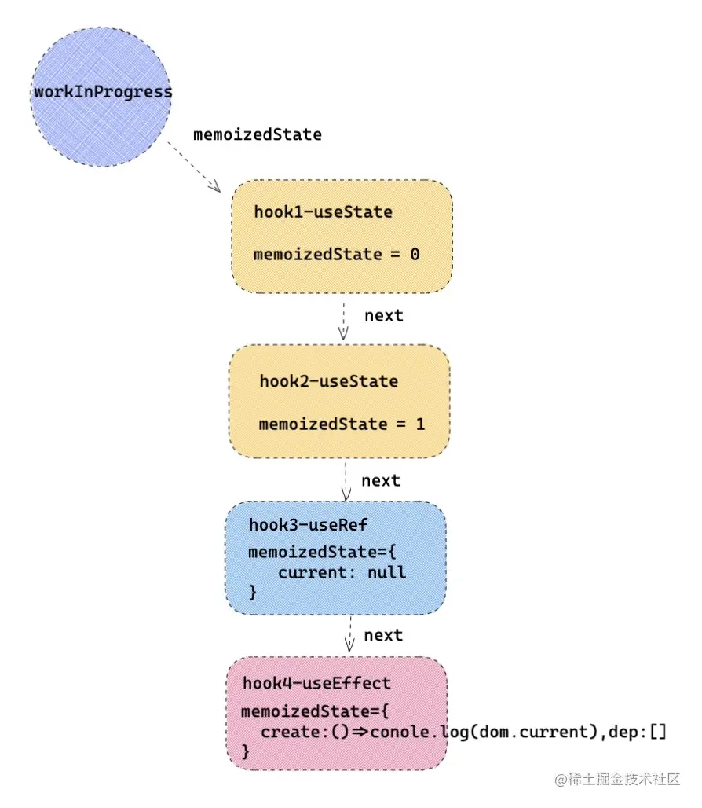

# React进阶

## 6 多功能Ref

### 6.1 Ref的两种创建方式

1. 类组件：React.createRef
2. 函数组件：useRef

### 6.2 Ref的三种使用方式

1. Ref属性设置为字符串
2. Ref属性设置爱为函数
3. Ref属性设置为对象

### 6.3 Ref的高阶用法

#### forwardRef转发Ref

1. 跨层级获取Ref
2. 合并转发Ref
3. 高阶组件转发Ref

#### Ref实现组件通信

**类组件直接通过Ref获取**

1. 父组件通过Ref获取子组件的setstate方法，给子组件传递信息。
2. 子组件通过props传递的父组件的setstate给父组件传递消息。

**函数组件forwardRef + useImperaHandle**

1. forwardRef将Ref传递给子组件，父组件就可以获得子组件的Ref。
2. useImperativeHandle将子组件的方法加入Ref引用中。

#### 函数组件缓存数据

由于函数组件没有实例，每次渲染都会重新调用函数，所以不需要改变视图的数据可以用Ref缓存。

### 6.4 原理揭秘

Ref的处理阶段都是在commit，有两个操作commitDetachRef（置空）和commitAttachRef（更新Ref），分别是DOM更新前和DOM更新后


## 9 高阶组件

### 9.1 高阶组件解决了什么问题

高阶组件解决了大量的代码复用和逻辑复用问题。

### 9.2 两种不同的高阶组件


#### 属性代理

属性代理就是用新的组件包裹被代理的组件，在新的组件内部对代理组件进行加强等操作，被代理的组件会在新的组件了被挂载。

#### 反向继承

在反向继承中新的组件继承了元素组件本身，在这个基础上添加新的功能或者修改原有属性，所以无需挂载原始组件。

### 9.3 高阶组件的功能

#### 强化**props**

#### 控制渲染

1. 渲染劫持
2. 修改渲染树
3. 动态加载

#### 组件赋能

1. Ref获取实例
2. 事件监控

### 9.4 高阶组件的注意事项

- 谨慎修改原型链（因为当前修改可能被后续修改影响）
- 不要在函数组件或者类组件的render中使用HOC（这样处理的话每次返回的HOC不一样，或引起不必要的渲染）
- Ref得转发，不想props一样可以传递下去
- HOC嵌套的顺序要看是否有以来以及是否获取实例等

## 10 渲染控制

### 10.1 render阶段的作用是什么

render的作用：根据一次更新中产生的新状态值，通过 React.createElement ，替换成新的状态，得到新的 React element 对象，新的  element 对象上，保存了最新状态值。 createElement 会产生一个全新的props。到此 render 函数使命完成了。

### 10.2 React提供的几种控制render的方法

#### 缓存React.element对象（从父组件直接隔断子组件的渲染）

通过函数判断需要控制的子组件，如果子组件的props没变则返回同一个实例，否则克隆实例并传入新的props。

#### 使用useMemo达到同样效果

useMemo的第一个参数传入回调函数，回调的返回值就是缓存的内容。第二个值deps数组，传入改变的props。

**useMemo 用法：**

```js
const cacheSomething = useMemo(create,deps)
```

- `create`：第一个参数为一个函数，函数的返回值作为缓存值，如上 demo 中把 Children 对应的 element 对象，缓存起来。
- `deps`： 第二个参数为一个数组，存放当前 useMemo 的依赖项，在函数组件下一次执行的时候，会对比 deps 依赖项里面的状态，是否有改变，如果有改变重新执行 create ，得到新的缓存值。
- `cacheSomething`：返回值，执行 create 的返回值。如果 deps 中有依赖项改变，返回的重新执行 create 产生的值，否则取上一次缓存值。

**useMemo原理：**

useMemo 会记录上一次执行 create 的返回值，并把它绑定在函数组件对应的 fiber 对象上，只要组件不销毁，缓存值就一直存在，但是 deps 中如果有一项改变，就会重新执行 create ，返回值作为新的值记录到 fiber 对象上。

**useMemo应用场景：**

- 可以缓存 element 对象，从而达到按条件渲染组件，优化性能的作用。
- 如果组件中不期望每次 render 都重新计算一些值,可以利用 useMemo 把它缓存起来。
- 可以把函数和属性缓存起来，作为 PureComponent 的绑定方法，或者配合其他Hooks一起使用。

### pureComponent（组件自身控制渲染，浅比较state，props）

### shouldComponentUpdate（更细粒度渲染控制）

### React.memo

#### 相当于只能控制props的shouldComponentUpdate


### 10.3 什么时候应该注意渲染节流

- 展示了大量数据的组件，一次更新伴随大量diff
- 含有大量表单的组件，表单频繁更新
- 靠近root跟组件的组件，root牵一发动全身

#### 10.4  一些开发中的细节问题

- 开发过程中对于大量数据展示的模块，开发者有必要用 shouldComponentUpdate ，PureComponent来优化性能。
- 对于表单控件，最好办法单独抽离组件，独自管理自己的数据层，这样可以让 state 改变，波及的范围更小。
- 如果需要更精致化渲染，可以配合 immutable.js 。
- 组件颗粒化，配合 memo 等 api ，可以制定私有化的渲染空间。

## 11 渲染调优

### 11.1 懒加载和异步渲染

传统模式：挂载组件-> 请求数据 -> 再渲染组件。
 异步模式：请求数据-> 渲染组件。

那么异步渲染相比传统数据交互相比好处就是：

- 不再需要 componentDidMount 或 useEffect 配合做数据交互，也不会因为数据交互后，改变 state 而产生的二次更新作用。
- 代码逻辑更简单，清晰。

### 11.2 动态加载（懒加载）

先来看一下基本使用：

```js
const LazyComponent = React.lazy(() => import('./test.js'))

export default function Index(){
   return <Suspense fallback={<div>loading...</div>} >
       <LazyComponent />
   </Suspense>
}
```

- 用 React.lazy 动态引入 test.js 里面的组件，配合 Suspense 实现动态加载组件效果。**这样很利于代码分割，不会让初始化的时候加载大量的文件。**

### 11.3 渲染错误边界

### componentDidCatch

componentDidCatch 可以捕获异常，它接受两个参数：

- 1 error —— 抛出的错误。
- 2 info —— 带有 componentStack key 的对象，其中包含有关组件引发错误的栈信息。

### static getDerivedStateFromError

React更期望用 getDerivedStateFromError 代替 componentDidCatch  用于处理渲染异常的情况。getDerivedStateFromError 是静态方法，内部不能调用  setState。getDerivedStateFromError 返回的值可以合并到 state，作为渲染使用。用  getDerivedStateFromError 解决如上的情况。

### 11.4 diff children

**第一步：遍历新 children ，复用 oldFiber**

**第二步：统一删除oldfiber**

**第三步：统一创建newFiber**

**第四步：针对发生移动和更复杂的情况**

**第五步：删除剩余没有复用的oldFiber**

## 12 处理海量数据

#### 12.1 时间分片

大量的数据分批次渲染，利用requestIdelCallback在浏览器的空闲时间渲染下一批次。

#### 12.2 虚拟列表

只渲染的可视区域以及其周围的列表。


## 13 调度与时间片

### 13.1 异步调度原理

由于UI渲染线程和js引擎线程是互斥的，所以React之前的版本在初次渲染会递归遍历大量的虚拟冬梅造成占用js线程，阻塞渲染，出现卡顿。

那么为了解决以上问题，把更新任务交给浏览器控制，该渲染的时候渲染空闲的时候更新，这样就可以解决卡顿。


### 13.2 React为什么不用setTimeout

setTimeout的最短执行时间是4ms，4ms的开销粒度太大，浪费。并且setTimeout任务会添加到异步队列，实际的执行时间一般大于设置的实际。

所以requestIdelCallBack是更好的选择，保证在每一帧内的空余时间执行，失效更高。

### 13.3 React的时间分片

根据requestID饿了CallBack将任务分成多个时间片，也就是每一帧为一个时间片，在事件片内执行任务。

requestIdleCallback 是谷歌浏览器提供的一个 API， 在浏览器有空余的时间，浏览器就会调用 requestIdleCallback 的回调。首先看一下 requestIdleCallback的基本用法：

```js
requestIdleCallback(callback,{ timeout })
```

- callback 回调，浏览器空余时间执行回调函数。
- timeout 超时时间。如果浏览器长时间没有空闲，那么回调就不会执行，为了解决这个问题，可以通过 requestIdleCallback 的第二个参数指定一个超时时间。

React 为了防止 requestIdleCallback 中的任务由于浏览器没有空闲时间而卡死，所以设置了 5 个优先级。

- `Immediate`     -1      需要立刻执行。
- `UserBlocking`  250ms   超时时间250ms，一般指的是用户交互。
- `Normal`        5000ms  超时时间5s，不需要直观立即变化的任务，比如网络请求。
- `Low`           10000ms 超时时间10s，肯定要执行的任务，但是可以放在最后处理。
- `Idle`                  一些没有必要的任务，可能不会执行。

React 的异步更新任务就是通过类似 requestIdleCallback 去向浏览器做一帧一帧请求，等到浏览器有空余时间，去执行 React 的异步更新任务，这样保证页面的流畅。


### 13.4 调度流程


## 14 调和与Fiber

### 14.1 什么是fiber ? 

fiber是React花两年时间重构的React架构，目的是解决大型应用卡顿问题。fiber是React中的最小粒度的执行单位，可以把Fiber理解为React的虚拟DOM。

### 14.2 Fiber 架构解决了什么问题？ 

react15以及之前的版本对于虚拟DOM采用递归的方式更新，当项目足够大的时候整个递归过程是非常耗时的，会组设UI渲染造成卡顿。

因此React16引入了fiber，fiber的更新过程叫做调和，每个fiber都可以作为单个执行单元来执行，每个fiber会根据自身的过期时间来判断每个时间片是否还有时间执行更新。如果没有时间就会把主动权交给浏览器去执行动画、重排、重绘等任务。等后面的实际片有足够的空余时间就会通过调度器来恢复到上次中断的执行单元，提高了用户体验。

### 14.3 Fiber root 和 root fiber 有什么区别？ 

FiberRoot是整个应用的根基只有一个

rootFiber作为FiberRoot的子节点，由ReactDom.render渲染处理，可以有多个。


### 14.4 不同fiber 之间如何建立起关联的？

每一个element对应一个fiber，每个fiber通过return，child，sibling三个属性简历联系。

return指向父节点，child指向子节点，sibling指向兄弟节点。

所有的fiber构成了一个双向链表。

### 14.5 React 调和流程？


初始化：

1. 创建FiberRoot和rootFiber
2. 创建workInprogress和current树
3. 向下调和子节点渲染视图
4. 最后以内存中新建的workInprogress作为最小的current渲染树。也就是FiberRoot的current指向workInProgress


更新：

1. 复用current树上的alternate，重新创建一颗workInProgress树。自上而下创建，同时将两者的alternate相互关联。最后将FiberRoot的current指向新的workInProgress。

### 14.6 **两大阶段 commit 和 render 都做了哪些事情？**

**render：**

1. 向下调和（beginWork）
   - 对于组件执行部分生命周期，执行render得到新的children
   - 向下遍历调和children，复用oldFiber
   - 给fiber打副作用标签effectTag，比如类组件的声明周期，元素的增删改
2. 向上归并（completeUnitOfWork）
   - 将具有effectTag的fiber节点保存到单项列表effectList中，在commit阶段将不再需要遍历每一个fiber只需要执行effectList
   - 对于组件处理context，对于标签则初始化。

**commit：**

1. before mutation
   - 因为 Before mutation 还没修改真实的 DOM ，是获取 DOM 快照的最佳时期，如果是类组件有 getSnapshotBeforeUpdate ，那么会执行这个生命周期。
   - 会异步调用 useEffect ，在生命周期章节讲到 useEffect 是采用异步调用的模式，其目的就是防止同步执行时阻塞浏览器做视图渲染。
2. mutation
   - 置空 ref ，在 ref 章节讲到对于 ref 的处理。
   - 对新增元素，更新元素，删除元素。进行真实的 DOM 操作。
3. layout
   - commitLayoutEffectOnFiber 对于类组件，会执行生命周期，setState 的callback，对于函数组件会执行 useLayoutEffect 钩子。
   - 如果有 ref ，会重新赋值 ref 。

### 14.7 什么是双缓冲树？ 有什么作用？

canvas在绘制动画是，如果上一帧的计算量比较大，旧货导致清除上一帧到绘制当前帧有较大的时间间隙造成空白。为了解决这个问题，canvas在内存中绘制当前帧，绘制完毕后直接代替上一帧，省去了两帧替换间的计算支时间。这就是双缓存。类似的，JS的垃圾清理机制中有一步就是将新生代空间划分两半，循环交替使用两半。

React的双缓冲树也是这种思路，一个是内存中构建的树（workInProrecess）和渲染树（current）。双缓存一个在内存中构建一个渲染视图两颗树用alternate指针指向对方，在下一次渲染时直接复用缓存树作为下一次的渲染树，反复交替。布局可以防止只用一棵树导致的更新状态丢失还可以加快DOM的替换和更新。

### 14.8 Fiber的调和能中断吗？ 如何中断？

能，每一个fiber都是一个执行单位，每个fiber的调和都会更具剩余时间和当前时间片的时间更新来决定是否更新，如果不够就会中断调和。将控制权交给浏览器，浏览器执行完动画，重绘，重排等任务后再返回中断的fiber任务，继续根据时间判断是否执行。


## 15 hooks原理

hooks的起因：

1. 函数组件没有实例，不能拥有自己的生命周期函数以及Ref等。hooks起到连接函数组件和fiber的作用，将state和Ref等属性挂载到fiber上。使得函数也拥有了类组件才有的功能。
2. 解决逻辑复用难的问题，对于一些在不同组件间复用的逻辑，hooks相较于高阶组件更加清晰简单，一个hooks可以再不同的组件间复用。
3. 拥抱函数式编程，面向对象的类组件会随着功能的增加而臃肿。

### 15.1 React Hooks 为什么必须在函数组件内部执行？React 如何能够监听 React Hooks 在外部执行并抛出异常。

1. hooks是连接函数组件和fiber的桥梁，要建立fiber与hooks的联系显然应该在函数内部执行，在函数内部时才能获得单曲渲染对象current，执行相关操作。

2. hooks对象在React中有三种状态，函数组件初始化时hooks的状态，函数组件更新时hooks的状态，报错形态；

   只要在函数组件外部调用hooks，此时hooks对象是报错形态，直接抛出异常。

### 15.2 React Hooks 如何把状态保存起来？保存的信息存在了哪里？

首先函数组件对应 fiber 用 memoizedState 保存 hooks 信息，每一个 hooks 执行都会产生一个 hooks  对象，hooks 对象中，保存着当前 hooks 的信息，不同 hooks 保存的形式不同。每一个 hooks 通过 next 链表建立起关系。



### 15.3 React Hooks 为什么不能写在条件语句中？

在初始化函数组件的hooks时，会根据每个hook的参数建立相应的hook对象。然后将这些hook连接成一个链表。在hooks更新的时候，更新逻辑和双缓存树类似，新的hooks复用旧hooks而来。如果hooks写在条件语句中，那么hooks就不唯一了，在复用旧hooks会出现问题。

### 15.4 useMemo 内部引用 useRef 为什么不需要添加依赖项，而 useState 就要添加依赖项。

因为Ref存的是同意个值，而useState，每次取的时候是一个新的值。useState每次改变值的时候和redux是类似的，通过dispatch讲消息发送过去，然后更改。每次取的值不是同一个对象。

### 15.5 useEffect 添加依赖项 props.a ，为什么 props.a 改变，useEffect 回调函数 create 重新执行。

在函数内部会比较依赖性有没有改变，如果改变了就会重新执行回调函数。

### 15.6 React 内部如何区别 useEffect 和 useLayoutEffect ，执行时机有什么不同？

### 不同的effect

**useEffect**

对于 useEffect 执行， React 处理逻辑是采用异步调用 ，对于每一个 effect 的 callback， React 会向 `setTimeout`回调函数一样，放入任务队列，等到主线程任务完成，DOM 更新，js 执行完成，视图绘制完毕，才执行。所以 effect 回调函数不会阻塞浏览器绘制视图。

**useLayoutEffect:**

useLayoutEffect 和 useEffect 不同的地方是采用了同步执行，那么和useEffect有什么区别呢？

- 首先 useLayoutEffect 是在 DOM 更新之后，浏览器绘制之前，这样可以方便修改 DOM，获取 DOM  信息，这样浏览器只会绘制一次，如果修改 DOM 布局放在 useEffect ，那 useEffect 执行是在浏览器绘制视图之后，接下来又改  DOM ，就可能会导致浏览器再次回流和重绘。而且由于两次绘制，视图上可能会造成闪现突兀的效果。
- useLayoutEffect callback 中代码执行会阻塞浏览器绘制。

关于 `EffectTag` 的思考🤔：

- React 会用不同的 EffectTag 来标记不同的 effect，对于useEffect 会标记 UpdateEffect |  PassiveEffect， UpdateEffect 是证明此次更新需要更新 effect ，HookPassive 是 useEffect  的标识符，对于 useLayoutEffect 第一次更新会打上  HookLayout  的标识符。**React 就是在 commit 阶段，通过标识符，证明是 useEffect 还是 useLayoutEffect ，接下来 React 会同步处理 useLayoutEffect ，异步处理 useEffect** 。
- 如果函数组件需要更新副作用，会标记 UpdateEffect，至于哪个effect 需要更新，那就看 hooks 上有没有  HookHasEffect 标记，所以初始化或者 deps 不想等，就会给当前 hooks 标记上 HookHasEffect  ，所以会执行组件的副作用钩子。

## 16 React-router

### 16.1 路由原理

react路由有两种方式，hash和history路由。

**链接式：**以history路由为例，当url改变，首先触发history相关的事件popstate，触发回调函数。回调函数中会调用setstate更新location路由信息，然后在Router组件通过context传递给route组件匹配，匹配的route组件会渲染对应的组件。

**编程式路由：**如果是调用history.push来改变路由，实际上就是调用window.history.pushState改变url，同时不刷新页面。然后调用setState，后续流程相同。

hash路由原理也一样，只是路由改变调用的接口是window.location.hash，触发的事件是hashchange。


### 16.2 history、react-router、react-rouer-dom三者关系


history：history是整个react-router的核心，里面包括两种路由模式下改变路由的方法和监听路由变化的方法等，封装了很多原生JavaScript浏览器的api。

react-router：提供Router、switch等调度组件来派发路由的更新信息，以及route等容器组件匹配路由渲染视图；

react-router-dom：在react-router的基础上提供了一些UI层面的扩展比如NavLink、Link，以及两种模式的根部路由BrowserRouter、HashRouter（这两种组件是通过将不同模式下的history对象注入到Router组件形成的）

### 16.3 四种Route

**四种形式：**

- `Component` 形式：将组件直接传递给 Route 的 component 属性，Route 可以将路由信息隐式注入到页面组件的 props 中，但是无法传递父组件中的信息，比如如上 mes 。
- `render` 形式：Route 组件的 render 属性，可以接受一个渲染函数，函数参数就是路由信息，可以传递给页面组件，还可以混入父组件信息。
- `children` 形式：直接作为 children 属性来渲染子组件，但是这样无法直接向子组件传递路由信息，但是可以混入父组件信息。
- `renderProps` 形式：可以将 childen 作为渲染函数执行，可以传递路由信息，也可以传递父组件信息。

## 17. 渲染调优细节处理

### 17.1 React防抖和节流

将函数通过防抖和节流处理后再通过usecallback缓存

### 17.2 按需引入

如果只需要引用antd中的部分组件，则不需要引入所有的依赖。通过设置.babelrc，实现按需引入。

babelrc 增加对 antd 样式按需引入。

```json
["import", {
    "libraryName":
    "antd",
    "libraryDirectory": "es",
    "style": true
}]
```

### 17.3 React动画

1. 动态添加类名

2. 操纵原生DOM

3. setstate+css3

   如果 ① 和 ② 都不能满足要求，一定要使用 setState 实时改变DOM元素状态的话，那么尽量采用 css3 ， css3 开启硬件加速，使 GPU (Graphics Processing Unit) 发挥功能，从而提升性能。

   比如想要改变元素位置 left ，top 值，可以换一种思路通过改变 transform: translate，transform 是由 GPU 直接控制渲染的，所以不会造成浏览器的重排。

### 17.4 及时清除定时器、延时器、监听器

类组件通过componentWillUNmount、函数组件通过useEffect和useLayoutEffect返回的destroy函数

### 17.5 合理使用state

与渲染无关的变量不要用state存，在类组件可以挂载到实例下，在函数组件可以用useRef挂载到fiber上。

### 17.6 建议不要在 hooks 的参数中执行函数或者 new 实例

有一种场景是平时比较容易忽略的，就是在 `hooks` 的参数中执行函数或者 new 实例，比如如下这样：

```js
const hook1 = useRef(fn())
const hook2 = useRef(new Fn())
```

- 首先函数每次 `rerender` 都会执行 hooks ，那么在执行 hooks 函数的同时，也会执行函数的参数，比如上面的代码片段中的 `fn()` 和 `new Fn()`，也就是每一次 rerender 都会执行 fn 或者是 new 一个实例。这可能不是开发者期望的，而执行函数，或创建实例也成了一种性能浪费，在一些极端情况下，可能会造成内存泄漏，比如在创建新的 dom 元素，但是没有进行有效的回收。
- 在 hooks 原理章节讲到过，函数组件在**初始化**和**更新**流程中，会使用不同的 hooks 对象，还是以 `useRef` 为例子，在初始化阶段用的是 `mountRef`函数，在更新阶段用的是 `updateRef`函数，开发者眼睛看见的是 `useRef`，在 React 底层却悄悄的替换成了不同的函数。 更重要的是大部分的 hooks 参数都作为**初始化**的参数，在更新阶段压根没有用到，那么传入的参数也就没有了意义，回到上述代码片段，`fn()` 和 `new Fn()`在更新阶段根本就没有被 `useRef`接收， 无辜的成了流浪者。

## 18. React事件系统

### 18.1 React 为什么有自己的事件系统？ 

1. 首先，不同的浏览器对事件存在不同的兼容性，React 想实现一个兼容全浏览器的框架， 为了实现这个目标就需要创建一个兼容全浏览器的事件系统，以此抹平不同浏览器的差异。
2. 其次，v17 之前 React 事件不是绑定在真实DOM上的，react只在Document或者容器DOM上绑定了一个dispatchEvent函数，由这个函数来进一步派发React自己的合成事件。由于不是绑定在真实的  DOM 上，所以 React 需要模拟一套事件流：事件捕获-> 事件源 -> 事件冒泡，也包括重写一下事件源对象 event 。
3. 最后，这种事件系统，大部分处理逻辑都在底层处理了，这对后期的 ssr 和跨端支持度很高。
4. 事件系统实现了事件委托，有利于节省内存，优化性能。

### 18.2 什么是事件合成 ？ 

1. React 的事件不是绑定在元素上的，而是统一绑定在顶部容器上，在 v17 之前是绑定在 document 上的，在 v17 改成了 app 容器上。这样更利于一个 html 下存在多个应用（微前端）。
2. 绑定事件并不是一次性绑定所有事件，比如发现了 onClick 事件，就会绑定 click 事件，比如发现 onChange 事件，会绑定 `[blur，change ，focus ，keydown，keyup]` 多个事件。
3. React 事件合成的概念：React 应用中，元素绑定的事件并不是原生事件，而是React 合成的事件，比如 onClick 是由 click 合成，onChange 是由 blur ，change ，focus 等多个事件合成。

### 18.3 如何实现的批量更新？

在 React 事件执行之前通过 `isBatchingEventUpdates=true` 打开开关，开启事件批量更新，当该事件结束，再通过 `isBatchingEventUpdates = false;` 关闭开关，然后在 scheduleUpdateOnFiber 中根据这个开关来确定是否进行批量更新。


### 18.4 React事件触发的流程

1.点击按钮button，开启批量更新。触发click事件回调函数，回调函数执行dispatchEvent，dispatch react的click合成事件，并传入事件源Button元素本身。

2.根据事件类型，合成新的事件源，里面包含了 preventDefault 和 stopPropagation 等方法。

3.形成事件执行队列，在第一步通过原生 DOM 获取到对应的 fiber ，接着会从这个 fiber 向上遍历，遇到元素类型 fiber ，就会收集事件，用一个数组收集事件：

1. 遇到捕获阶段事件则unshift加入数组前。
2. 遇到冒泡阶段事件在push加入数组后。
3. 一直收集到顶端App形成执行队列，然后一次执行队列中的事件，模拟冒泡和捕获。

4.传入事件源，执行更新队列。


### 18.5 事件系统如何模拟冒泡和捕获阶段？

4.形成事件执行队列，在第一步通过原生 DOM 获取到对应的 fiber ，接着会从这个 fiber 向上遍历，遇到元素类型 fiber ，就会收集事件，用一个数组收集事件：

1. 遇到捕获阶段事件则unshift加入数组前。
2. 遇到冒泡阶段事件在push加入数组后。
3. 一致收集到顶端App形成执行队列，然后一次执行队列中的事件，模拟冒泡和捕获。

### 18.6 如何通过 dom 元素找到与之匹配的fiber？

React 在初始化真实 DOM 的时候，用一个随机的 key internalInstanceKey  指针指向了当前 DOM 对应的 fiber 对象，fiber 对象用 stateNode 指向了当前的 DOM 元素。


### 18.7 为什么不能用 return false 来阻止事件的默认行为？

React中该元素注册的事件处理函数不是真正的事件处理函数，用return false不起作用。用e.preventDefault阻止默认行为，事件源e也不是原生的事件源，而是合成事件源。

### 18.8 事件是绑定在真实的dom上吗？如何不是绑定在哪里？

答案是否定的，绑定在 document 的事件，是 React 统一的事件处理函数 dispatchEvent ，React 需要一个统一流程去代理事件逻辑，包括 React 批量更新等逻辑。事件处理函数绑定在DOM元素对应的fiber对象的memoizedProps属性上。


如下，实际click事件触发，就会触发绑定的合成事件，合成事件在触发事件处理函数。

```js
const listener = dispatchEvent.bind(null,'click',eventSystemFlags,document) 
/* TODO: 重要, 这里进行真正的事件绑定。*/
document.addEventListener('click',listener,false) 
```

### 18.9 V17 对事件系统有哪些改变？

React17的事件是注册到根root上而非document

- 方便多版本react版本共存
- 主要目的：后续版本不会在对不常用的API特性提供兼容

取消事件池

- 目前不存在性能提升

- 解决之前的bug

- 不能将 event 用于异步操作，只能使用event.persist()

- - 即 event.persist() 方法会将当前event踢出事件池，因此属性值可以一直存在而不会被重置。

解决React事件与原生事件中，调用事件stopPropagation方法执行混乱的问题

- 17版本之前，给document绑定监听事件，比如click事件，React点击事件处理去的内部调用e.stopPropagation()依然不能阻止原生document的click事件的调用

捕获事件（例如，onClickCapture）现在使用的是实际浏览器中的捕获监听器（Capture phase events (e.g. onClickCapture) now use real browser capture phase  listeners.）


## 19. redux

### 19.1 为什么要用redux

**组件之间复杂状态如何管理**

设想一种场景，就是一些通过 ajax 向服务器请求的重要数据，比如用户信息，权限列表，可能会被多个组件需要，那么如果每个组件初始化都请求一遍数据显然是不合理的。这时候常用的一种解决方案是，应用初始化时候，只请求一次数据，然后通过状态管理把数据存起来，需要数据的组件只需要从状态管理中‘拿’就可以了。


**复杂组件之间如何通信**

对于组件树形结构中，非同父节点之间的通信，常规的方式实现起来非常困难（props传递+状态提升、事件总线）。

### 19.2 React-Redux,Redux,React三者关系

- `Redux`： 首先 Redux 是一个应用状态管理js库，它本身和 React 是没有关系的，换句话说，Redux 可以应用于其他框架构建的前端应用，甚至也可以应用于 Vue 中。
- `React-Redux`：React-Redux 是连接 React 应用和 Redux 状态管理的桥梁。React-redux 主要专注两件事，一是如何向 React 应用中注入 redux 中的 Store ，二是如何根据 Store 的改变，把消息派发给应用中需要状态的每一个组件。
- `React`：这个就不必多说了。

### **19.3 redux优势**

#### redux的三大原则

- 1 单向数据流：整个 redux ，数据流向都是单向的，用一张官网的图片描述整个数据流动的流程。


- 2 state 只读：在 Redux 中不能通过直接改变 state ，来让状态发生变化，如果想要改变 state ，那就必须触发一次 action ，通过 action 执行每个 reducer 。
- 3 纯函数执行：每一个 reducer 都是一个纯函数，里面不要执行任何副作用，返回的值作为新的 state ，state 改变会触发 store 中的 subscribe 。

#### 发布订阅思想

redux 可以作为发布订阅模式的一个具体实现。redux 都会创建一个 store ，里面保存了状态信息，改变 store 的方法 dispatch ，以及订阅 store 变化的方法 subscribe 。

#### 中间件思想

redux 应用了前端领域为数不多的中间件 `compose` ，那么 redux 的中间件是用来做什么的？ 答案只有一个： 那就是**强化 dispatch** ， Redux 提供了中间件机制，使用者可以根据需要来强化 dispatch 函数，传统的 dispatch 是不支持异步的，但是可以针对 Redux 做强化，于是有了 `redux-thunk`，`redux-actions` 等中间件，包括 dvajs 中，也写了一个 redux 支持 promise 的中间件。

一起来看一下 compose 是如何实现的：

```js
const compose = (...funcs) => {
  return funcs.reduce((f, g) => (x) => f(g(x)));
}
```

- funcs 为中间件组成的数组，compose 通过数组的 reduce 方法，实现执行每一个中间件，强化 dispatch 。

### 19.4 redux原理

1. Provider注入store
   - React-Redux 是通过 context 上下文来保存传递 Store 的，但是上下文 value 保存的除了 Store 还有 subscription 。
   - subscription 可以理解为订阅器，在 React-redux 中一方面用来订阅来自 state 变化，另一方面通知对应的组件更新。在 Provider 中的订阅器 subscription 为根订阅器，
   - 在 Provider 的 useEffect 中，进行真正的绑定订阅功能，其原理内部调用了 store.subscribe ，只有根订阅器才会触发store.subscribe，至于为什么，马上就会讲到。

2. 每一个用connect包裹的组件内部都有订阅器，然后这些层级组件之间的connect中的订阅器也会建立层级关系。整体上就是层层订阅（下层订阅上层）、层层下发（上层的更新会下发到下层，由下层决定是否更新）。

3. 通过中间件强化dispatch，来实现异步或者数据加工等功能。

